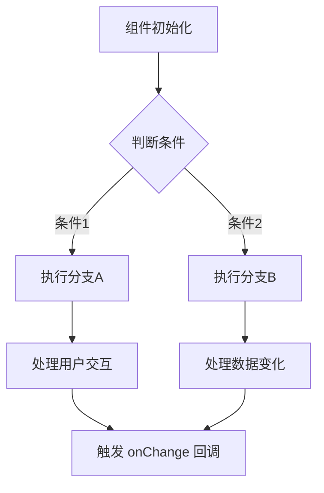

import { SourceCode } from '@theme';
import { BasicStory, WithSchemaStory } from 'components/form-materials/components/{物料名称}';

# ComponentName

ComponentName 是一个用于...的组件，它支持...功能。[用 1-2 段文字描述物料的核心功能、使用场景和主要特性]

<br />
<div>
  
</div>

## 案例演示

### 基本使用

<BasicStory />

```tsx pure title="form-meta.tsx"
import { ComponentName } from '@flowgram.ai/form-materials';

const formMeta = {
  render: () => (
    <>
      <FormHeader />
      <Field<ValueType> name="field_name">
        {({ field }) => (
          <ComponentName
            value={field.value}
            onChange={(value) => field.onChange(value)}
          />
        )}
      </Field>
    </>
  ),
}
```

### 高级用法示例（根据物料特性添加）

<WithSchemaStory />

```tsx pure title="form-meta.tsx"
import { ComponentName } from '@flowgram.ai/form-materials';

const formMeta = {
  render: () => (
    <>
      <FormHeader />
      <Field<ValueType> name="field_name">
        {({ field }) => (
          <ComponentName
            value={field.value}
            onChange={(value) => field.onChange(value)}
            schema={{ type: 'string' }}
            // 其他高级配置...
          />
        )}
      </Field>
    </>
  ),
}
```

## API 参考

### ComponentName Props

| 属性名 | 类型 | 默认值 | 描述 |
|--------|------|--------|------|
| `value` | `ValueType` | - | 组件的值 |
| `onChange` | `(value: ValueType) => void` | - | 值变化时的回调函数 |
| `readonly` | `boolean` | `false` | 是否为只读模式 |
| `hasError` | `boolean` | `false` | 是否显示错误状态 |
| `style` | `React.CSSProperties` | - | 自定义样式 |

### RelatedConfigType（如果有相关的配置类型）

| 属性名 | 类型 | 默认值 | 描述 |
|--------|------|--------|------|
| `property1` | `string` | - | 属性说明 |
| `property2` | `boolean` | `false` | 属性说明 |

### RelatedProviderProps（如果有 Provider 组件）

| 属性名 | 类型 | 默认值 | 描述 |
|--------|------|--------|------|
| `children` | `React.ReactNode` | - | 子组件 |
| `config` | `ConfigType` | - | 配置对象 |

## 源码导读

<SourceCode
  href="https://github.com/bytedance/flowgram.ai/tree/main/packages/materials/form-materials/src/components/{物料路径}"
/>

使用 CLI 命令可以复制源代码到本地：

```bash
npx @flowgram.ai/cli@latest materials components/{物料路径}
```

### 目录结构讲解

```
{物料名称}/
├── index.tsx           # 主组件实现，包含 ComponentName 核心逻辑
├── hooks.ts            # 自定义 Hooks，处理... [如果有]
├── context.tsx         # Context Provider，提供... [如果有]
├── utils.ts            # 工具函数，用于... [如果有]
└── styles.css          # 样式文件
```

### 核心实现说明

#### 功能点1
[用简洁的文字描述实现原理]

```typescript
// 展示关键代码片段
const result = useHookName(props);
```

#### 功能点2
[描述另一个关键功能的实现方式]

```typescript
// 展示关键逻辑
if (condition) {
  return <ComponentA />;
} else {
  return <ComponentB />;
}
```

### 整体流程



### 使用到的 FlowGram API

[**@flowgram.ai/package-name**](https://github.com/bytedance/flowgram.ai/tree/main/packages/path)
- [`ApiName`](https://flowgram.ai/auto-docs/package/type/ApiName): API 的功能说明
- [`HookName`](https://flowgram.ai/auto-docs/package/functions/HookName): Hook 的功能说明

[**@flowgram.ai/another-package**](https://github.com/bytedance/flowgram.ai/tree/main/packages/another-path)
- [`TypeName`](https://flowgram.ai/auto-docs/package/interfaces/TypeName): 类型定义说明

### 依赖的其他物料

[**DependentMaterial**](./dependent-material) 物料的简要说明
- `ExportedComponent`: 导出组件的用途
- `ExportedHook`: 导出 Hook 的用途

[**AnotherMaterial**](./another-material) 物料的简要说明

### 使用的第三方库

[**library-name**](https://library-url.com) 库的说明
- `ImportedComponent`: 组件的用途
- `importedFunction`: 函数的用途
