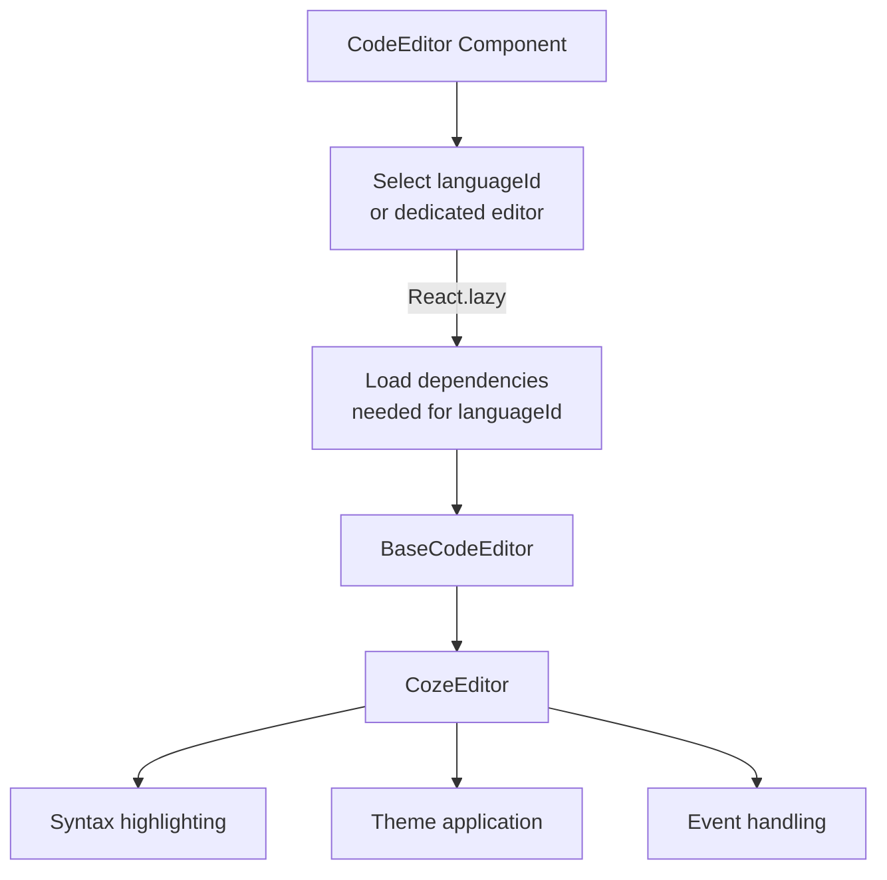

import { SourceCode } from '@theme';
import { BasicStory } from 'components/form-materials/components/code-editor';

# CodeEditor

CodeEditor is a powerful code editor component built on CodeMirror 6, supporting syntax highlighting and intelligent suggestions for multiple programming languages. It provides dedicated editor versions for TypeScript, Python, SQL, Shell, JSON, and more.

## Demo

### Basic Usage

<BasicStory />

```tsx pure title="form-meta.tsx"
import { CodeEditor } from '@flowgram.ai/form-materials';

const formMeta = {
  render: () => (
    <>
      <FormHeader />
      <Field<string | undefined> name="code_editor">
        {({ field }) => (
          <CodeEditor
            value={field.value}
            onChange={(value) => field.onChange(value)}
            languageId="typescript"
          />
        )}
      </Field>
    </>
  ),
}
```

### Dedicated Language Editors

:::warning Note
Importing dedicated language editors separately can reduce the dependencies required for bundling
:::

```tsx
// TypeScript Editor
import { TypeScriptCodeEditor } from '@flowgram.ai/form-materials';

// Python Editor
import { PythonCodeEditor } from '@flowgram.ai/form-materials';

// SQL Editor
import { SQLCodeEditor } from '@flowgram.ai/form-materials';

// Shell Editor
import { ShellCodeEditor } from '@flowgram.ai/form-materials';

// JSON Editor
import { JsonCodeEditor } from '@flowgram.ai/form-materials';
```

## API Reference

### CodeEditor Props

| Property | Type | Default | Description |
|----------|------|---------|-------------|
| `value` | `string` | - | Editor content |
| `onChange` | `(value: string) => void` | - | Callback function when content changes |
| `languageId` | `'python' \| 'typescript' \| 'shell' \| 'json' \| 'sql'` | - | Code language type |
| `theme` | `'dark' \| 'light'` | `'light'` | Editor theme |
| `placeholder` | `string` | - | Placeholder text |
| `activeLinePlaceholder` | `string` | - | Current line placeholder hint |
| `readonly` | `boolean` | `false` | Whether it's read-only mode |
| `mini` | `boolean` | `false` | Whether it's mini mode |
| `options` | `Options` | - | CodeMirror configuration options |

### Language Support

CodeEditor supports the following languages:

- **typescript**: TypeScript/JavaScript
- **python**: Python
- **sql**: SQL
- **shell**: Shell scripts
- **json**: JSON

## Source Code Guide

<SourceCode
  href="https://github.com/bytedance/flowgram.ai/tree/main/packages/materials/form-materials/src/components/code-editor"
/>

Use CLI command to copy source code locally:

```bash
npx @flowgram.ai/cli@latest materials components/code-editor
```

### Directory Structure Explanation

```
code-editor/
├── index.tsx           # Unified export file
├── editor.tsx          # Base editor component BaseCodeEditor
├── editor-all.tsx      # Full-featured editor (deprecated)
├── editor-ts.tsx       # TypeScript editor
├── editor-python.tsx   # Python editor
├── editor-sql.tsx      # SQL editor
├── editor-shell.tsx    # Shell editor
├── editor-json.tsx     # JSON editor
├── factory.tsx         # Editor factory function
├── theme/              # Theme configuration
│   ├── dark.ts         # Dark theme
│   ├── light.ts        # Light theme
│   └── index.ts        # Theme export
├── utils.ts            # Utility functions
└── README.md          # Component documentation
```

### Core Implementation Explanation

#### BaseCodeEditor

The base editor component, a simple wrapper around coze-editor, provides basic syntax highlighting, theme switching, mini mode, read-only mode, and other features.

:::warning Note
BaseCodeEditor does not include any language logic loading; language logic is implemented in dedicated editors.
:::

#### Dedicated Editors
Each language has a corresponding dedicated editor, implemented through dynamic import:

```typescript
export const loadTypescriptLanguage = () =>
  import('@flowgram.ai/coze-editor/language-typescript').then((module) => {
    // TypeScript language loading logic
  });

export const TypeScriptCodeEditor = CodeEditorFactory<true>(
  loadTypescriptLanguage,
  {
    displayName: 'TypeScriptCodeEditor',
    fixLanguageId: 'typescript',
  }
);
```

### Flowgram APIs Used

#### @flowgram.ai/coze-editor

@flowgram.ai/coze-editor is a code editor component built on CodeMirror 6. See source code: [coze-dev/rush-dev](https://github.com/coze-dev/rush-arch/tree/main/packages/text-editor)

- `createRenderer`: Create editor
- `preset-code`: Code editor preset configuration
- `EditorProvider`: Editor context provider
- `ActiveLinePlaceholder`: Current line placeholder component

#### @codemirror/view
- `EditorView`: CodeMirror editor view

### Overall Process



### Performance Optimization

- **Lazy Loading**: Each language is loaded on demand
- **Dedicated Editors**: It is recommended to use XXXCodeEditor instead of the generic CodeEditor to optimize bundling speed