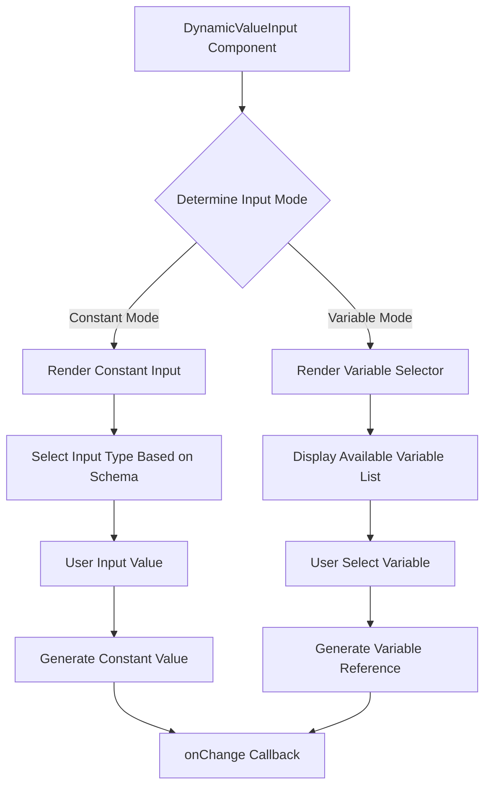

import { SourceCode } from '@theme';
import { BasicStory, WithSchemaStory } from 'components/form-materials/components/dynamic-value-input';

# DynamicValueInput

DynamicValueInput is a dynamic value input component that supports both constant and variable input modes. It can automatically select the appropriate input type based on the provided schema and offers variable selection functionality. The component can intelligently switch between constant input and variable selection.

<br />
<div>
  
</div>

## Demo

### Basic Usage

<BasicStory />

```tsx pure title="form-meta.tsx"
import { DynamicValueInput } from '@flowgram.ai/form-materials';

const formMeta = {
  render: () => (
    <>
      <FormHeader />
      <Field<any> name="dynamic_value_input">
        {({ field }) => (
          <DynamicValueInput value={field.value} onChange={(value) => field.onChange(value)} />
        )}
      </Field>
    </>
  ),
}
```

### With Schema Constraints

<WithSchemaStory />

```tsx pure title="form-meta.tsx"
import { DynamicValueInput } from '@flowgram.ai/form-materials';

const formMeta = {
  render: () => (
    <>
      <FormHeader />
      <Field<any> name="dynamic_value_input">
        {({ field }) => (
          <DynamicValueInput
            value={field.value}
            onChange={(value) => field.onChange(value)}
            schema={{ type: 'string' }}
          />
        )}
      </Field>
    </>
  ),
}
```

### Constant Mode

```tsx
<DynamicValueInput
  value={{
    type: 'constant',
    content: 'Hello World',
    schema: { type: 'string' }
  }}
  onChange={handleChange}
/>
```

### Variable Mode

```tsx
<DynamicValueInput
  value={{
    type: 'ref',
    content: ['start_0', 'query']
  }}
  onChange={handleChange}
/>
```

## API Reference

### DynamicValueInput Props

| Property | Type | Default | Description |
|----------|------|---------|-------------|
| `value` | `IFlowConstantRefValue` | - | Input value, supports constant or variable reference |
| `onChange` | `(value?: IFlowConstantRefValue) => void` | - | Callback function when value changes |
| `readonly` | `boolean` | `false` | Whether it's read-only mode |
| `hasError` | `boolean` | `false` | Whether to display error state |
| `style` | `React.CSSProperties` | - | Custom styles |
| `schema` | `IJsonSchema` | - | JSON Schema to constrain input type |
| `constantProps` | `ConstantInputProps` | - | Additional properties passed to constant input component |

### IFlowConstantRefValue

```typescript
type IFlowConstantRefValue =
  | IFlowConstantValue  // Constant value
  | IFlowRefValue;     // Variable reference

interface IFlowConstantValue {
  type: 'constant';
  content: any;           // Constant value
  schema: IJsonSchema;  // Value type definition
}

interface IFlowRefValue {
  type: 'ref';
  content: string; // Variable path, e.g., "user.name"
}
```

### Mode Switching

The component supports intelligent switching between two input modes:

1. **Constant Mode**: Direct value input
2. **Variable Mode**: Select variables within scope

## Source Code Guide

<SourceCode
  href="https://github.com/bytedance/flowgram.ai/tree/main/packages/materials/form-materials/src/components/dynamic-value-input"
/>

Use CLI command to copy source code locally:

```bash
npx @flowgram.ai/cli@latest materials components/dynamic-value-input
```

### Directory Structure Explanation

```
dynamic-value-input/
├── index.tsx           # Main component implementation, containing DynamicValueInput core logic
├── hooks.ts            # Custom Hooks for handling variable references and schema selection
├── styles.tsx          # Style definitions using styled-components
└── README.md          # Component documentation
```

### Core Implementation Explanation

#### Variable Reference Handling
Get variable reference information through the `useRefVariable` Hook:

```typescript
const refVariable = useRefVariable(value);
```

#### Schema Selection Management
Manage type selection through the `useSelectSchema` Hook:

```typescript
const [selectSchema, setSelectSchema] = useSelectSchema(
  schemaFromProps,
  constantProps,
  value
);
```

#### Mode Switching Logic
The component determines whether to render constant input or variable selector by judging `value.type`:

```typescript
if (value?.type === 'ref') {
  // Render variable selector
  return <InjectVariableSelector />;
} else {
  // Render constant input
  return <ConstantInput />;
}
```

### Flowgram APIs Used

#### @flowgram.ai/json-schema
- `JsonSchemaUtils`: JSON Schema utility class
- `IJsonSchema`: JSON Schema type definition
- `useTypeManager`: Type manager Hook

#### @flowgram.ai/variable-core
- `useScopeAvailable`: Get available variables in current scope

#### Internal Components
- [`InjectVariableSelector`](./variable-selector): Variable selector
- [`TypeSelector`](./type-selector): Type selector
- `ConstantInput`: Constant input component
- `createInjectMaterial`: Create injectable material components

### Overall Process

