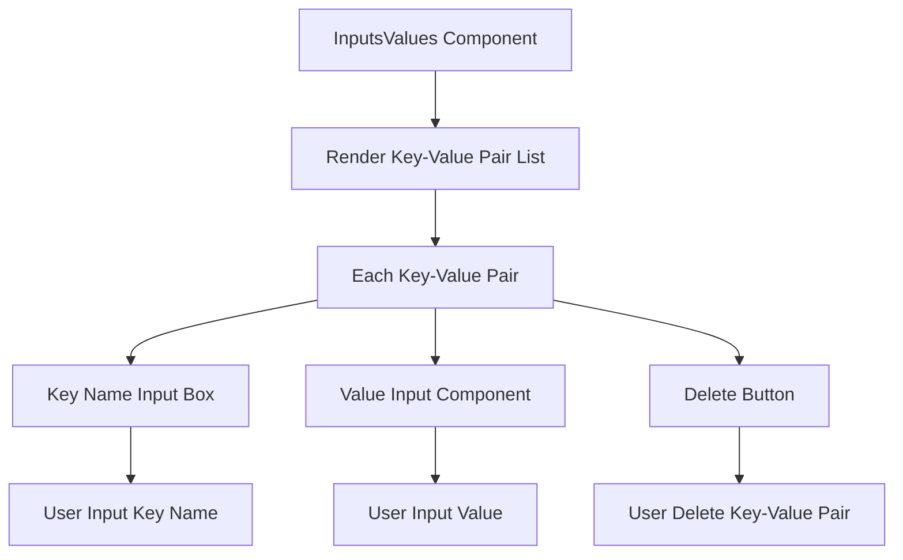

import { SourceCode } from '@theme';
import { BasicStory, WithSchemaStory } from 'components/form-materials/components/inputs-values';

# InputsValues

InputsValues is a key-value pair input list component used to collect and manage a set of input parameters. Each key-value pair supports both constant and variable input modes, implemented through the DynamicValueInput component for flexible input methods.

## Demo

### Basic Usage

<BasicStory />

```tsx pure title="form-meta.tsx"
import { InputsValues } from '@flowgram.ai/form-materials';

const formMeta = {
  render: () => (
    <>
      <FormHeader />
      <Field<Record<string, any> | undefined> name="inputs_values">
        {({ field }) => (
          <InputsValues value={field.value} onChange={(value) => field.onChange(value)} />
        )}
      </Field>
    </>
  ),
}
```

### With Schema Constraints

<WithSchemaStory />

```tsx pure title="form-meta.tsx"
import { InputsValues } from '@flowgram.ai/form-materials';

const formMeta = {
  render: () => (
    <>
      <FormHeader />
      <Field<Record<string, any> | undefined> name="inputs_values">
        {({ field }) => (
          <InputsValues
            value={field.value}
            onChange={(value) => field.onChange(value)}
            schema={{
              type: 'string',
            }}
          />
        )}
      </Field>
    </>
  ),
}
```

### Custom Constant Input Strategy
You can customize the input behavior of each value through `constantProps`:

```typescript
const customStrategies = [
  {
    type: 'string',
    render: (props) => <CustomStringInput {...props} />
  },
  {
    type: 'number',
    render: (props) => <CustomNumberInput {...props} />
  }
];

<InputsValues
  constantProps={{
    strategies: customStrategies
  }}
/>
```

## API Reference

### InputsValues Props

| Property | Type | Default | Description |
|----------|------|---------|-------------|
| `value` | `Record<string, IFlowValue \| undefined>` | - | Key-value pair data |
| `onChange` | `(value?: Record<string, IFlowValue \| undefined>) => void` | - | Callback function when data changes |
| `readonly` | `boolean` | `false` | Whether it's read-only mode |
| `hasError` | `boolean` | `false` | Whether to display error state |
| `style` | `React.CSSProperties` | - | Custom styles |
| `schema` | `IJsonSchema` | - | JSON Schema to constrain all value types |
| `constantProps` | `ConstantInputProps` | - | Additional properties passed to DynamicValueInput |

### Data Structure

```typescript
interface PropsType {
  value?: Record<string, IFlowValue | undefined>;
  onChange: (value?: Record<string, IFlowValue | undefined>) => void;
  // ... other properties
}

type IFlowValue =
  | IFlowConstantValue  // Constant value
  | IFlowRefValue;     // Variable reference

interface IFlowConstantValue {
  type: 'constant';
  content: any;           // Constant value
  schema: IJsonSchema;  // Value type definition
}

interface IFlowRefValue {
  type: 'ref';
  content: string; // Variable path, e.g., "user.name"
}
```

## Source Code Guide

<SourceCode
  href="https://github.com/bytedance/flowgram.ai/tree/main/packages/materials/form-materials/src/components/inputs-values"
/>

Use CLI command to copy source code locally:

```bash
npx @flowgram.ai/cli@latest materials components/inputs-values
```

### Directory Structure Explanation

```
inputs-values/
├── index.tsx           # Main component implementation, containing InputsValues core logic
├── types.ts            # Type definitions
├── styles.tsx          # Style definitions using styled-components
└── README.md          # Component documentation
```

### Core Implementation Explanation

#### Key-Value Pair Management
Use the `useObjectList` Hook to manage the key-value pair list:

```typescript
const { list, updateKey, updateValue, remove, add } = useObjectList<IFlowValue | undefined>({
  value,
  onChange,
  sortIndexKey: 'extra.index',
});
```

#### Dynamic Value Input Integration
Each value uses the `InjectDynamicValueInput` component for input:

```typescript
<InjectDynamicValueInput
  value={item.value as IFlowConstantRefValue}
  onChange={(v) => updateValue(item.id, v)}
  schema={schema}
  constantProps={constantProps}
/>
```

#### Key Name Input
Use the `BlurInput` component to implement key name input and validation:

```typescript
<BlurInput
  value={item.key}
  onChange={(v) => updateKey(item.id, v)}
  placeholder={I18n.t('Input Key')}
/>
```

### Flowgram APIs Used

#### @flowgram.ai/i18n
- `I18n`: Internationalization support

#### Internal Components
- `InjectDynamicValueInput`: Dynamic value input component
- `BlurInput`: Blur input component
- `useObjectList`: Object list management Hook

### Overall Process

