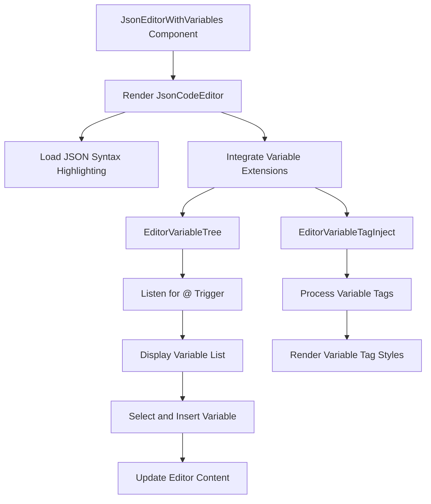

import { SourceCode } from '@theme';
import { BasicStory } from 'components/form-materials/components/json-editor-with-variables';

# JsonEditorWithVariables

JsonEditorWithVariables is an enhanced JSON editor that supports inserting variable references into JSON. Built on JsonCodeEditor, it integrates variable selectors and variable tag injection functionality, allowing users to reference variables in JSON strings using the `{{variable}}` syntax.

## Demo

### Basic Usage

<BasicStory />

```tsx pure title="form-meta.tsx"
import { JsonEditorWithVariables } from '@flowgram.ai/form-materials';

const formMeta = {
  render: () => (
    <>
      <FormHeader />
      <Field<any> name="json_editor_with_variables" defaultValue={`{ "a": {{start_0.str}} }`}>
        {({ field }) => (
          <JsonEditorWithVariables
            value={field.value}
            onChange={(value) => field.onChange(value)}
          />
        )}
      </Field>
    </>
  ),
}
```

### JSON with Variables Example

```json
{
  "user_info": {
    "name": "{{start_0.name}}",
    "email": "{{start_0.email}}",
  }
}
```

### Variable Insertion

Enter the `@` character in the editor to trigger the variable selector.

After entering `@`, a list of available variables will be displayed. Selecting a variable will automatically insert it in the `{{variable.name}}` format.

## API Reference

### JsonEditorWithVariables Props

| Property | Type | Default | Description |
|----------|------|---------|-------------|
| `value` | `string` | - | JSON string content |
| `onChange` | `(value: string) => void` | - | Callback function when content changes |
| `theme` | `'dark' \| 'light'` | `'light'` | Editor theme |
| `placeholder` | `string` | - | Placeholder text |
| `activeLinePlaceholder` | `string` | `'Press @ to select variable'` | Current line placeholder hint |
| `readonly` | `boolean` | `false` | Whether it's read-only mode |
| `options` | `Options` | - | CodeMirror configuration options |

### Variable Syntax

Use double curly brace syntax to reference variables in JSON strings:

```json
{
  "key": "{{variable.path}}"
}
```

Supported variable formats:
- `{{start_0.name}}` - Simple variable
- `{{start_0.address.city}}` - Nested property

## Source Code Guide

<SourceCode
  href="https://github.com/bytedance/flowgram.ai/tree/main/packages/materials/form-materials/src/components/json-editor-with-variables"
/>

Use CLI command to copy source code locally:

```bash
npx @flowgram.ai/cli@latest materials components/json-editor-with-variables
```

### Directory Structure Explanation

```
json-editor-with-variables/
├── index.tsx           # Lazy loading export file
├── editor.tsx          # Main component implementation
└── README.md          # Component documentation
```

### Core Implementation Explanation

#### Variable Syntax Parsing
Parse variable references in JSON through regular expressions:

```typescript
const matches = findAllMatches(originalSource, /\{\{([^\}]*)\}\}/g);
```

#### Variable Selector Integration
Integrate `EditorVariableTree` and `EditorVariableTagInject` extensions:

```typescript
<EditorVariableTree triggerCharacters={TRIGGER_CHARACTERS} />
<EditorVariableTagInject />
```

#### Trigger Character
Use `@` as the trigger character for variable selection:

```typescript
const TRIGGER_CHARACTERS = ['@'];
```

### Flowgram APIs Used

#### @flowgram.ai/coze-editor
- `JsonCodeEditor`: JSON code editor
- `transformerCreator`: Syntax transformer creator
- `EditorVariableTree`: Variable tree selector
- `EditorVariableTagInject`: Variable tag injector
- `Text`: Text processing tool

#### @flowgram.ai/i18n
- `I18n`: Internationalization support

#### coze-editor-extensions Material
- `EditorVariableTree`: Variable tree selection trigger
- `EditorVariableTagInject`: Variable tag display

### Overall Process



#### Custom Trigger Characters
Can extend support for more trigger characters:

```typescript
const CUSTOM_TRIGGERS = ['@', '#', '$'];

<JsonCodeEditor
  options={{
    transformer: customTransformer,
  }}
>
  <EditorVariableTree triggerCharacters={CUSTOM_TRIGGERS} />
</JsonCodeEditor>
```