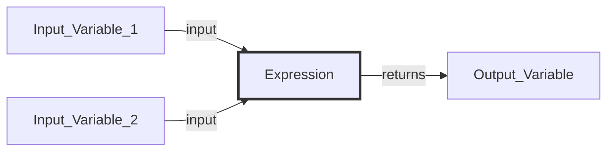
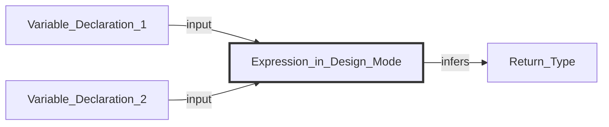
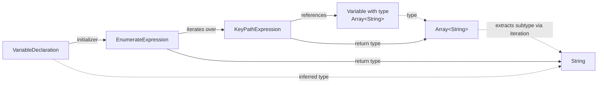
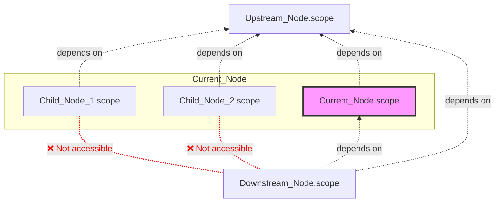
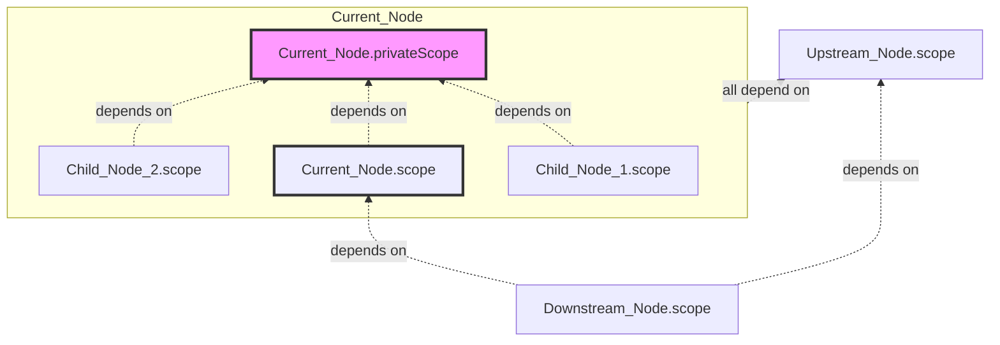
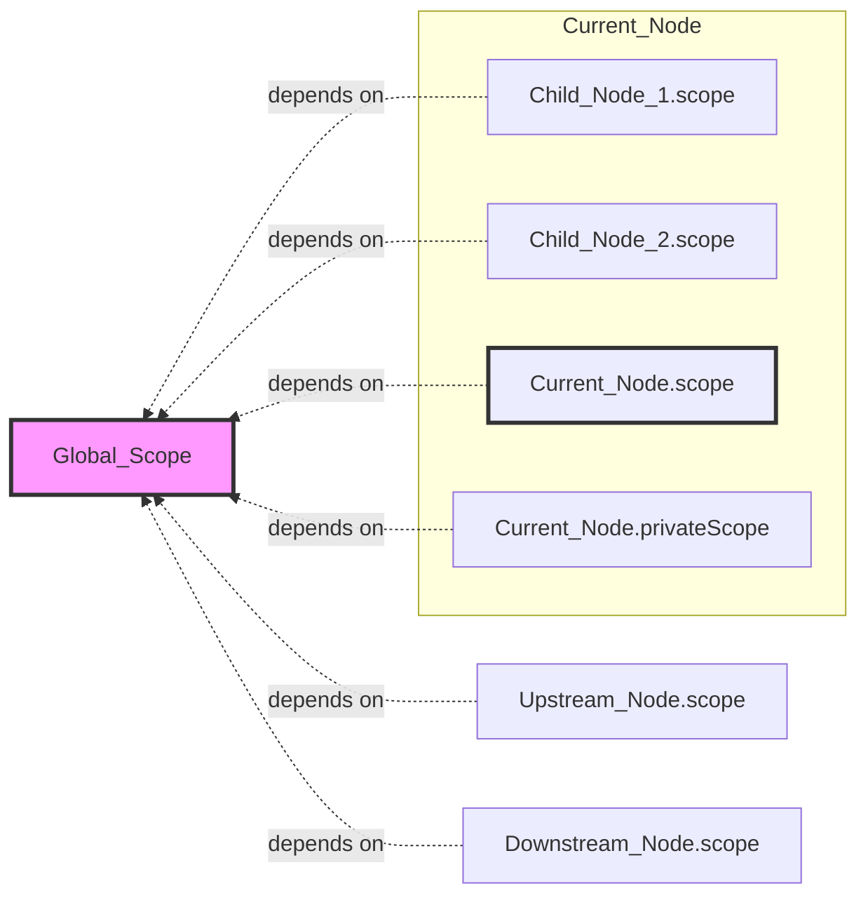

# Concepts


:::tip

The variable engine has many abstract concepts. This article uses 🌟 to mark a batch of concepts that you can **prioritize understanding**.

:::

:::info{title="📖 Quick Terminology Lookup"}

- [**Variable**](#variable) 🌟
- [**Scope**](#scope-) 🌟: A container that aggregates a series of variable information and maintains dependencies with other scopes.
- [**AST**](#ast-) 🌟: Scopes use AST to store variable information.
- [**ASTNode**](#astnode): The basic unit for storing variable information.
- [**ASTNodeJSON**](#astnodejson): The JSON representation of an ASTNode.
- [**Declaration**](#declaration) 🌟: Identifier + Definition.
- [**Type**](#type) 🌟: Constraints on the value of a variable.
- [**Expression**](#expression): Combines several variables in a specific way to return a new variable.
- [**Scope Chain**](#scope-chain): Defines which scopes' variables a scope can reference.
- [**Dependency Scope**](#dependency-scope): Which scopes' output variables a scope can access.
- [**Covering Scope**](#covering-scope): Which scopes can access the output variables of a scope.
- [**Node Scope**](#node-scope) 🌟: Can access the output variables of upstream nodes, and its output variables can also be accessed by downstream nodes.
- [**Node Private Scope**](#node-private-scope): The node's private scope can only be accessed by the node itself or its child nodes.
- [**Global Scope**](#global-scope): Variables in the global scope can be accessed by all node scopes.

:::


## Core Concepts

The core concepts of the variable engine can be summarized in the following diagram:


### Variable

See [Variable Introduction](./basic.mdx) for details.

:::warning{title="⚠️ Different Focus on Variables in Design and Runtime"}

**In process design, variables only focus on definitions, not values**. The value of a variable is dynamically calculated at the process's [runtime](/guide/runtime/introduction).

:::

### Scope 🌟

A Scope is a **container**: it aggregates a series of **variable information** and maintains **dependencies with other scopes**.

The range of a scope can be defined according to different business scenarios:

| Scene | Example |
| :--- | :--- |
| Nodes in a process can be defined as scopes |  |
| The global variable sidebar can also be defined as a scope |  |
| Components (including variables) in UI editing can be defined as scopes |  |


:::warning{title="Why does FlowGram abstract the concept of a scope outside of nodes?"}

1. A node is not equivalent to a scope.
2. Some scopes (e.g., global scope) are not related to nodes.
3. A node can have multiple scopes (e.g., loop private scope).

:::

### AST 🌟

A Scope stores variable information through an `AST`.

:::tip

You can access the `AST` tree within a scope via `scope.ast` to perform CRUD operations on variable information.

:::


#### ASTNode

`ASTNode` is the **basic information unit** used in the variable engine to **store variable information**. It can model various **variable information**, including:

- **Declarations**: such as `VariableDeclaration`, used to declare new variables.
- **Types**: such as `StringType`, used to represent the String type.
- **Expressions**: such as `KeyPathExpression`, used to reference variables.

:::info{title="ASTNode has the following features"}

- **Tree Structure**: `ASTNode` can be nested to form a tree (`AST`) to represent complex variable structures.
- **Serialization**: `ASTNode` can be converted to and from JSON format (`ASTNodeJSON`) for storage or transmission.
- **Extensibility**: New features can be added by extending the `ASTNode` base class.
- **Reactivity**: Changes in `ASTNode` values trigger events, enabling a reactive programming model.

:::

#### ASTNodeJSON

`ASTNodeJSON` is the **pure JSON serialization** representation of an `ASTNode`.

`ASTNodeJSON` includes a `kind` field to indicate the type of the `ASTNode`:

```tsx
/**
 * Equivalent to the JavaScript code:
 * `var var_index: string`
 */
{
  kind: 'VariableDeclaration',
  key: 'var_index',
  type: { kind: 'StringType' },
}
```

When using the variable engine, users describe variable information with `ASTNodeJSON`, which is then **instantiated** into an `ASTNode` by the variable engine and added to the scope.

```tsx
/**
 * Instantiate ASTNodeJSON into an ASTNode and add it to the scope using the scope.setVar method
 */
const variableDeclaration: VariableDeclaration = scope.setVar({
  kind: 'VariableDeclaration',
  key: 'var_index',
  type: { kind: 'StringType' },
});

/**
 * After ASTNodeJSON is instantiated into an ASTNode, you can listen for changes reactively
 */
variableDeclaration.onTypeChange((newType) => {
  console.log('Variable type changed', newType);
})

```

:::info{title="Concept Comparison"}

The relationship between `ASTNodeJSON` and `ASTNode` is similar to the relationship between `JSX` and `VDOM` in React.
- `ASTNodeJSON` is instantiated into `ASTNode` by the variable engine.
- `JSX` is instantiated into `VDOM` by the React engine.

:::

:::warning{title="❓ Why not use Json Schema"}

[`Json Schema`](https://json-schema.org/) is a format for describing the structure of JSON data:

- `Json Schema` only describes the type information of a variable, while `ASTNodeJSON` can also contain other information about the variable (e.g., its initial value).
- `ASTNodeJSON` can be instantiated into an `ASTNode` by the variable engine, enabling capabilities like reactive listening.
- `Json Schema` is good at describing Json types, while `ASTNodeJSON` can define more complex behaviors through custom extensions.

In terms of technical selection, the `VariableEngine` requires more powerful extension and expression capabilities. Therefore, `ASTNodeJSON` is needed to describe richer and more complex variable information, such as implementing dynamic type inference and automatic linking by defining the initial value of variables.

However, as an industry-standard format for describing JSON types, `Json Schema` has advantages in ease of use, cross-team communication, and ecosystem (e.g., ajv, zod). Therefore, we use Json Schema extensively in our [**Materials**](/materials/introduction) to lower the barrier to entry.

:::

:::tip

The variable engine provides `ASTFactory` for **type-safe** creation of `ASTNodeJSON`:

```tsx
import { ASTFactory } from '@flowgram/editor';

/**
 * Type-safely create a VariableDeclaration ASTNodeJSON
 *
 * Equivalent to:
 * {
 *   kind: 'VariableDeclaration',
 *   key: 'var_index',
 *   type: { kind: 'StringType' },
 * }
 */
ASTFactory.createVariableDeclaration({
  key: 'var_index',
  type: { kind: 'StringType' },
});
```
:::


### Declaration

Declaration = Identifier (Key) + Definition. In design mode, a declaration is an `ASTNode` that stores an identifier and its definition.

- Identifier (Key): The index for accessing the declaration.
- Definition: The information defined by the declaration. For example, a variable's definition = type + right-hand value.


:::info{title="Example: Declarations in JavaScript"}

**Variable Declaration** = Identifier + Variable Definition (Type + Initial Value)

```javascript
/**
 * Identifier: some_var
 * Variable Definition: type is number, initial value is 10
 */
const some_var: number = 10;
```

**Function Declaration** = Identifier + Function Definition (Function Parameters and Return Value + Function Body Implementation)

```javascript
/**
 * Identifier: add
 * Function Definition: parameters are two number variables a, b, and the return value is a number variable
 */
function add(a: number, b: number): number {
  return a + b;
}
```

**Struct Declaration** = Identifier + Struct Definition (Fields + Types)

```javascript
/**
 * Identifier: Point
 * Struct Definition: fields are x, y, both of type number
 */
interface Point {
  x: number;
  y: number;
}
```

:::


:::tip{title="The Role of Identifiers"}

- The `Identifier` is the **index** of a declaration, used to access the `Definition` within the declaration.
- Example: During compilation, a programming language uses the `Identifier` to find the type `Definition` of a variable for type checking.

:::


The variable engine currently only provides **variable field declaration** (`BaseVariableField`), and extends it to two types of declarations: **variable declaration** (`VariableDeclaration`) and **property declaration** (`Property`).

- Variable Field Declaration (`BaseVariableField`) = Identifier + Variable Field Definition (Type + Metadata + Initial Value)
- Variable Declaration (`VariableDeclaration`) = **Globally Unique** Identifier + Variable Definition (Type + Metadata + Initial Value + Order within Scope)
- Property Declaration (`Property`) = **Unique within Object** Identifier + Property Definition (Type + Metadata + Initial Value)


### Type

Types are used to **constrain the range of variable values**. In design mode, a type is an `ASTNode`.

The variable engine has built-in **basic types** from JSON:
- `StringType`: string
- `IntegerType`: integer
- `NumberType`: floating-point number
- `BooleanType`: boolean
- `ObjectType`: object, which can be drilled down into `Property` declarations.
- `ArrayType`: array, which can be drilled down into other types.

It also adds:
- `MapType`: key-value pairs, where both keys and values can have type definitions.
- `CustomType`: can be custom extended by the user, such as date, time, file types, etc.

### Expression

An expression takes **0 or more variables as input**, computes them in a **specific way**, and returns a new **variable**.



In **design mode**, an expression is an `ASTNode`. In modeling, we only need to focus on:

- Which variable declarations does the expression **use**?
- How is the expression's **return type** inferred?




:::info{title="Example: Expression Inference in Design Mode"}

Suppose we have an expression described in JavaScript code as `ref_var + 1`.

Which variable declarations does the expression **use**?
- The variable declaration corresponding to the `ref_var` identifier.

How is the expression's **return type** inferred?
- If the type of `ref_var` is `IntegerType`, the return type of `ref_var + 1` is `IntegerType`.
- If the type of `ref_var` is `NumberType`, the return type of `ref_var + 1` is `NumberType`.
- If the type of `ref_var` is `StringType`, the return type of `ref_var + 1` is `StringType`.

:::

:::info{title="Example: How the Variable Engine Implements Type Inference + Linking"}

<div style={{  }}>
  <div style={{ width: 500 }}>
     
  </div>

  <div style={{ minWidth: 500 }}>


The figure shows a common example: a batch processing node references the output variable of a preceding node, iterates over it, and obtains an `item` variable. The type of the `item` variable automatically changes with the type of the output variable of the preceding node.

The ASTNodeJSON for this example can be represented as:

```tsx
ASTFactory.createVariableDeclaration({
  key: 'item',
  initializer: ASTFactory.createEnumerateExpression({
    enumerateFor: ASTFactory.createKeyPathExpression({
      keyPath: ['start_0', 'arr']
    })
  })
})
```

The type inference chain is as follows:


  </div>
</div>


:::


### Scope Chain

The Scope Chain defines **which scopes' variables a scope can reference**. It is an abstract class, and specific business scenarios can implement custom scope chains.

The variable engine has built-in implementations for two types of scope chains: **free-layout scope chain** and **fixed-layout scope chain**.


#### Dependency Scope

`Dependency Scope` = Which scopes' output variables a scope can access.

You can access a scope's `Dependency Scope` via `scope.depScopes`.


#### Covering Scope

`Covering Scope` = Which scopes can access the output variables of a scope.

You can access a scope's `Covering Scope` via `scope.coverScopes`.


## Variables in the Canvas

FlowGram defines the following special types of scopes in the canvas:

### Node Scope

Also known as `Node Public Scope`, this scope can access the variables of the `Node Scope` of **upstream nodes**, and its output variable declarations can also be accessed by the `Node Scope` of **downstream nodes**.

The `Node Scope` can be set and retrieved via `node.scope`. Its scope chain relationship is shown in the figure below:



:::warning

In the default scope logic, the output variables of a child node's `Node Scope` cannot be accessed by the **downstream nodes of the parent node**.

:::


### Node Private Scope

The output variables of a `Node Private Scope` can only be accessed within the **current node's** `Node Scope` and its **child nodes'** `Node Scope`. This is similar to the concept of `private variables` in programming languages.

The `Node Private Scope` can be set and retrieved via `node.privateScope`. Its scope chain relationship is shown in the figure below:




### Global Scope

Variables in the `Global Scope` can be accessed by **all node scopes and node private scopes**, but it cannot access variables from other scopes.

For how to set the global scope, see [Output Global Variables](./variable-output#output-global-variables). Its scope chain relationship is shown in the figure below:




## Overall Architecture


The variable engine is designed following the DIP (Dependency Inversion Principle) and is divided into three layers according to code stability, abstraction level, and proximity to the business:

### Variable Abstraction Layer

This is the highest abstraction level in the variable architecture and the most stable part of the code. The abstraction layer defines abstract classes for core concepts such as `ASTNode`, `Scope`, and `ScopeChain`.

### Variable Implementation Layer

This part of the variable architecture changes more frequently and may be adjusted for different business needs. The engine has a built-in set of stable `ASTNode` implementations and `ScopeChain` implementations. When users have complex variable requirements, they can register new `ASTNode`s or override existing `ASTNode`s through dependency injection for customization.

### Variable Material Layer

Based on the Facade pattern, this layer improves the usability of variables by encapsulating complex variable logic into simple, out-of-the-box variable materials.

- For the use of variable materials, see: [Materials](/materials/introduction)
