# Concepts


:::tip

Complete [Output Variables](./variable-output.mdx) → [Consume Variables](./variable-consume.mdx) first, then come back to this article as a reference manual. We use 🌟 to highlight concepts worth mastering early.

:::

## Reading Path

- Skim the terminology navigator below to confirm the term you need is covered.
- Study the “Core Concepts” diagram to link variables, scopes, and AST into one picture.
- Jump to the sections you need based on the problem at hand—no need to read in order.

:::info{title="📖 Quick Terminology Lookup"}

- **Core Ideas**
  - [Variable](#variable) 🌟: A data container defined during design and evaluated at runtime.
  - [Scope](#scope-) 🌟: A container for variables that also maintains relationships with other scopes.
  - [AST](#ast-) 🌟: The structured storage used to keep variable information inside a scope.
- **AST Related**
  - [ASTNode](#astnode): Nodes in the AST tree, each describing a piece of variable information.
  - [ASTNodeJSON](#astnodejson): The JSON serialization of an ASTNode.
  - [Declaration](#declaration) 🌟: Identifier + definition, the smallest information unit in the variable engine.
  - [Type](#type) 🌟: A definition that constrains the range of possible values for a variable.
  - [Expression](#expression): Consumes variables and produces a new one.
- **Scope Relationships**
  - [Scope Chain](#scope-chain): Determines which other scopes a scope can read variables from.
  - [Dependency Scope](#dependency-scope): The upstream scopes whose outputs are readable here.
  - [Covering Scope](#covering-scope): The downstream scopes that can read this scope’s outputs.
  - [Node Scope](#node-scope) 🌟: The public variable set of a node.
  - [Node Private Scope](#node-private-scope): Variables only accessible to the node and its children.
  - [Global Scope](#global-scope): Shared variables readable from every scope.

:::


## Core Concepts

You can connect the variable engine’s core concepts through the diagram below:


:::info{title="How to read the diagram"}

- Green nodes represent **what the information is**, such as variables, types, or expressions.
- Red nodes represent **how the information is stored**, namely AST nodes.
- Purple nodes represent **where the information lives**, i.e., scopes.
- Dashed nodes and lines depict **how the information flows**, which is the scope chain.

:::

To keep things tangible, hold on to one real-world case:

> A “Batch” node reads the array output from an upstream HTTP node → iterates to produce `item` → and continues using `item` inside its child nodes.

Every concept mentioned in that workflow appears below, so feel free to cross-reference as you read.


### Variable

Variables are containers defined during design time and evaluated during runtime. See [Variable Introduction](./basic.mdx) for a deeper primer.

:::warning{title="⚠️ Different Focus on Variables in Design and Runtime"}

**In process design, variables only focus on definitions, not values**. The value of a variable is dynamically calculated at the process's [runtime](/guide/runtime/introduction).

:::

### Scope 🌟

A scope is a **container** that bundles **variable information** and keeps track of **relationships with other scopes**. In short, a scope decides “who can access which variables.”

Its boundaries vary by business scenario; the three most common cases are:

| Scene | Example |
| :--- | :--- |
| Nodes in a process can be defined as scopes |  |
| The global variable sidebar can also be defined as a scope |  |
| Components (including variables) in UI editing can be defined as scopes |  |


:::warning{title="Why does FlowGram abstract the concept of a scope outside of nodes?"}

1. Node ≠ scope: a single node may need both a public scope and a private one.
2. Some scopes, like the global drawer, live outside of any node.
3. Certain nodes require multiple layers of scopes (e.g., a loop’s private scope), which can’t be expressed with the node concept alone.

:::

### AST 🌟

Scopes store variable information through an `AST`. Treat it as a tree where each node describes a declaration, type, or expression.

:::tip

Through `scope.ast` you can access the tree inside a scope and perform CRUD operations on variable information.

:::


#### ASTNode

`ASTNode` is the **basic information unit** used in the variable engine to **store variable information**. It can model various **pieces of information**:

- **Declarations**: such as `VariableDeclaration`, used to declare new variables.
- **Types**: such as `StringType`, used to represent the String type.
- **Expressions**: such as `KeyPathExpression`, used to reference variables.

:::info{title="ASTNode has the following features"}

- **Tree Structure**: `ASTNode` can be nested to form a tree (`AST`) to represent complex variable structures.
- **Serialization**: `ASTNode` can be converted to and from JSON format (`ASTNodeJSON`) for storage or transmission.
- **Extensibility**: New features can be added by extending the `ASTNode` base class.
- **Reactivity**: Changes in `ASTNode` values trigger events, enabling a reactive programming model.

:::

#### ASTNodeJSON

`ASTNodeJSON` is the **pure JSON serialization** of an `ASTNode`. We usually construct it on the design side and let the variable engine instantiate it later.

Its most important field is `kind`, which indicates the type of the `ASTNode`:

```tsx
/**
 * Equivalent to the JavaScript code:
 * `var var_index: string`
 */
{
  kind: 'VariableDeclaration',
  key: 'var_index',
  type: { kind: 'StringType' },
}
```

When using the variable engine, we describe variable information with `ASTNodeJSON`. The engine then **instantiates** it into an `ASTNode` and stores it in the scope.

```tsx
/**
 * Instantiate ASTNodeJSON into an ASTNode and add it to the scope using the scope.setVar method
 */
const variableDeclaration: VariableDeclaration = scope.setVar({
  kind: 'VariableDeclaration',
  key: 'var_index',
  type: { kind: 'StringType' },
});

/**
 * After ASTNodeJSON is instantiated into an ASTNode, you can listen for changes reactively
 */
variableDeclaration.onTypeChange((newType) => {
  console.log('Variable type changed', newType);
})

```

:::info{title="Concept Comparison"}

The relationship between `ASTNodeJSON` and `ASTNode` is similar to the relationship between `JSX` and `VDOM` in React.
- `ASTNodeJSON` is instantiated into `ASTNode` by the variable engine.
- `JSX` is instantiated into `VDOM` by the React engine.

:::

:::warning{title="❓ Why not use Json Schema"}

[`Json Schema`](https://json-schema.org/) is a format for describing the structure of JSON data:

- `Json Schema` only describes the type information of a variable, while `ASTNodeJSON` can also contain other information about the variable (e.g., its initial value).
- `ASTNodeJSON` can be instantiated into an `ASTNode` by the variable engine, enabling capabilities like reactive listening.
- `Json Schema` is good at describing Json types, while `ASTNodeJSON` can define more complex behaviors through custom extensions.

In terms of technical selection, the `VariableEngine` requires more powerful extension and expression capabilities. Therefore, `ASTNodeJSON` is needed to describe richer and more complex variable information, such as implementing dynamic type inference and automatic linking by defining the initial value of variables.

However, as an industry-standard format for describing JSON types, `Json Schema` has advantages in ease of use, cross-team communication, and ecosystem (e.g., ajv, zod). Therefore, we use Json Schema extensively in our [**Materials**](/materials/introduction) to lower the barrier to entry.

:::

:::tip

The variable engine provides `ASTFactory` for **type-safe** creation of `ASTNodeJSON`:

```tsx
import { ASTFactory } from '@flowgram/editor';

/**
 * Type-safely create a VariableDeclaration ASTNodeJSON
 *
 * Equivalent to:
 * {
 *   kind: 'VariableDeclaration',
 *   key: 'var_index',
 *   type: { kind: 'StringType' },
 * }
 */
ASTFactory.createVariableDeclaration({
  key: 'var_index',
  type: { kind: 'StringType' },
});
```
:::


### Declaration 🌟

Declaration = Identifier (Key) + Definition. In design mode, a declaration is an `ASTNode` that stores an identifier plus variable information—the smallest unit that can be referenced.

- Identifier (Key): The index used to access a declaration.
- Definition: The information carried by the declaration. For a variable, the definition = type + right-hand value.


:::info{title="Example: Declarations in JavaScript"}

**Variable Declaration** = Identifier + Variable Definition (Type + Initial Value)

```javascript
/**
 * Identifier: some_var
 * Variable Definition: type is number, initial value is 10
 */
const some_var: number = 10;
```

**Function Declaration** = Identifier + Function Definition (Function Parameters and Return Value + Function Body Implementation)

```javascript
/**
 * Identifier: add
 * Function Definition: parameters are two number variables a, b, and the return value is a number variable
 */
function add(a: number, b: number): number {
  return a + b;
}
```

**Struct Declaration** = Identifier + Struct Definition (Fields + Types)

```javascript
/**
 * Identifier: Point
 * Struct Definition: fields are x, y, both of type number
 */
interface Point {
  x: number;
  y: number;
}
```

:::


:::tip{title="The Role of Identifiers"}

- The `Identifier` is the **index** of a declaration, used to access the `Definition` within the declaration.
- Example: During compilation, a programming language uses the `Identifier` to find the type `Definition` of a variable for type checking.

:::


The variable engine currently only provides **variable field declaration** (`BaseVariableField`), and extends it to two types of declarations: **variable declaration** (`VariableDeclaration`) and **property declaration** (`Property`).

- Variable Field Declaration (`BaseVariableField`) = Identifier + Variable Field Definition (Type + Metadata + Initial Value)
- Variable Declaration (`VariableDeclaration`) = **Globally Unique** Identifier + Variable Definition (Type + Metadata + Initial Value + Order within Scope)
- Property Declaration (`Property`) = **Unique within Object** Identifier + Property Definition (Type + Metadata + Initial Value)


### Type 🌟

Types **constrain the range of variable values**. In design mode, a type is also an `ASTNode`. Understanding types helps you reason about what a variable can store and what an expression returns.

The variable engine has built-in **basic types** from JSON:
- `StringType`: string
- `IntegerType`: integer
- `NumberType`: floating-point number
- `BooleanType`: boolean
- `ObjectType`: object, which can be drilled down into `Property` declarations.
- `ArrayType`: array, which can be drilled down into other types.

It also adds:
- `MapType`: key-value pairs, where both keys and values can have type definitions.
- `CustomType`: can be custom extended by the user, such as date, time, file types, etc.

### Expression

An expression takes **0 or more variables as input**, processes them in a **specific way**, and returns a new **variable**. Design time only records “who it depends on” and the inferred return type—runtime handles the actual value calculation.


In **design mode**, an expression is an `ASTNode`. Modeling focuses on:

- Which variable declarations does the expression **use**?
- How is the expression's **return type** inferred?


:::info{title="Example: Expression Inference in Design Mode"}

Suppose we have an expression described in JavaScript code as `ref_var + 1`.

Which variable declarations does the expression **use**?
- The variable declaration corresponding to the `ref_var` identifier.

How is the expression's **return type** inferred?
- If the type of `ref_var` is `IntegerType`, the return type of `ref_var + 1` is `IntegerType`.
- If the type of `ref_var` is `NumberType`, the return type of `ref_var + 1` is `NumberType`.
- If the type of `ref_var` is `StringType`, the return type of `ref_var + 1` is `StringType`.

:::

:::info{title="Example: How the Variable Engine Implements Type Inference + Linking"}

<div style={{  }}>
  <div style={{ width: 500 }}>
     
  </div>

  <div style={{ minWidth: 500 }}>


The figure shows a common example: a batch processing node references the output variable of a preceding node, iterates over it, and obtains an `item` variable. The type of the `item` variable automatically changes with the type of the output variable of the preceding node.

The ASTNodeJSON for this example can be represented as:

```tsx
ASTFactory.createVariableDeclaration({
  key: 'item',
  initializer: ASTFactory.createEnumerateExpression({
    enumerateFor: ASTFactory.createKeyPathExpression({
      keyPath: ['start_0', 'arr']
    })
  })
})
```

The type inference chain is as follows:


  </div>
</div>


:::


### Scope Chain

The scope chain defines **which other scopes a scope can read variables from**. Think of it as the whitelist for variable access. The variable engine exposes an abstract class, and product teams can implement custom scope chains as needed.

Out of the box, the engine ships with **free-layout** and **fixed-layout** scope chain implementations.


#### Dependency Scope

`Dependency scope` = the upstream scopes whose output variables the current scope can access.

You can access a scope's `Dependency Scope` via `scope.depScopes`.


#### Covering Scope

`Covering scope` = the downstream scopes that can access the current scope’s output variables.

You can access a scope's `Covering Scope` via `scope.coverScopes`.


## Variables in the Canvas

FlowGram defines the following special types of scopes in the canvas:

### Node Scope 🌟

Also known as `Node Public Scope`, this scope can access the variables of the `Node Scope` of **upstream nodes**, and its output variable declarations can also be accessed by the `Node Scope` of **downstream nodes**.

The `Node Scope` can be set and retrieved via `node.scope`. Its scope chain relationship is shown in the figure below:

```mermaid
graph BT

  subgraph Current_Node
    Child_Node_1.scope
    Child_Node_2.scope
    Current_Node.scope
  end

  Child_Node_1.scope -.depends on.-> Upstream_Node.scope
  Child_Node_2.scope -.depends on.-> Upstream_Node.scope
  Current_Node.scope -.depends on.-> Upstream_Node.scope
  Downstream_Node.scope -.depends on.-> Upstream_Node.scope
  Downstream_Node.scope -.depends on.-> Current_Node.scope

  Downstream_Node.scope -.-|"<font color=red>❌ Not accessible</font>"| Child_Node_1.scope
  Downstream_Node.scope -.-|"<font color=red>❌ Not accessible</font>"| Child_Node_2.scope

  linkStyle 5 stroke:red,stroke-width:2px
  linkStyle 6 stroke:red,stroke-width:2px


  style Current_Node.scope fill:#f9f,stroke:#333,stroke-width:3px
```



:::warning

In the default scope logic, the output variables of a child node's `Node Scope` cannot be accessed by the **downstream nodes of the parent node**.

:::


### Node Private Scope

The output variables of a `Node Private Scope` can only be accessed within the **current node's** `Node Scope` and its **child nodes'** `Node Scope`. This is similar to the concept of `private variables` in programming languages.

The `Node Private Scope` can be set and retrieved via `node.privateScope`. Its scope chain relationship is shown in the figure below:


### Global Scope

Variables in the `Global Scope` are readable from **all node scopes and node private scopes**, yet the global scope itself **does not depend on any other scope**. It’s ideal for configuration, constants, environment context, and other shared data.

For how to set the global scope, see [Output Global Variables](./variable-output#output-global-variables). Its scope chain relationship is shown in the figure below:


## Overall Architecture


The variable engine follows the Dependency Inversion Principle (DIP) and is split into three layers according to code stability, abstraction level, and proximity to business logic:

### Variable Abstraction Layer

This abstraction layer is the most stable part of the architecture. It defines the core interfaces—`ASTNode`, `Scope`, `ScopeChain`, and more—that upper layers extend.

### Variable Implementation Layer

This layer sits closer to product requirements and evolves more often. The engine provides a set of built-in `ASTNode` and `ScopeChain` implementations, and you can register new ones or override defaults via dependency injection when your domain demands it.

### Variable Material Layer

The outermost layer adopts the Facade pattern to boost usability, packaging complex capabilities into “materials” that can be reused directly.

- For the use of variable materials, see: [Materials](/materials/introduction)
