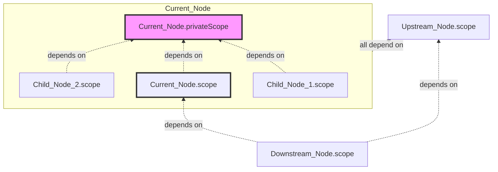

# Outputting Variables

We mainly divide output variables into three categories:

1. **Output Node Variables**: Usually as the output of that node for subsequent nodes to use.
2. **Output Node Private Variables**: Output variables are limited to the inside of the node (including child nodes) and cannot be accessed by external nodes.
3. **Output Global Variables**: Runs through the entire process, and any node can read it. It is suitable for storing some public states or configurations.

## Outputting Node Variables

Outputting a node variable means that this variable is bound to the life cycle of the current node. When the node is created, the variable is born; when the node is deleted, the variable also disappears.

We usually have three ways to output node variables:

### Method 1: Sync via Form Side Effects

[Form Side Effects](/guide/form/form#副作用-effect) are usually configured in the node's `form-meta.ts` file and are the most common way to define node output variables.

#### `provideJsonSchemaOutputs` Material

If the structure of the output variable required by the node matches the [JSON Schema](https://json-schema.org/) structure, you can use the `provideJsonSchemaOutputs` side effect (Effect) material.

It is very simple to use, just add two lines of configuration in the `effect` of `formMeta`:

```tsx pure title="form-meta.ts"
import {
  syncVariableTitle,
  provideJsonSchemaOutputs,
} from '@flowgram.ai/form-materials';

export const formMeta = {
  effect: {
    title: syncVariableTitle, // Variable title is automatically synchronized
    outputs: provideJsonSchemaOutputs,
  },
};
```

#### Via `createEffectFromVariableProvider`

`provideJsonSchemaOutputs` only adapts to `JsonSchema`. If you want to define your own set of Schema, then you need to customize the side effects of the form.

:::note

Flowgram provides `createEffectFromVariableProvider`, you only need to define a `parse` function to customize your own variable synchronization side effects:
- `parse` will be called when the form value is initialized and updated
- The input of `parse` is the value of the current field's form
- The output of `parse` is the variable AST information

:::

In the following example, we create output variables for the two fields of the form `path.to.value` and `path.to.value2`:

```tsx pure title="form-meta.ts"
import {
  createEffectFromVariableProvider,
  ASTFactory,
  type ASTNodeJSON
} from '@flowgram.ai/fixed-layout-editor';

export function createTypeFromValue(value: string): ASTNodeJSON | undefined {
  switch (value) {
    case 'string':
      return ASTFactory.createString();
    case 'number':
      return ASTFactory.createNumber();
    case 'boolean':
      return ASTFactory.createBoolean();
    case 'integer':
      return ASTFactory.createInteger();

    default:
      return;
  }
}

export const formMeta =  {
  effect: {
    // Create first variable
    // = node.scope.setVar('path.to.value', ASTFactory.createVariableDeclaration(parse(v)))
    'path.to.value': createEffectFromVariableProvider({
      // parse form value to variable
      parse(v: string) {
        return {
          meta: {
            title: `Your Output Variable Title`,
          },
          key: `uid_${node.id}`,
          type: createTypeFromValue(v)
        }
      }
    }),
    // Create second variable
    // = node.scope.setVar('path.to.value2', ASTFactory.createVariableDeclaration(parse(v)))
    'path.to.value2': createEffectFromVariableProvider({
      // parse form value to variable
      parse(v: string) {
        return {
          meta: {
            title: `Your Output Variable Title 2`,
          },
          key: `uid_${node.id}_2`,
          type: createTypeFromValue(v)
        }
      }
    }),
  },
  render: () => (
    // ...
  )
}
```

#### Syncing multiple form fields to one variable

If multiple fields are synchronized to one variable, you need to use the `namespace` field of `createEffectFromVariableProvider` to synchronize the variable data of multiple fields to the same namespace.

```tsx pure title="form-meta.ts"
import {
  createEffectFromVariableProvider,
  ASTFactory,
} from '@flowgram.ai/fixed-layout-editor';

/**
 * Get information of multiple fields from the form
 */
const variableSyncEffect = createEffectFromVariableProvider({
  // Must be added to ensure that the side effects of different fields are synchronized to the same namespace
  namespace: 'your_namespace',

  // Parse the form value into a variable
  parse(_, { form, node }) {
    return {
      meta: {
        title: `Your Output Variable Title`,
      },
      key: `uid_${node.id}`,
      type: createTypeFromValue({
        value1: form.getValueIn('path.to.value'),
        value2: form.getValueIn('path.to.value2'),
      })
    }
  }
})

export const formMeta = {
  effect: {
    'path.to.value': variableSyncEffect,
    'path.to.value2': variableSyncEffect,
  },
  render: () => (
   // ...
  )
}
```

#### Using the `node.scope` API in Side Effects

If `createEffectFromVariableProvider` does not meet your needs, you can also directly use the `node.scope` API in form side effects for more flexible and variable operations.

:::note

`node.scope` will return a node's variable scope (Scope) object, which has several core methods:

- `setVar(variable)`: Set a variable.
- `setVar(namespace, variable)`: Set a variable under the specified namespace.
- `getVar()`: Get all variables.
- `getVar(namespace)`: Get the variables under the specified namespace.
- `clearVar()`: Clear all variables.
- `clearVar(namespace)`: Clear the variables under the specified namespace.

:::


```tsx pure title="form-meta.tsx"
import { Effect } from '@flowgram.ai/editor';

export const formMeta = {
  effect: {
    'path.to.value': [{
      event: DataEvent.onValueInitOrChange,
      effect: ((params) => {
        const { context, value } = params;

        context.node.scope.setVar(
          ASTFactory.createVariableDeclaration({
            meta: {
              title: `Your Output Variable Title`,
            },
            key: `uid_${node.id}`,
            type: createTypeFromValue(value),
          })
        )

        console.log("View generated variables", context.node.scope.getVar())

      }) as Effect,
    }],
    'path.to.value2': [{
      event: DataEvent.onValueInitOrChange,
      effect: ((params) => {
        const { context, value } = params;

        context.node.scope.setVar(
          'namespace_2',
          ASTFactory.createVariableDeclaration({
            meta: {
              title: `Your Output Variable Title 2`,
            },
            key: `uid_${node.id}_2`,
            type: createTypeFromValue(value),
          })
        )

        console.log("View generated variables", context.node.scope.getVar('namespace_2'))

      }) as Effect,
    }],
  },
  render: () => (
    // ...
  )
}
```


### Method 2: Sync Variables via Plugins

In addition to static configuration in the form, we can also freely and dynamically operate the variables of the node in the plugin (Plugin) through `node.scope`.


#### Update the Scope of the specified node

The following example demonstrates how to get the `Scope` of the start node in the `onInit` life cycle of the plugin and perform a series of operations on its variables.

```tsx pure title="sync-variable-plugin.tsx"
import {
  FlowDocument,
  definePluginCreator,
  PluginCreator,
} from '@flowgram.ai/fixed-layout-editor';

export const createSyncVariablePlugin: PluginCreator<SyncVariablePluginOptions> =
  definePluginCreator<SyncVariablePluginOptions, FixedLayoutPluginContext>({
    onInit(ctx, options) {
      const startNode = ctx.get(FlowDocument).getNode('start_0');
      const startScope =  startNode.scope!

      // Set Variable For Start Scope
      startScope.setVar(
        ASTFactory.createVariableDeclaration({
          meta: {
            title: `Your Output Variable Title`,
          },
          key: `uid`,
          type: ASTFactory.createString(),
        })
      )
    }
  })
```

#### Sync variables in onNodeCreate

The following example demonstrates how to get the Scope of a newly created node through `onNodeCreate` and synchronize variables by listening to `node.form.onFormValuesChange`.

```tsx pure title="sync-variable-plugin.tsx"
import {
  FlowDocument,
  definePluginCreator,
  PluginCreator,
} from '@flowgram.ai/fixed-layout-editor';

export const createSyncVariablePlugin: PluginCreator<SyncVariablePluginOptions> =
  definePluginCreator<SyncVariablePluginOptions, FixedLayoutPluginContext>({
    onInit(ctx, options) {
      ctx.get(FlowDocument).onNodeCreate(({ node }) => {
        const syncVariable = (title: string) => {
          node.scope?.setVar(
            ASTFactory.createVariableDeclaration({
              key: `uid_${node.id}`,
              meta: {
                title,
                icon: iconVariable,
              },
              type: ASTFactory.createString(),
            })
          );
        };

        if (node.form) {
          // sync variable on init
          syncVariable(node.form.getValueIn('title'));

          // listen to form values change
          node.form?.onFormValuesChange(({ values, name }) => {
            // title field changed
            if (name.match(/^title/)) {
              syncVariable(values[name]);
            }
          });
        }
      });
    }
  })
```

### Method 3: Sync Variables in UI (Not Recommended)

:::warning
Directly synchronizing variables in the UI (Method 3) is a highly discouraged practice.

It breaks the principle of **separation of data and rendering**, leading to tight coupling between data and rendering:

- **Unable to sync variables without UI**: Variables cannot be updated independently without the UI, leading to inconsistencies between data and rendering.
- **Increased code complexity**: Directly manipulating variables in the UI increases the complexity of the UI logic, making the code harder to maintain.
- **Performance issues**: Variable synchronization operations may trigger unnecessary re-rendering of UI components.

:::

```tsx pure title="form-meta.ts"
import {
  createEffectFromVariableProvider,
  ASTFactory,
} from '@flowgram.ai/fixed-layout-editor';

/**
 * Get information of multiple fields from the form
 */
const FormRender = () => {
  /**
   * Get the current scope for subsequent variable setting
   */
  const scope = useCurrentScope()

  return <>
    <UserCustomForm
      onValuesChange={(values) => {
        scope.setVar(
          ASTFactory.createVariableDeclaration({
            meta: {
              title: values.title,
            },
            key: `uid`,
            type: ASTFactory.createString(),
          })
        )
      }}
    />
  </>
}

export const formMeta = {
  render: () => <FormRender />
}
```

## Outputting Node Private Variables

Private variables are variables that can only be accessed within the current node and its child nodes.

Private variables can be set and obtained through the private scope `node.privateScope`. Its scope chain relationship is shown in the following figure:



Only two of the methods are listed below, and other methods can be deduced from the [Output Node Variables](#outputting-node-variables) method.

### Method 1: Via `createEffectFromVariableProvider`

`createEffectFromVariableProvider` provides the parameter `scope` to specify the scope of the variable.
- When `scope` is set to `private`, the scope of the variable is the private scope of the current node `node.privateScope`
- When `scope` is set to `public`, the scope of the variable is the scope of the current node `node.scope`

```tsx pure title="form-meta.ts"
import {
  createEffectFromVariableProvider,
  ASTFactory,
} from '@flowgram.ai/fixed-layout-editor';

export const formMeta =  {
  effect: {
    // Create variable in privateScope
    // = node.privateScope.setVar('path.to.value', ASTFactory.createVariableDeclaration(parse(v)))
    'path.to.value': createEffectFromVariableProvider({
      scope: 'private',
      // parse form value to variable
      parse(v: string) {
        return {
          meta: {
            title: `Your Private Variable Title`,
          },
          key: `uid_${node.id}_locals`,
          type: createTypeFromValue(v)
        }
      }
    }),
  },
  render: () => (
    // ...
  )
}
```


### Method 2: Via `node.privateScope`


The API of `node.privateScope` is designed to be almost identical to the node scope (`node.scope`), providing methods such as `setVar`, `getVar`, `clearVar`, and also supporting namespaces. For details, please refer to [`node.scope`](#using-the-nodescope-api-in-side-effects).


```tsx pure title="form-meta.tsx"
import { Effect } from '@flowgram.ai/editor';

export const formMeta = {
  effect: {
    'path.to.value': [{
      event: DataEvent.onValueInitOrChange,
      effect: ((params) => {
        const { context, value } = params;

        context.node.privateScope.setVar(
          ASTFactory.createVariableDeclaration({
            meta: {
              title: `Your Private Variable Title`,
            },
            key: `uid_${node.id}`,
            type: createTypeFromValue(value),
          })
        )

        console.log("View generated variables", context.node.privateScope.getVar())

      }) as Effect,
    }],
  },
  render: () => (
    // ...
  )
}
```


## Outputting Global Variables

Global variables are like the "shared memory" of the entire process, which can be accessed and modified by any node and any plugin. It is very suitable for storing some states that run through, such as user information, environment configuration, and so on.

Similar to node variables, we also have two main ways to obtain the scope of global variables (`GlobalScope`).

### Method 1: Obtain in Plugin

In the context of the plugin (`ctx`), we can directly "inject" the instance of `GlobalScope`:


```tsx pure title="global-variable-plugin.tsx"
import {
  GlobalScope,
  definePluginCreator,
  PluginCreator
} from '@flowgram.ai/fixed-layout-editor';


export const createGlobalVariablePlugin: PluginCreator<SyncVariablePluginOptions> =
  definePluginCreator<SyncVariablePluginOptions, FixedLayoutPluginContext>({
    onInit(ctx, options) {
      const globalScope = ctx.get(GlobalScope)

      globalScope.setVar(
         ASTFactory.createVariableDeclaration({
          meta: {
            title: `Your Output Variable Title`,
          },
          key: `your_variable_global_unique_key`,
          type: ASTFactory.createString(),
        })
      )
    }
  })

```


### Method 2: Obtain in UI

If you want to interact with global variables in the React component of the canvas, you can use the `useService` Hook to get the instance of `GlobalScope`:

```tsx pure title="global-variable-component.tsx"
import {
  GlobalScope,
  useService,
} from '@flowgram.ai/fixed-layout-editor';

function GlobalVariableComponent() {

  const globalScope = useService(GlobalScope)

  // ...

  const handleChange = (v: string) => {
    globalScope.setVar(
      ASTFactory.createVariableDeclaration({
        meta: {
          title: `Your Output Variable Title`,
        },
        key: `uid_${v}`,
        type: ASTFactory.createString(),
      })
    )
  }

  return <Input onChange={handleChange}/>
}

```


### API of Global Scope

The API of `GlobalScope` is designed to be almost identical to the node scope (`node.scope`), providing methods such as `setVar`, `getVar`, `clearVar`, and also supporting namespaces. For details, please refer to [`node.scope`](#using-the-nodescope-api-in-side-effects).

Here is a comprehensive example of operating global variables in a plugin:

```tsx pure title="sync-variable-plugin.tsx"
import {
  GlobalScope,
} from '@flowgram.ai/fixed-layout-editor';

// ...

onInit(ctx, options) {
  const globalScope = ctx.get(GlobalScope);

  // 1. Create, Update, Read, Delete Variable in GlobalScope
  globalScope.setVar(
    ASTFactory.createVariableDeclaration({
      meta: {
        title: `Your Output Variable Title`,
      },
      key: `your_variable_global_unique_key`,
      type: ASTFactory.createString(),
    })
  )

  console.log(globalScope.getVar())

  globalScope.clearVar()


  // 2.  Create, Update, Read, Delete Variable in GlobalScope's namespace: 'namespace_1'
    globalScope.setVar(
      'namespace_1',
      ASTFactory.createVariableDeclaration({
        meta: {
          title: `Your Output Variable Title 2`,
        },
        key: `uid_2`,
        type: ASTFactory.createString(),
      })
  )

  console.log(globalScope.getVar('namespace_1'))

  globalScope.clearVar('namespace_1')

  // ...
}
```

See also: [Class: GlobalScope](https://flowgram.ai/auto-docs/editor/classes/GlobalScope.html)
