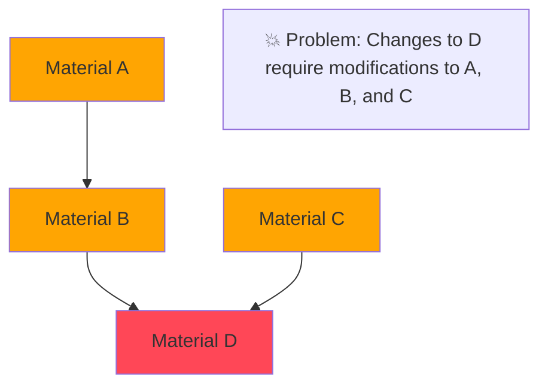
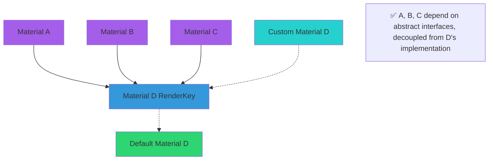
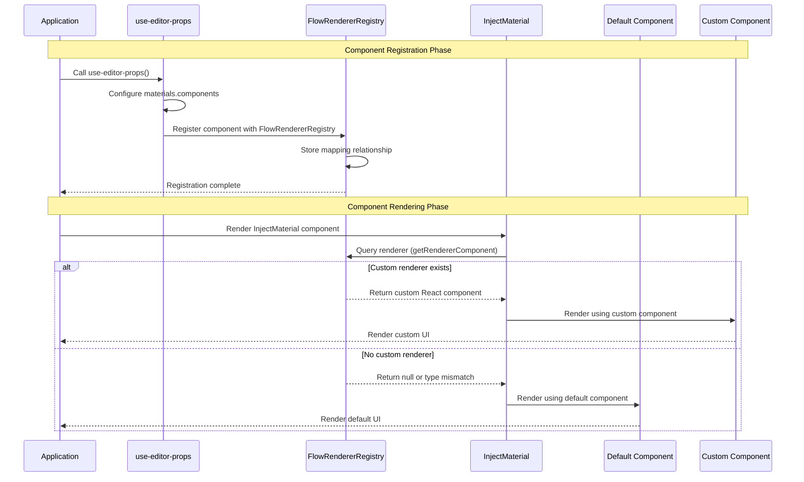

import { SourceCode } from '@theme';

# Material Dependency Injection

:::tip{title="Component Materials Supporting Dependency Injection in the Material Library"}

- [InjectDynamicValueInput](../components/dynamic-value-input)
- [InjectTypeSelector](../components/type-selector)
- [InjectVariableSelector](../components/variable-selector)

:::

## Background: Why Does the Material Library Need Dependency Injection?

### ❌ Tight Coupling: Traditional Dependency Problems



**Issues:** Chain reactions, high maintenance costs

### ✅ Decoupling: Dependency Injection Solution



**Advantages:** Hot-swappable, parallel development, version compatibility

## Usage

### Creating Injectable Component Materials

```tsx
import { createInjectMaterial } from '@flowgram.ai/form-materials';
import { VariableSelector } from './VariableSelector';

// Wrap the component using the createInjectMaterial higher-order component
const InjectVariableSelector = createInjectMaterial(VariableSelector);

// Now you can use it like a normal component
function MyComponent() {
  return <InjectVariableSelector value={value} onChange={handleChange} />;
}
```

### Registering Custom Components

When a component material is created as an injectable material component and used by other materials, you can inject a custom renderer for that material in `use-editor-props.tsx`:

```tsx
import { useEditorProps } from '@flowgram.ai/editor';
import { YourCustomVariableSelector } from './YourCustomVariableSelector';
import { VariableSelector } from '@flowgram.ai/form-materials';

function useCustomEditorProps() {
  const editorProps = useEditorProps({
    materials: {
      components: {
        // By default, the component's Function Name is used as renderKey
        'VariableSelector': YourCustomVariableSelector,
        'TypeSelector': YourCustomTypeSelector,
      }
    }
  });

  return editorProps;
}
```

### Using Custom renderKey

If your component needs a specific renderKey:

**Method 1:** Specify renderKey through the second parameter of createInjectMaterial

```tsx
const InjectCustomComponent = createInjectMaterial(MyComponent, {
  renderKey: 'my-custom-key'
});
// When registering
{
  materials: {
    components: {
      'my-custom-key': MyCustomRenderer
    }
  }
}
```

**Method 2:** Or directly set the renderKey property of the component

```tsx
MyComponent.renderKey = 'my-custom-key';
const InjectCustomComponent = createInjectMaterial(MyComponent);
// When registering
{
  materials: {
    components: {
      [MyComponent.renderKey]: MyCustomRenderer
    }
  }
}

```

:::note{title="Render Key Priority"}

The determination of component render keys follows this priority order:

1. `params.renderKey` (second parameter of createInjectMaterial)
2. `Component.renderKey` (renderKey property of the component itself)
3. `Component.name` (display name of the component)
4. Empty string (final fallback)

:::

## API Reference

```typescript
interface CreateInjectMaterialOptions {
  renderKey?: string;
}

function createInjectMaterial<Props>(
  Component: React.FC<Props> & { renderKey?: string },
  params?: CreateInjectMaterialOptions
): React.FC<Props>
```

## Source Code Guide

<SourceCode
  href="https://github.com/bytedance/flowgram.ai/blob/main/packages/materials/form-materials/src/shared/inject-material/index.tsx"
/>

You can copy the source code to your local environment using the CLI command:

```bash
npx @flowgram.ai/cli@latest materials shared/inject-material
```

### Core Sequence Diagram

Complete component registration and rendering sequence diagram:


