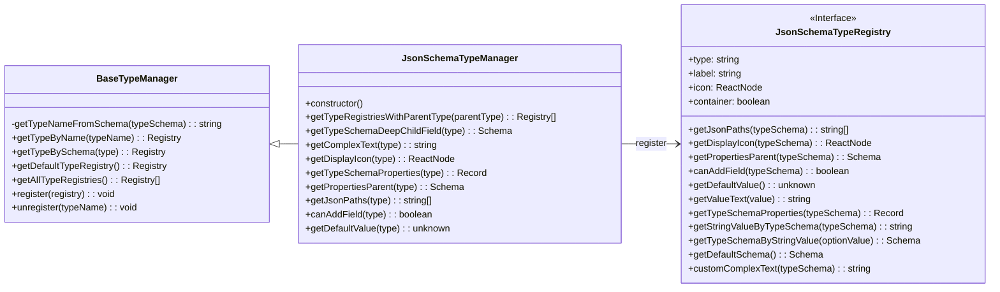

import { SourceCode } from '@theme';
import { BasicStory } from 'components/form-materials/common/json-schema-preset';

# Type Management

Type management is implemented in two parts:

1. **Material Layer** (preset type definitions in the material library):
   - Extends the type engine to define default renderers, condition rule configurations, etc. for types
   - Provides preset definitions for default types in the material library (constant input renderer, condition rule configuration, etc.)
   - Provides Editor Plugin for easily extending custom types
2. **Engine Layer** (core type engine, provided by `@flowgram.ai/json-schema`)
   - Provides basic definitions of Json types, including icons, name display, etc.
   - Provides BaseTypeManager, which can extend type definitions beyond Json Schema
   - Provides `JsonSchemaUtils` to implement mutual conversion between JSONSchema and AST

## Case Demonstration

### Adding Color Type

<BasicStory />

```tsx pure title="use-editor-props.tsx"
import { createTypePresetPlugin } from "@flowgram.ai/form-materials";

// ...
{
  plugins: () => [
    createTypePresetPlugin({
      types: [
        types: [
          {
            type: 'color',
            icon: <IconColorPalette />,
            label: 'Color',
            ConstantRenderer: ({ value, onChange }) => (
              <div className="json-schema-color-picker-container ">
                <ColorPicker
                  alpha={true}
                  usePopover={true}
                  value={value ? ColorPicker.colorStringToValue(value) : undefined}
                  onChange={(_value) => onChange?.(_value.hex)}
                />
              </div>
            ),
            conditionRule: {
              eq: { type: 'color' },
            },
          },
        ],
      },
    }),
  ],
}
// ...

```

### Getting Type Definitions

```tsx
const typeManager = useTypeManager();

// Get type definition based on schema
const type = typeManager.getTypeBySchema({ type: "color" });
const type2 = typeManager.getTypeBySchema({ type: "array", items: { type: "color" } });

// Get type definition based on type name
const type3 = typeManager.getTypeByName("color");
```

## API

### createTypePresetPlugin

Create an Editor Plugin for extending material library preset type definitions or disabling certain preset types in the material library.

```typescript
function createTypePresetPlugin(options: TypePresetPluginOptions): Plugin;

interface TypePresetPluginOptions {
  // Array of custom type definitions to add
  types?: TypePresetRegistry[];
  // Array of type names to remove
  unregisterTypes?: string[];
}

interface TypePresetRegistry {
  // Type name
  type: string;
  // Type icon
  icon?: React.ReactNode;
  // Type label
  label?: string;
  // Constant renderer component
  ConstantRenderer: React.FC<ConstantRendererProps>;
  // Condition rule configuration
  conditionRule?: IConditionRule | IConditionRuleFactory;
  // Other properties inherited from base type
}

interface ConstantRendererProps<Value = any> {
  value?: Value;
  onChange?: (value: Value) => void;
  readonly?: boolean;
  [key: string]: any;
}
```

## Source Code Guide

Material layer source code: <SourceCode
  href="https://github.com/bytedance/flowgram.ai/tree/main/packages/materials/form-materials/src/plugins/json-schema-preset"
/>

Use the CLI command to copy the material layer source code to local:

```bash
npx @flowgram.ai/cli@latest materials plugins/json-schema-preset
```

Engine layer source code: <SourceCode
  href="https://github.com/bytedance/flowgram.ai/tree/main/packages/variable-engine/json-schema/src"
/>

Due to its complexity, the engine layer currently needs to be used through the separate `@flowgram.ai/json-schema` package, and does not support downloading source code via CLI commands.

### Material Layer Core Logic

The definitions added in the material layer are used by the following materials:
- [ConstantInput](../components/constant-input): Get constant input corresponding to the type
  - Source code: <SourceCode
    href="https://github.com/bytedance/flowgram.ai/tree/main/packages/materials/form-materials/src/components/constant-input/index.tsx"
  />
- [ConditionContext](../components/condition-context): Get Condition rules corresponding to the type
  - Source code: <SourceCode
    href="https://github.com/bytedance/flowgram.ai/blob/main/packages/materials/form-materials/src/components/condition-context/hooks/use-condition.tsx"
  />

### Engine Layer Core Logic

#### JsonSchemaTypeManager Class Structure



#### JsonSchemaTypeManager Function Overview

**Core Functions**:

1. **Type Registration and Management**
   - `register(registry)`: Register new type definitions
   - `unregister(typeName)`: Remove registered types
   - `getAllTypeRegistries()`: Get all registered types
   - `getTypeByName(typeName)`: Get type definition by type name
   - `getTypeBySchema(schema)`: Get corresponding type definition by schema

2. **Type Information Retrieval**
   - `getTypeNameFromSchema(schema)`: Extract type name from schema
   - `getTypeRegistriesWithParentType(parentType)`: Get all types under specified parent type
   - `getTypeSchemaDeepChildField(type)`: Get the deepest child field of a type
   - `getComplexText(type)`: Get complex text representation of type (e.g., Array\<String\>)
   - `getDisplayIcon(type)`: Get display icon of type

3. **Type Property Operations**
   - `getTypeSchemaProperties(type)`: Get property definitions of type
   - `getPropertiesParent(type)`: Get parent node of properties
   - `getJsonPaths(type)`: Get json paths of type in flow schema
   - `canAddField(type)`: Determine if fields can be added to the type
   - `getDefaultValue(type)`: Get default value of type

**Initialization Process**:

In the constructor, JsonSchemaTypeManager automatically registers a series of default type definitions:
- defaultTypeDefinitionRegistry: Default type definition
- stringRegistryCreator: String type
- integerRegistryCreator: Integer type
- numberRegistryCreator: Number type
- booleanRegistryCreator: Boolean type
- objectRegistryCreator: Object type
- arrayRegistryCreator: Array type
- unknownRegistryCreator: Unknown type
- mapRegistryCreator: Map type
- dateTimeRegistryCreator: DateTime type
