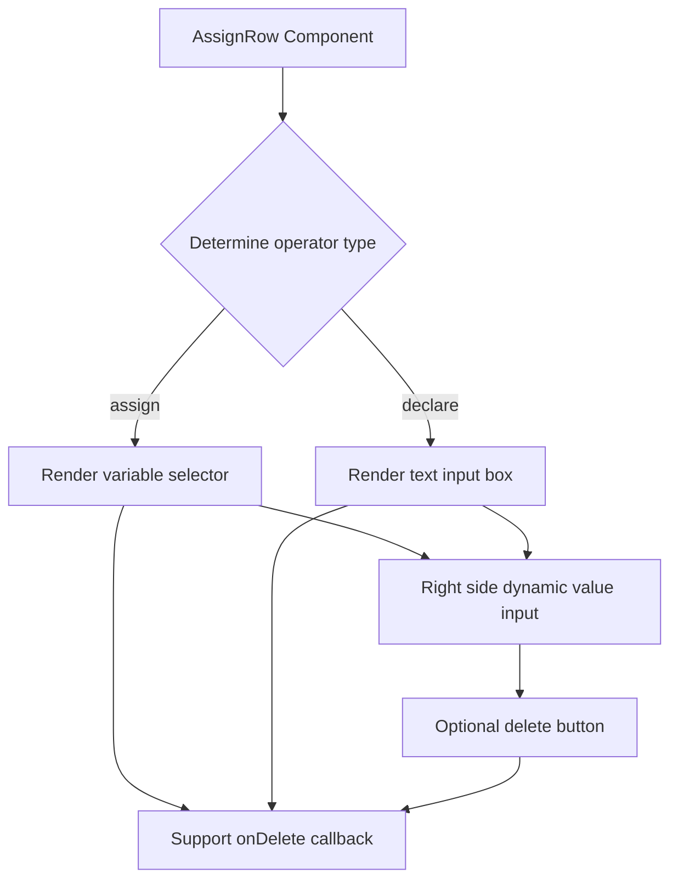

import { SourceCode } from '@theme';
import { AssignModeStory, DeclareModeStory } from 'components/form-materials/components/assign-row';

# AssignRow

AssignRow is an assignment row component that supports two operation modes: **assignment mode (assign)** and **declaration mode (declare)**.

- In assignment mode: the left side is a variable selector, and the right side is dynamic value input;
- In declaration mode: the left side is a text input box, and the right side is dynamic value input.

## Examples

### Assignment Mode

AssignRow **defaults to assignment mode**. In assignment mode, the left side is a variable selector and the right side is dynamic value input:

<AssignModeStory />

```tsx pure title="form-meta.tsx"
import { AssignRow } from '@flowgram.ai/form-materials';
import { AssignValueType } from '@flowgram.ai/form-materials';

const formMeta = {
  render: () => (
    <>
      <FormHeader />
      <Field<AssignValueType | undefined> name="assign_row">
        {({ field }) => (
          <AssignRow value={field.value} onChange={(value) => field.onChange(value)} />
        )}
      </Field>
    </>
  ),
}
```

### Declaration Mode

In declaration mode, the left side is variable name input and the right side is dynamic value input:

<DeclareModeStory />

```tsx pure title="form-meta.tsx"
import { AssignRow } from '@flowgram.ai/form-materials';
import { AssignValueType } from '@flowgram.ai/form-materials';

const formMeta = {
  render: () => (
    <>
      <FormHeader />
      <Field<AssignValueType | undefined> name="assign_row">
        {({ field }) => (
          <AssignRow
            value={{
              operator: 'declare',
              left: 'newVariable',
              right: {
                type: 'constant',
                content: 'Hello World',
                schema: { type: 'string' },
              },
            }}
            onChange={(value) => field.onChange(value)}
          />
        )}
      </Field>
    </>
  ),
}
```

## API Reference

### AssignRow Props

| Property | Type | Default | Description |
|--------|------|--------|------|
| `value` | `AssignValueType` | - | The value of the assignment row, containing operator, left value, and right value |
| `onChange` | `(value?: AssignValueType) => void` | - | Callback function when value changes |
| `onDelete` | `() => void` | - | Callback function when delete button is clicked |
| `readonly` | `boolean` | `false` | Whether it is read-only mode |

### AssignValueType

```typescript
type AssignValueType =
  | {
      operator: 'assign';
      left?: IFlowRefValue;      // Variable reference
      right?: IFlowValue;        // Dynamic value
    }
  | {
      operator: 'declare';
      left?: string;             // Variable name
      right?: IFlowValue;        // Dynamic value
    };
```

## Source Code Guide

<SourceCode
  href="https://github.com/bytedance/flowgram.ai/tree/main/packages/materials/form-materials/src/components/assign-row"
/>

You can copy the source code locally using the CLI command:

```bash
npx @flowgram.ai/cli@latest materials components/assign-row
```

### Directory Structure

```
assign-row/
├── index.tsx     # Main implementation of AssignRow component
└── types.ts      # Type definition file
```

### Core Implementation

The core logic of the AssignRow component is to render different left input controls based on the `operator` field:

1. **Assignment mode (`operator: 'assign'`)**: Renders `InjectVariableSelector` on the left for selecting existing variables
2. **Declaration mode (`operator: 'declare'`)**: Renders `BlurInput` on the left for inputting new variable names
3. **Unified right side**: Regardless of the mode, the right side renders `InjectDynamicValueInput`, supporting both constant and variable input

#### Component Structure



### Dependencies

#### Other Components

[**VariableSelector**](./variable-selector)
- `InjectVariableSelector`: Dependency-injected variable selector

[**DynamicValueInput**](./dynamic-value-input)
- `InjectDynamicValueInput`: Dependency-injected dynamic value input component

[**BlurInput**](./blur-input)
- `BlurInput`: Blur input component

#### Third-party Libraries

[**Semi Design**](https://semi.design/zh-CN/)
- `IconButton`: Icon button component
- `IconMinus`: Minus icon