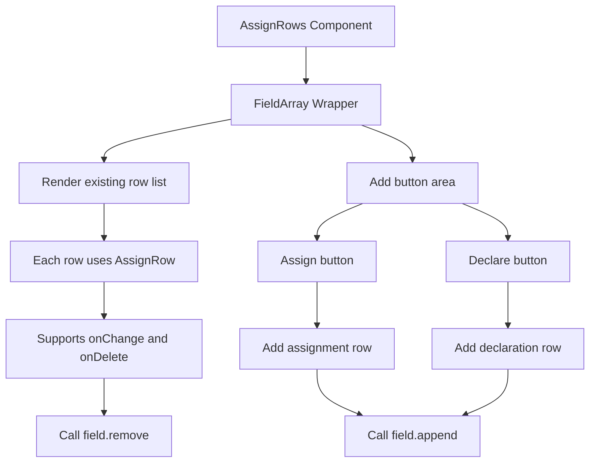

import { SourceCode } from '@theme';
import { BasicStory } from 'components/form-materials/components/assign-rows';

# AssignRows

AssignRows is an assignment row list component implemented based on `FieldArray`, supporting dynamic addition and deletion of assignment rows.

The component provides two action buttons: **Assign** and **Declare**, which can add assignment mode and declaration mode assignment rows respectively. Each assignment row can be configured and deleted independently.

:::tip

`AssignRows` is typically used together with the [`infer-assign-plugin`](../form-plugins/infer-assign-plugin) form plugin to convert defined declarations into node output variables and achieve automatic type linkage.

:::

## Examples

### Basic Usage

<BasicStory />

```tsx pure title="form-meta.tsx"
import { AssignRows } from '@flowgram.ai/form-materials';

const formMeta = {
  render: () => (
    <>
      <FormHeader />
      <AssignRows name="assign_rows" />
    </>
  ),
}
```

## API Reference

### AssignRows Props

| Property | Type | Default | Description |
|--------|------|--------|------|
| `name` | `string` | - | Form field name for FieldArray |
| `readonly` | `boolean` | `false` | Whether it is read-only mode |

## Source Code Guide

<SourceCode
  href="https://github.com/bytedance/flowgram.ai/tree/main/packages/materials/form-materials/src/components/assign-rows"
/>

You can copy the source code locally using the CLI command:

```bash
npx @flowgram.ai/cli@latest materials components/assign-rows
```

### Directory Structure

```
assign-rows/
└── index.tsx     # Main implementation of AssignRows component
```

### Core Implementation

The core functionality of the AssignRows component is dynamic list management implemented based on `FieldArray`:

1. **Dynamic Addition**: Provides two buttons to add assignment mode and declaration mode rows respectively
2. **Dynamic Deletion**: Each row supports independent deletion operations
3. **State Management**: Uses `FieldArray` to manage the state of the entire list
4. **Component Reuse**: Each row reuses the `AssignRow` component

#### Component Workflow



### Dependencies

#### flowgram API

[**@flowgram.ai/editor**](https://github.com/bytedance/flowgram.ai/tree/main/packages/client/editor)
- `FieldArray`: Form array field component for managing dynamic lists
- `FieldArrayRenderProps`: FieldArray render property types

#### Other Components

[**AssignRow**](./assign-row)
- `AssignRow`: Assignment row component that handles single row logic
- `AssignValueType`: Assignment row value type definition

#### Third-party Libraries

[**Semi Design**](https://semi.design/zh-CN/)
- `Button`: Button component
- `IconPlus`: Plus icon