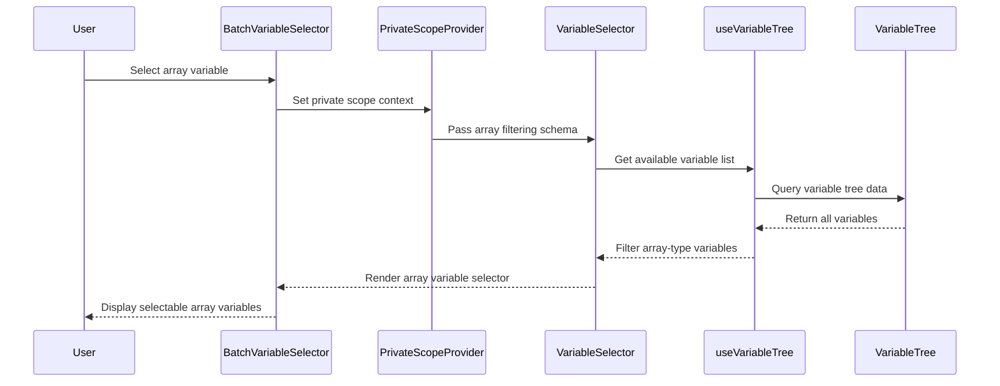

import { SourceCode } from '@theme';
import { BasicStory } from 'components/form-materials/components/batch-variable-selector';

# BatchVariableSelector

BatchVariableSelector is a component for selecting array-type variables. It's a wrapper around [VariableSelector](./variable-selector) that automatically filters the variable tree to show only array-type variables and provides private scope support. It's commonly used in batch processing scenarios (such as selecting loop data sources in Loop nodes).

**Core Features:**

- 🔍 **Auto Filtering**: Only displays array-type (`type: 'array'`) variables
- 🔐 **Private Scope**: Provides isolated variable scope through [`PrivateScopeProvider`](../../guide/variable/concept#node-private-scope)
- 🎯 **Specialized Scenarios**: Designed for batch processing, loops, and other scenarios requiring array data sources
- 📦 **Ready to Use**: No need to manually configure schema filtering conditions, automatically applies array type constraints

## Examples

### Basic Usage

<BasicStory />

```tsx pure title="form-meta.tsx"
import { BatchVariableSelector, VariableSelector } from '@flowgram.ai/form-materials';

const formMeta = {
  render: () => (
    <>
      <FormHeader />
      {/* BatchVariableSelector only shows array-type variables */}
      <Field<string[] | undefined> name="batch_variable">
        {({ field }) => (
          <BatchVariableSelector
            value={field.value}
            onChange={(value) => field.onChange(value)}
          />
        )}
      </Field>

      {/* VariableSelector shows all variable types */}
      <Field<string[] | undefined> name="normal_variable">
        {({ field }) => (
          <VariableSelector
            value={field.value}
            onChange={(value) => field.onChange(value)}
          />
        )}
      </Field>
    </>
  ),
}
```

## API Reference

### BatchVariableSelector Props

BatchVariableSelector inherits all properties from [VariableSelector](./variable-selector), but the `includeSchema` property is fixed to array-type filtering and cannot be customized.

| Property | Type | Default | Description |
|----------|------|---------|-------------|
| `value` | `string[]` | - | Selected variable path array |
| `onChange` | `(value?: string[]) => void` | - | Callback when variable selection changes |
| `config` | `VariableSelectorConfig` | `{}` | Configuration object (same as VariableSelector) |
| `readonly` | `boolean` | `false` | Whether in read-only mode |
| `hasError` | `boolean` | `false` | Whether to display error state |
| `style` | `React.CSSProperties` | - | Custom styles |
| `triggerRender` | `(props: TriggerRenderProps) => React.ReactNode` | - | Custom trigger renderer |

:::warning
`includeSchema` and `excludeSchema` properties are not available in BatchVariableSelector, as the component internally uses `{ type: 'array', extra: { weak: true } }` as the fixed filtering condition.
:::

### VariableSelectorConfig

| Property | Type | Default | Description |
|----------|------|---------|-------------|
| `placeholder` | `string` | `'Select Variable'` | Placeholder text |
| `notFoundContent` | `string` | `'Undefined'` | Content to display when variable is not found |

## Source Code Guide

<SourceCode
  href="https://github.com/bytedance/flowgram.ai/tree/main/packages/materials/form-materials/src/components/batch-variable-selector"
/>

Use the CLI command to copy the source code locally:

```bash
npx @flowgram.ai/cli@latest materials components/batch-variable-selector
```

### Directory Structure

```
batch-variable-selector/
└── index.tsx           # Main component implementation with BatchVariableSelector core logic
```

### Core Implementation

#### Private Scope Mechanism

BatchVariableSelector provides an independent variable scope for child components through [`PrivateScopeProvider`](../../guide/variable/concept#node-private-scope):

```tsx
<PrivateScopeProvider>
  <VariableSelector {...props} includeSchema={batchVariableSchema} />
</PrivateScopeProvider>
```

`PrivateScopeProvider` creates a [node private scope](../../guide/variable/concept#node-private-scope), which is crucial in batch processing scenarios:

- **Loop variable isolation**: In Loop nodes, loop variables for each iteration (such as `item`, `index`) are stored in the private scope, preventing pollution of the external scope
- **Avoid naming conflicts**: Temporary variables defined inside batch processing nodes will not conflict with external variable names
- **Support nested structures**: Complex batch processing logic can define multi-level variable structures in the private scope
- **Data security**: Variables in the private scope can only be accessed by the current node and its child nodes, ensuring data security

:::info

For more detailed information about scopes, please refer to the [Variable Concept Documentation](../../guide/variable/concept#variables-in-canvas).

:::

#### Array Type Filtering

The component internally uses the following fixed schema for filtering:

```typescript
const batchVariableSchema: IJsonSchema = {
  type: 'array',
  extra: { weak: true },
};
```

- `type: 'array'`: Only display array-type variables
- `extra: { weak: true }`: Enable weak type matching, allowing potentially compatible types

### Overall Flow



### FlowGram APIs Used

[**@flowgram.ai/editor**](https://github.com/bytedance/flowgram.ai/tree/main/packages/plugins/node-variable-plugin)
- [`PrivateScopeProvider`](https://flowgram.ai/auto-docs/node-variable-plugin/functions/PrivateScopeProvider): Context Provider for private variable scope

[**@flowgram.ai/json-schema**](https://github.com/bytedance/flowgram.ai/tree/main/packages/variable/json-schema)
- [`IJsonSchema`](https://flowgram.ai/auto-docs/json-schema/interfaces/IJsonSchema): JSON Schema type definition for variable type filtering

### Dependent Materials

[**VariableSelector**](./variable-selector) Base variable selector component
- `VariableSelector`: Core variable selection component, BatchVariableSelector is its wrapper version
- `VariableSelectorProps`: Property type definitions

## FAQ

### Why is PrivateScopeProvider needed?

`PrivateScopeProvider` provides variable scope isolation, which is important in the following scenarios:

1. **Loop Nodes**: In Loop nodes, each iteration needs an independent scope to store loop variables (such as `item`, `index`). Refer to [Variable Concept - Node Private Scope](../../guide/variable/concept#node-private-scope)
2. **Nested Structures**: When there are nested variable declarations inside nodes, avoiding naming conflicts with external variables
3. **Component Reuse**: Ensuring variables don't interfere with each other when the same component is used in different contexts
4. **Data Security**: Variables in the private scope can only be accessed by the current node and its child nodes, ensuring data security

For more information about scope chains and variable access permissions, please refer to [Variable Concept - Scope Chain](../../guide/variable/concept#scope-chain).

### What's the difference between BatchVariableSelector and VariableSelector?

| Feature | BatchVariableSelector | VariableSelector |
|---------|----------------------|------------------|
| Variable Type Filtering | Fixed to array type | Customizable |
| Scope | Built-in private scope | Uses current scope |
| Use Cases | Batch processing, loops, etc. | General variable selection |
| Schema Configuration | Not configurable | Fully configurable |

### How to get the actual value of the selected variable?

BatchVariableSelector returns a variable path (`string[]`). To get the actual value, you need to use [`provideBatchInputEffect`](../effects/provide-batch-input) in the form's effect:

```typescript
export const formMeta = {
  render: YourFormRender,
  effect: {
    yourFieldName: provideBatchInputEffect,
  },
};
```

`provideBatchInputEffect` automatically resolves variable references and injects them into the form data.
