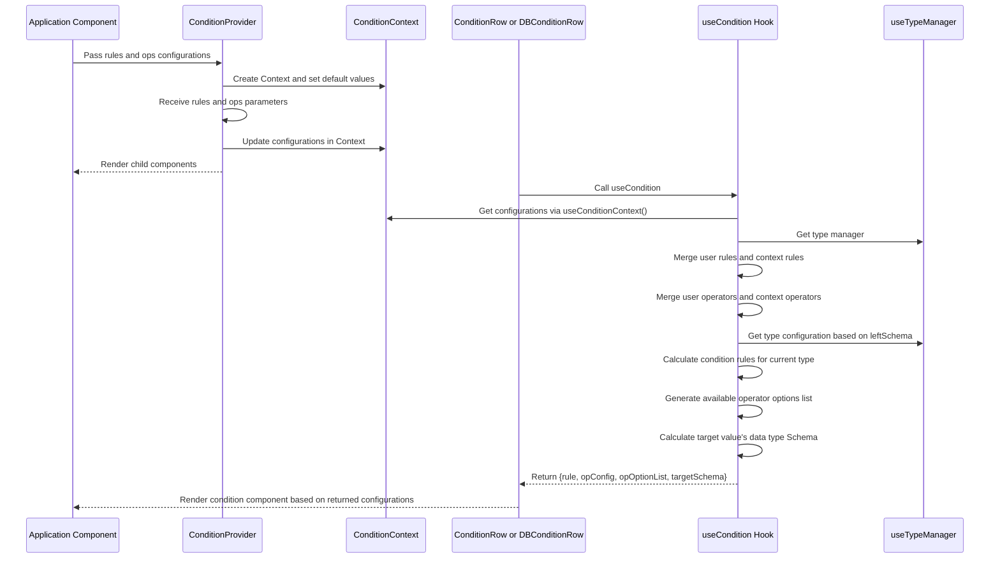

import { SourceCode } from '@theme';
import { BasicStory } from 'components/form-materials/components/condition-context';

# ConditionContext

ConditionContext is a context management system for condition configuration, used to uniformly manage condition rules and operator configurations, providing a consistent configuration environment for condition components.

:::tip

The condition configuration context of ConditionContext can affect the following materials:

- [**ConditionRow**](./condition-row)
- [**DBConditionRow**](./db-condition-row)

:::

## Examples

### Basic Usage

<BasicStory />

```tsx pure title="form-meta.tsx"
import React from 'react';
import { Field } from '@flowgram.ai/free-layout-editor';
import {
  ConditionProvider,
  ConditionRow,
  DBConditionRow,
  type ConditionOpConfigs,
  type IConditionRule
} from '@flowgram.ai/form-materials';

const OPS: ConditionOpConfigs = {
  cop: {
    abbreviation: 'C',
    label: 'Custom Operator',
  },
};

const RULES: Record<string, IConditionRule> = {
  string: {
    cop: { type: 'string' },
  },
};

const formMeta = {
  render: () => (
    <>
      <FormHeader />
      <ConditionProvider ops={OPS} rules={RULES}>
        <Field<any | undefined> name="condition_row">
          {({ field }) => (
            <ConditionRow value={field.value} onChange={(value) => field.onChange(value)} />
          )}
        </Field>
        <Field<any | undefined> name="db_condition_row">
          {({ field }) => (
            <DBConditionRow
              options={[
                {
                  label: 'UserName',
                  value: 'username',
                  schema: { type: 'string' },
                },
              ]}
              value={field.value}
              onChange={(value) => field.onChange(value)}
            />
          )}
        </Field>
      </ConditionProvider>
    </>
  ),
};
```

## API Reference

### ConditionProvider

A context provider component for condition configuration, used to uniformly manage condition rules and operator configurations.

| Parameter | Type | Required | Description |
|-----------|------|----------|-------------|
| `rules` | `Record<string, IConditionRule>` | No | Condition rule configuration |
| `ops` | `ConditionOpConfigs` | No | Operator configuration |
| `children` | `React.ReactNode` | Yes | Child components |

### useCondition

A hook to get condition configuration, which obtains corresponding configuration information based on data type and operator.

For specific usage, you can refer to the use of `useCondition` in [ConditionRow's source code](https://github.com/bytedance/flowgram.ai/blob/main/packages/materials/form-materials/src/components/condition-row/index.tsx).

### ConditionPresetOp

A preset operator enumeration, providing commonly used comparison operators.

| Enum Value | Description | Abbreviation |
|------------|-------------|--------------|
| `EQ` | Equal | `=` |
| `NEQ` | Not Equal | `≠` |
| `GT` | Greater Than | `>` |
| `GTE` | Greater Than or Equal | `>=` |
| `LT` | Less Than | `<` |
| `LTE` | Less Than or Equal | `<=` |
| `IN` | In | `∈` |
| `NIN` | Not In | `∉` |
| `CONTAINS` | Contains | `⊇` |
| `NOT_CONTAINS` | Not Contains | `⊉` |
| `IS_EMPTY` | Is Empty | `=` |
| `IS_NOT_EMPTY` | Is Not Empty | `≠` |
| `IS_TRUE` | Is True | `=` |
| `IS_FALSE` | Is False | `=` |

### Type Definitions

```typescript
// Operator configuration
interface ConditionOpConfig {
  label: string; // Operator label
  abbreviation: string; // Operator abbreviation
  rightDisplay?: string; // Right side display text (when right side is not a value)
}

// Operator configuration collection
type ConditionOpConfigs = Record<string, ConditionOpConfig>;

// Condition rule
type IConditionRule = Record<string, string | IJsonSchema | null>;

// Condition rule factory function
type IConditionRuleFactory = (
  schema?: IJsonSchema
) => Record<string, string | IJsonSchema | null>;
```

## Source Code Guide

<SourceCode
  href="https://github.com/bytedance/flowgram.ai/tree/main/packages/materials/form-materials/src/components/condition-context"
/>

You can copy the source code to your local machine using the CLI command:

```bash
npx @flowgram.ai/cli@latest materials components/condition-context
```

### Directory Structure

```
condition-context/
├── context.tsx        # Context implementation
├── hooks/             # Hook functions directory
│   └── use-condition.tsx  # useCondition hook implementation
├── index.tsx          # Unified export file
├── op.ts              # Preset operator definitions
└── types.ts           # Type definitions
```

### Core Implementation

#### ConditionContext Workflow

Here is the sequence diagram of the workflow for ConditionProvider and useCondition Hook:



### Dependencies

#### flowgram API

[**@flowgram.ai/editor**](https://github.com/bytedance/flowgram.ai/tree/main/packages/client/editor)
- [`I18n`](https://flowgram.ai/auto-docs/editor/variables/I18n): Internationalization utility class

[**@flowgram.ai/json-schema**](https://github.com/bytedance/flowgram.ai/tree/main/packages/common/json-schema)
- [`IJsonSchema`](https://flowgram.ai/auto-docs/json-schema/types/IJsonSchema): JSON Schema type definition
