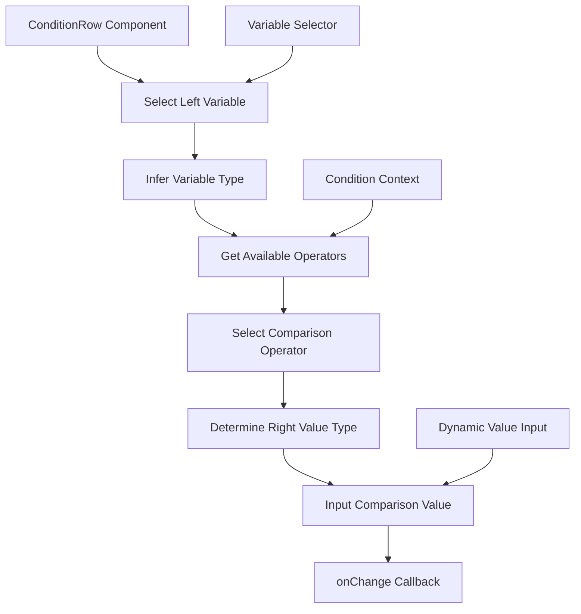

import { SourceCode } from '@theme';
import { BasicStory } from 'components/form-materials/components/condition-row';

# ConditionRow

ConditionRow is a conditional expression component used to build variable comparison logic. It supports selecting variables, choosing comparison operators, and inputting comparison values. It can automatically adapt available operators and value types based on the variable type.

<br />
<div>
  
  *The first condition is the query variable containing Hello Flow, the second condition is the enable variable being true*
</div>

## Demo

### Basic Usage

<BasicStory />

```tsx pure title="form-meta.tsx"
import { ConditionRow } from '@flowgram.ai/form-materials';

const formMeta = {
  render: () => (
    <>
      <FormHeader />
      <Field<any | undefined> name="condition_row">
        {({ field }) => (
          <ConditionRow value={field.value} onChange={(value) => field.onChange(value)} />
        )}
      </Field>
    </>
  ),
}
```

### Condition Row with Initial Value

```tsx
<ConditionRow
  value={{
    left: { type: 'ref', content: 'user.age' },
    operator: 'gt',
    right: { type: 'constant', content: 18, schema: { type: 'number' } }
  }}
  onChange={(value) => console.log('Condition changed:', value)}
/>
```

## API Reference

### ConditionRow Props

| Property | Type | Default | Description |
|----------|------|---------|-------------|
| `value` | `ConditionRowValueType` | - | Conditional expression value |
| `onChange` | `(value?: ConditionRowValueType) => void` | - | Callback function when condition changes |
| `readonly` | `boolean` | `false` | Whether it's read-only mode |
| `ruleConfig` | `{ ops?: ConditionOpConfigs; rules?: Record<string, IConditionRule> }` | - | Operator and rule configuration |
| `style` | `React.CSSProperties` | - | Custom styles |

### ConditionRowValueType

```typescript
interface ConditionRowValueType {
  left?: IFlowRefValue;           // Left variable reference
  operator?: string;            // Operator
  right?: IFlowConstantRefValue; // Right constant value
}

interface IFlowRefValue {
  type: 'ref';
  content: string; // Variable path, e.g., "user.name"
}

interface IFlowConstantRefValue {
  type: 'constant';
  content: any;           // Constant value
  schema: IJsonSchema;  // Value type definition
}
```

### Supported Comparison Operators

Based on the type of the left variable, ConditionRow will automatically provide corresponding comparison operators:

- **String type**: equals, not_equals, contains, not_contains, starts_with, ends_with
- **Number type**: equals, not_equals, gt, gte, lt, lte
- **Boolean type**: equals, not_equals
- **Array type**: contains, not_contains, empty, not_empty

## Source Code Guide

<SourceCode
  href="https://github.com/bytedance/flowgram.ai/tree/main/packages/materials/form-materials/src/components/condition-row"
/>

Use CLI command to copy source code locally:

```bash
npx @flowgram.ai/cli@latest materials components/condition-row
```

### Directory Structure Explanation

```
condition-row/
├── index.tsx           # Main component implementation, containing ConditionRow core logic
├── types.ts            # Type definitions
├── styles.tsx          # Style definitions using styled-components
└── README.md          # Component documentation
```

### Core Implementation Explanation

#### Variable Type Inference
The component automatically infers the JSON Schema type based on the selected left variable:

```typescript
const leftSchema = useMemo(() => {
  if (!variable) return undefined;
  return JsonSchemaUtils.astToSchema(variable.type, { drilldown: false });
}, [variable?.type?.hash]);
```

#### Dynamic Operator Adaptation
Available operators are obtained based on the left variable type through the `useCondition` Hook:

```typescript
const { rule, opConfig, opOptionList, targetSchema } = useCondition({
  leftSchema,
  operator,
});
```

#### Right Value Type Auto-Matching
The type of the right input field is automatically matched based on the operator and left variable type:

```typescript
targetSchema ? (
  <InjectDynamicValueInput
    schema={targetSchema}
    // ... other properties
  />
) : (
  // Placeholder input
)
```

### Flowgram APIs Used

#### @flowgram.ai/json-schema
- `JsonSchemaUtils.astToSchema()`: Convert AST type to JSON Schema
- `IJsonSchema`: JSON Schema type definition

#### @flowgram.ai/variable-core
- `useScopeAvailable()`: Get available variables in current scope

#### @flowgram.ai/i18n
- `I18n`: Internationalization support

#### Internal Components
- [`InjectVariableSelector`](./variable-selector): Variable selector
- [`InjectDynamicValueInput`](./dynamic-value-input): Dynamic value input component
- `useCondition`: Conditional logic Hook

### Overall Process

