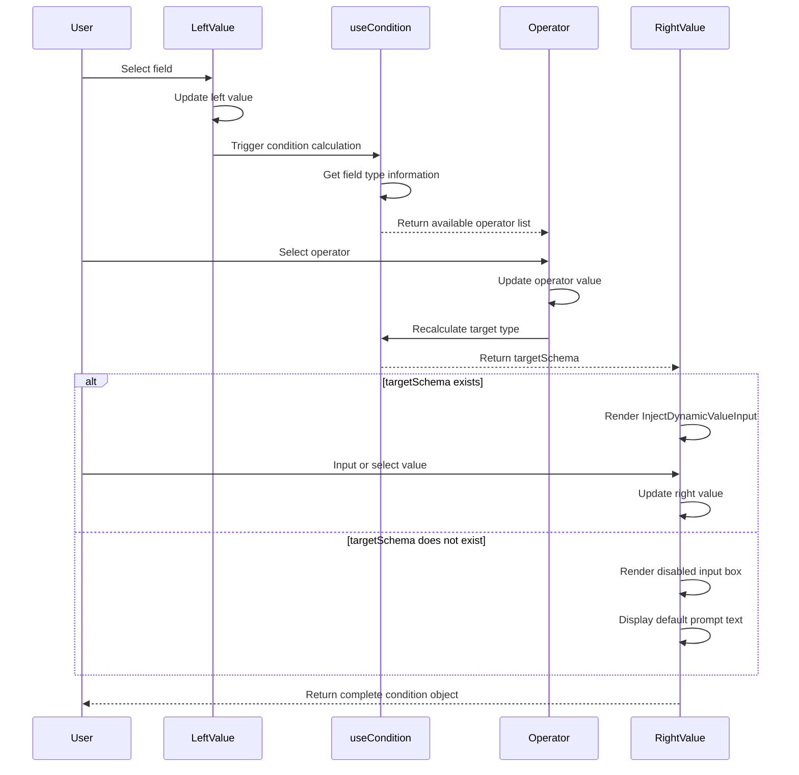

import { SourceCode } from '@theme';
import { BasicStory } from 'components/form-materials/components/db-condition-row';

# DBConditionRow

DBConditionRow is a database condition row component used for building database query conditions. It provides field selection, operator selection, and value input functionality, which can automatically display appropriate operators and input controls based on field types.

## Demo

### Basic Usage

<BasicStory />

```tsx pure title="form-meta.tsx"
import { DBConditionRow } from '@flowgram.ai/form-materials';

const formMeta = {
  render: () => (
    <>
      <FormHeader />
      <Field<any | undefined> name="db_condition_row">
        {({ field }) => (
          <DBConditionRow
            options={[
              {
                label: 'TransactionID',
                value: 'transaction_id',
                schema: { type: 'integer' },
              },
              {
                label: 'Amount',
                value: 'amount',
                schema: { type: 'number' },
              },
              {
                label: 'Description',
                value: 'description',
                schema: { type: 'string' },
              },
              {
                label: 'Archived',
                value: 'archived',
                schema: { type: 'boolean' },
              },
              {
                label: 'CreateTime',
                value: 'create_time',
                schema: { type: 'date-time' },
              },
            ]}
            value={field.value}
            onChange={(value) => field.onChange(value)}
          />
        )}
      </Field>
    </>
  ),
}
```

## API Reference

### DBConditionRow Props

| Property | Type | Default | Description |
|----------|------|---------|-------------|
| `value` | `DBConditionRowValueType` | - | The value of the condition row, including left (field name), operator (operator), and right (value) |
| `onChange` | `(value?: DBConditionRowValueType) => void` | - | Callback function when value changes |
| `options` | `DBConditionOptionType[]` | - | List of optional fields, each field contains label, value, and schema |
| `readonly` | `boolean` | `false` | Whether it is read-only mode |
| `style` | `React.CSSProperties` | - | Custom styles |
| `ruleConfig` | `{ ops?: ConditionOpConfigs; rules?: Record<string, IConditionRule> }` | - | **Deprecated**, use ConditionContext instead |

### DBConditionRowValueType Type

```typescript
interface DBConditionRowValueType {
  left?: string; // Field name
  operator?: string; // Operator
  right?: IFlowConstantRefValue; // Value, supports constant or variable reference
}
```

### DBConditionOptionType Type

```typescript
interface DBConditionOptionType {
  label: string | JSX.Element; // Field display name
  value: string; // Field value
  schema: IJsonSchema; // Field type definition
}
```

## Source Code Guide

<SourceCode
  href="https://github.com/bytedance/flowgram.ai/tree/main/packages/materials/form-materials/src/components/db-condition-row"
/>

Use the CLI command to copy the source code locally:

```bash
npx @flowgram.ai/cli@latest materials components/db-condition-row
```

### Directory Structure Explanation

```
db-condition-row/
├── index.tsx    # Main component implementation
├── types.ts     # Type definitions
└── styles.css   # Style files
```

### Core Implementation Explanation

#### Component Implementation Process



1. **Left Value: Field Selector**: Uses Semi UI's Select component to display available fields based on options, and shows field type icons.

2. **Operator: Operator Selector**: Gets the list of operators matching the field type through the useCondition Hook, and updates the operator after user selection.

3. **Right Value: Value Input Component**: Dynamically displays appropriate input controls based on the selected field type and operator:
   - When targetSchema exists, use the InjectDynamicValueInput component
   - Otherwise, display a disabled input box with prompt information

### Dependency Overview

#### flowgram API

[**@flowgram.ai/editor**](https://github.com/bytedance/flowgram.ai/tree/main/packages/client/editor)
- [`I18n`](https://flowgram.ai/auto-docs/editor/variables/I18n): Internationalization utility class

[**@flowgram.ai/json-schema**](https://github.com/bytedance/flowgram.ai/tree/main/packages/variable/json-schema)
- [`IJsonSchema`](https://flowgram.ai/auto-docs/json-schema/interfaces/IJsonSchema): JSON Schema type definition

#### Other Materials

[**ConditionContext**](./condition-context)
- `useCondition`: Hook to get condition configuration
- `ConditionOpConfigs`: Operator configuration type
- `IConditionRule`: Condition rule type

[**DynamicValueInput**](./dynamic-value-input)
- `InjectDynamicValueInput`: Injectable dynamic value input component

#### Third-party Libraries

[**Semi UI**](https://semi.design/)
- [`Select`](https://semi.design/input/select): Selector component
- [`Button`](https://semi.design/basic/button): Button component
- [`Input`](https://semi.design/input/input): Input box component
