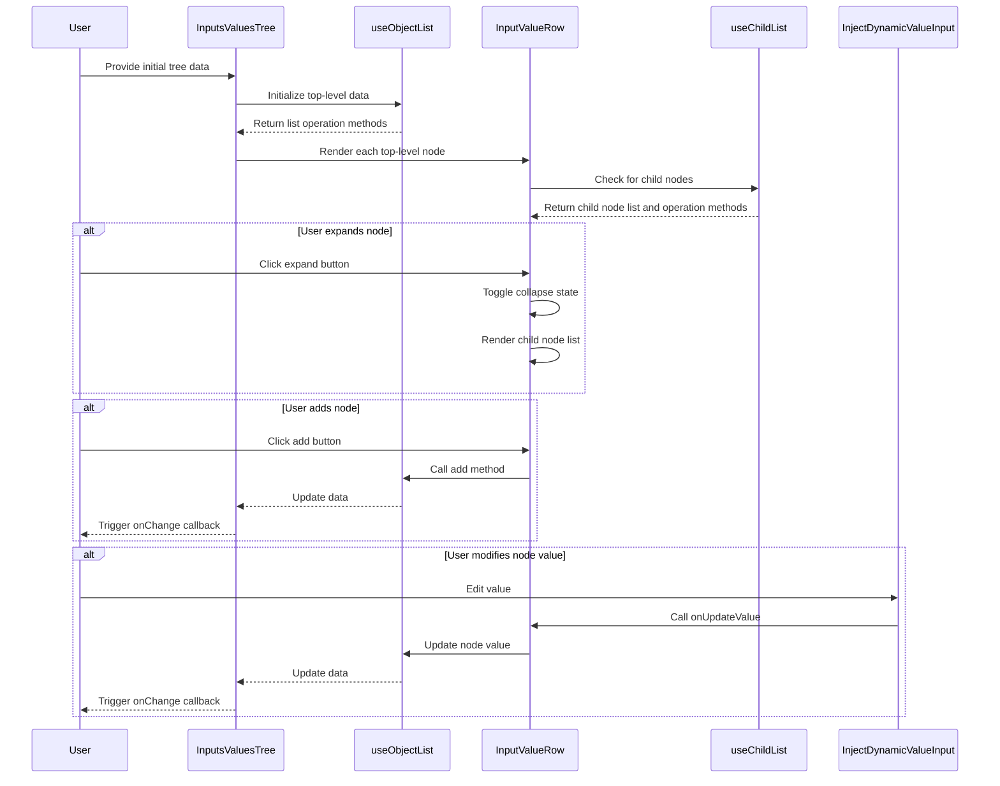

import { SourceCode } from '@theme';
import { BasicStory } from 'components/form-materials/components/inputs-values-tree';

# InputsValuesTree

InputsValuesTree is a component for displaying and editing **tree-structured input values**. Each leaf node is a key-value pair, with values supporting both constant and variable input modes through the DynamicValueInput component. The component uses a tree hierarchy display with expand/collapse functionality, making it suitable for building complex nested data structures.

:::tip{title="Difference from InputsValues"}

- **Structure Difference**: InputsValues only supports flat key-value pairs, while InputsValuesTree supports tree-structured nested data
- **Display Method**: InputsValues uses a simple list display, while InputsValuesTree uses a tree structure with indentation and expand/collapse functionality
- **Usage Scenarios**: InputsValues is suitable for simple key-value pair configurations, while InputsValuesTree is suitable for complex multi-level data structure configurations

:::

## Examples

### Basic Usage

<BasicStory />

```tsx pure title="form-meta.tsx"
import { InputsValuesTree } from '@flowgram.ai/form-materials';

const formMeta = {
  render: () => (
    <>
      <FormHeader />
      <Field<Record<string, any> | undefined>
        name="inputs_values"
        defaultValue={{
          a: {
            b: {
              type: 'ref',
              content: ['start_0', 'str'],
            },
            c: {
              type: 'constant',
              content: 'hello',
            },
          },
          d: {
            type: 'constant',
            content: '{ "a": "b"}',
            schema: { type: 'object' },
          },
        }}
      >
        {({ field }) => (
          <InputsValuesTree value={field.value} onChange={(value) => field.onChange(value)} />
        )}
      </Field>
    </>
  ),
}
```

## API Reference

| Property | Type | Default Value | Description |
| :--- | :--- | :--- | :--- |
| value | `IInputsValues` | - | Tree-structured input value object |
| onChange | `(value?: IInputsValues) => void` | - | Callback function when value changes |
| readonly | `boolean` | `false` | Whether in read-only mode |
| hasError | `boolean` | `false` | Whether to show error state |
| schema | `IJsonSchema` | - | JSON Schema definition for validation and type hints |
| style | `React.CSSProperties` | - | Custom styles |
| constantProps | `{ strategies?: ConstantInputStrategy[]; [key: string]: any }` | - | Configuration properties for constant input component |

## Source Code Guide

<SourceCode
  href="https://github.com/bytedance/flowgram.ai/tree/main/packages/materials/form-materials/src/components/inputs-values-tree"
/>

Use the CLI command to copy the source code locally:

```bash
npx @flowgram.ai/cli@latest materials components/inputs-values-tree
```

### Directory Structure

```plaintext
components/inputs-values-tree/
├── index.tsx          # Component entry file
├── row.tsx            # Tree row component, handles display and editing of individual nodes
├── types.ts           # Type definitions
├── icon.tsx           # Icon components
├── styles.css         # Component styles
└── hooks/
    └── use-child-list.tsx # Custom hook for handling child node lists
```

### Core Implementation

InputsValuesTree component is primarily used for displaying and editing tree-structured input values, supporting two types of values: constant values and reference values.

#### Workflow Sequence Diagram



Key Features:

1. **Tree Structure Display**: Displays nested tree data structures through recursion
2. **Value Type Support**: Supports both constant values (strings, numbers, booleans, etc.) and reference values that point to other nodes in the workflow
3. **CRUD Operations**: Supports adding, deleting, and modifying node keys and values
4. **Configurable**: Customize constant input component behavior through constantProps

The component internally uses the useObjectList hook to manage object lists and the InputValueRow component to render each row of data. When the user clicks the add button, an empty string-type constant value is added by default.

### Dependencies

#### flowgram API

[**@flowgram.ai/editor**](https://github.com/bytedance/flowgram.ai/tree/main/packages/client/editor)
- [`I18n`](https://flowgram.ai/auto-docs/editor/variables/I18n): Internationalization utility

[**@flowgram.ai/json-schema**](https://github.com/bytedance/flowgram.ai/tree/main/packages/json-schema)
- [`IJsonSchema`](https://flowgram.ai/auto-docs/json-schema/interfaces/IJsonSchema): JSON Schema type definition

#### Third-party Libraries

[**Semi UI**](https://semi.design/en-US)
- `Button`: Button component
- `IconPlus`: Plus icon component
