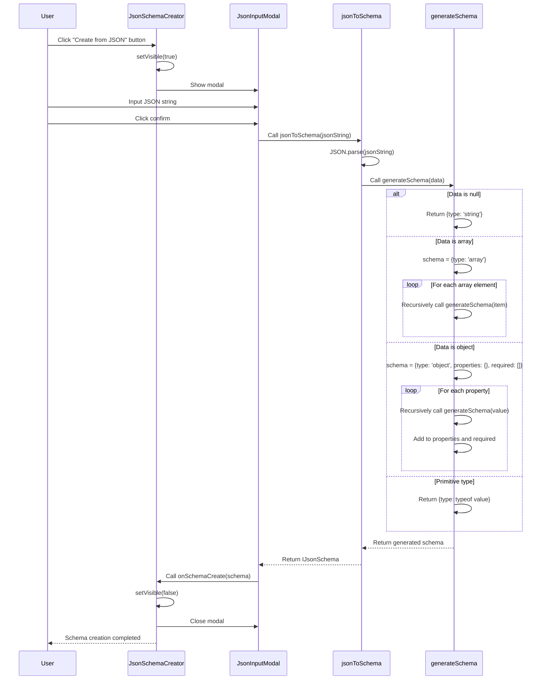

import { SourceCode } from '@theme';
import { BasicStory } from 'components/form-materials/components/json-schema-creator';

# JsonSchemaCreator

JsonSchemaCreator is a component that automatically generates JSON Schema from JSON strings. It provides a button to trigger a modal where users can paste JSON data, and the component automatically analyzes the data structure and generates the corresponding JSON Schema.

## Demo

### Basic Usage

<BasicStory />

```tsx pure title="form-meta.tsx"
import { JsonSchemaCreator } from '@flowgram.ai/form-materials';

const formMeta = {
  render: () => (
    <>
      <FormHeader />
      <Field<IJsonSchema | undefined> name="json_schema">
        {({ field }) => (
          <div>
            <JsonSchemaCreator
              onSchemaCreate={(schema) => field.onChange(schema)}
            />
            <div style={{ marginTop: 16 }}>
              <JsonSchemaEditor
                value={field.value}
                onChange={(value) => field.onChange(value)}
              />
            </div>
          </div>
        )}
      </Field>
    </>
  ),
}
```

## API Reference

### JsonSchemaCreator Props

| Property | Type | Default | Description |
|----------|------|---------|-------------|
| `onSchemaCreate` | `(schema: IJsonSchema) => void` | - | Callback function after schema generation |

## Source Code Guide

<SourceCode
  href="https://github.com/bytedance/flowgram.ai/tree/main/packages/materials/form-materials/src/components/json-schema-creator"
/>

Use CLI command to copy source code locally:

```bash
npx @flowgram.ai/cli@latest materials components/json-schema-creator
```

### Directory Structure

```
json-schema-creator/
├── index.tsx              # Main component export, contains JsonSchemaCreator and JsonSchemaCreatorProps
├── json-schema-creator.tsx # Main component implementation, contains button and state management
├── json-input-modal.tsx   # JSON input modal component
└── utils/
    └── json-to-schema.ts  # Core utility function for JSON to Schema conversion
```

### Core Implementation

#### JSON Parsing and Schema Generation Process

The following is the complete interaction sequence diagram for JSON Schema creation:



### FlowGram APIs Used

[**@flowgram.ai/json-schema**](https://github.com/bytedance/flowgram.ai/tree/main/packages/variable/json-schema)
- [`IJsonSchema`](https://flowgram.ai/auto-docs/json-schema/interfaces/IJsonSchema): JSON Schema type definition

### Other Components Dependencies

[**JsonCodeEditor**](./code-editor) Code editor component
- Used for editing JSON data in the modal

### Third-party Libraries Used

[**@douyinfe/semi-ui**](https://semi.design/)
- `Button`: Button component to trigger modal
- `Modal`: Modal container
- `Typography`: Text component