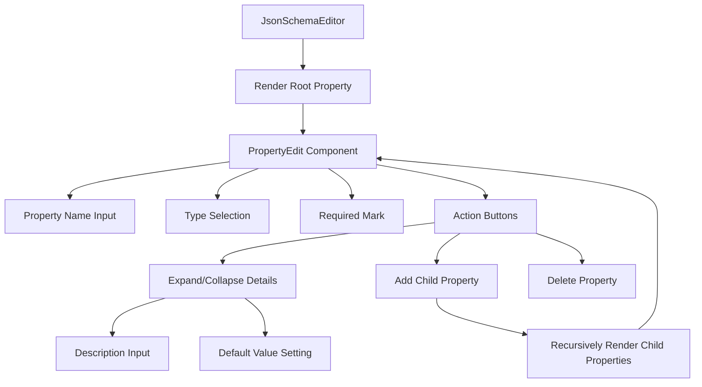

import { SourceCode } from '@theme';
import { BasicStory } from 'components/form-materials/components/json-schema-editor';

# JsonSchemaEditor

JsonSchemaEditor is a visual JSON Schema editor that supports creating and editing complex JSON Schema structures. It provides a tree-structured interface to intuitively define properties of various types such as objects, arrays, strings, and numbers, supporting nested structures and required field marking.

You can learn about the JsonSchema protocol through the following documentation:

- [Json Schema Official Site](https://json-schema.org/learn)
- [Json Schema Specification](https://json-schema.org/specification)

## Demo

### Basic Usage

<BasicStory />

```tsx pure title="form-meta.tsx"
import { JsonSchemaEditor } from '@flowgram.ai/form-materials';

const formMeta = {
  render: () => (
    <>
      <FormHeader />
      <Field<IJsonSchema> name="json_schema" defaultValue={{ type: 'object' }}>
        {({ field }) => (
          <JsonSchemaEditor
            value={field.value}
            onChange={(value) => field.onChange(value)}
          />
        )}
      </Field>
    </>
  ),
}
```

## API Reference

### JsonSchemaEditor Props

| Property | Type | Default | Description |
|----------|------|---------|-------------|
| `value` | `IJsonSchema` | `{ type: 'object' }` | JSON Schema object |
| `onChange` | `(value: IJsonSchema) => void` | - | Callback function when schema changes |
| `config` | `ConfigType` | `{}` | Editor configuration options |
| `className` | `string` | - | Custom style class name |
| `readonly` | `boolean` | `false` | Whether it's read-only mode |

### ConfigType

| Property | Type | Default | Description |
|----------|------|---------|-------------|
| `placeholder` | `string` | `'Enter variable name'` | Property name placeholder |
| `descTitle` | `string` | `'Description'` | Description field title |
| `descPlaceholder` | `string` | `'Help LLM understand this property'` | Description field placeholder |
| `defaultValueTitle` | `string` | `'Default Value'` | Default value field title |
| `defaultValuePlaceholder` | `string` | `'Default value'` | Default value placeholder |
| `addButtonText` | `string` | `'Add'` | Add button text |

### Supported Types

| Type | Description | Example |
|------|-------------|---------|
| `string` | String type | `"hello"` |
| `number` | Number type | `42` |
| `boolean` | Boolean type | `true` |
| `object` | Object type | `{}` |
| `array` | Array type | `[]` |
| `null` | Null type | `null` |

## Source Code Guide

<SourceCode
  href="https://github.com/bytedance/flowgram.ai/tree/main/packages/materials/form-materials/src/components/json-schema-editor"
/>

Use CLI command to copy source code locally:

```bash
npx @flowgram.ai/cli@latest materials components/json-schema-editor
```

### Directory Structure Explanation

```
json-schema-editor/
├── index.tsx           # Main component implementation
├── types.ts            # Type definitions
├── hooks.ts            # State management hooks
├── styles.ts           # Style components
├── default-value.tsx   # Default value editor
└── README.md          # Component documentation
```

### Core Implementation Explanation

#### Tree Structure Management
The component uses recursive `PropertyEdit` components to render nested Schema structures:

```typescript
function PropertyEdit(props: {
  value?: PropertyValueType;
  config?: ConfigType;
  onChange?: (value: PropertyValueType) => void;
  onRemove?: () => void;
  readonly?: boolean;
  $level?: number;
  $isLast?: boolean;
})
```

#### Property Edit State Management
Use the `usePropertiesEdit` hook to manage Schema CRUD operations:

```typescript
const {
  propertyList,
  onAddProperty,
  onRemoveProperty,
  onEditProperty
} = usePropertiesEdit(value, onChangeProps);
```

### Flowgram APIs Used

#### @flowgram.ai/json-schema
- `IJsonSchema`: JSON Schema type definition

#### @flowgram.ai/i18n
- `I18n`: Internationalization support

### Overall Process



### Advanced Features

#### Nested Structure Support
Supports unlimited levels of nested objects and arrays:

```json
{
  "type": "object",
  "properties": {
    "level1": {
      "type": "object",
      "properties": {
        "level2": {
          "type": "object",
          "properties": {
            "level3": {
              "type": "string"
            }
          }
        }
      }
    }
  }
}
```

#### Array Element Definition
Supports defining Schema for array elements:

```json
{
  "type": "array",
  "items": {
    "type": "object",
    "properties": {
      "id": { "type": "number" },
      "name": { "type": "string" }
    }
  }
}
```

#### Required Field Management
Supports marking fields as required and automatically updating the `required` array:

```json
{
  "type": "object",
  "properties": {
    "name": { "type": "string" },
    "email": { "type": "string" }
  },
  "required": ["email"]
}
```

### Use Cases

- **API Documentation Generation**: Create request/response Schema for REST APIs
- **Form Validation**: Define validation rules for form fields
- **Data Modeling**: Create data structure models
- **Configuration Management**: Define configuration file structures
- **Code Generation**: Provide Schema input for code generators