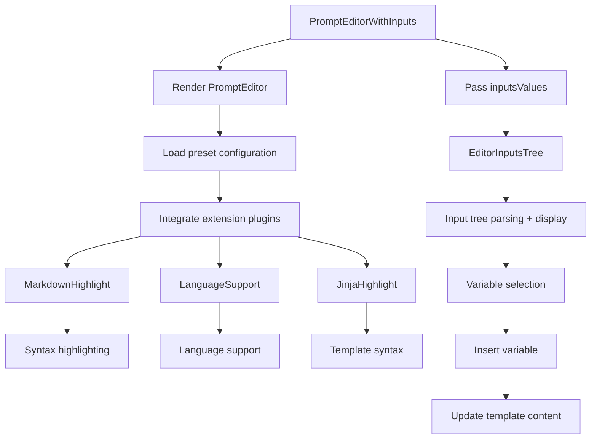

import { SourceCode } from '@theme';
import { BasicStory } from 'components/form-materials/components/prompt-editor-with-inputs';

# PromptEditorWithInputs

PromptEditorWithInputs is an enhanced prompt editor that integrates input variable management functionality. Built on PromptEditor, it additionally provides a tree-structured variable selector for inputs, enabling users to conveniently reference and manage input variables in prompt templates.

## Demo

### Basic Usage

<BasicStory />

```tsx pure title="form-meta.tsx"
import { PromptEditorWithInputs } from '@flowgram.ai/form-materials';

const formMeta = {
  render: () => (
    <>
      <Field<IInputsValues | undefined>
        name="inputsValues"
        defaultValue={{
          a: { type: 'constant', content: '123' },
          b: { type: 'ref', content: ['start_0', 'obj'] },
        }}
      >
        {({ field }) => (
          <InputsValuesTree value={field.value} onChange={(value) => field.onChange(value)} />
        )}
      </Field>
      <br />
      <Field<IInputsValues | undefined> name="inputsValues">
        {({ field: inputsField }) => (
          <Field<IFlowTemplateValue | undefined>
            name="prompt_editor_with_inputs"
            defaultValue={{
              type: 'template',
              content: '# Query \n {{b.obj2.num}}',
            }}
          >
            {({ field }) => (
              <PromptEditorWithInputs
                value={field.value}
                onChange={(value) => field.onChange(value)}
                inputsValues={inputsField.value || {}}
              />
            )}
          </Field>
        )}
      </Field>
    </>
  ),
}
```

### Inputs Insertion

Enter the `@`, `{` characters in the editor to trigger the Inputs selector.

After entering `@`, `{`, a list of available variables will be displayed. Selecting a variable will automatically insert it in the `{{inputs.path}}` format.

## API Reference

### PromptEditorWithInputs Props

| Property | Type | Default | Description |
|----------|------|---------|-------------|
| `value` | `{ type: 'template', content: string }` | - | Prompt template content |
| `inputsValues` | `IInputsValues` | `{}` | Input variable key-value pairs |
| `onChange` | `(value: { type: 'template', content: string }) => void` | - | Callback function when content changes |
| `readonly` | `boolean` | `false` | Whether it's read-only mode |
| `placeholder` | `string` | - | Placeholder text |
| `activeLinePlaceholder` | `string` | - | Current line placeholder hint |
| `hasError` | `boolean` | `false` | Whether to display error state |
| `disableMarkdownHighlight` | `boolean` | `false` | Whether to disable Markdown highlighting |
| `options` | `Options` | - | CodeMirror configuration options |

## Source Code Guide

<SourceCode
  href="https://github.com/bytedance/flowgram.ai/tree/main/packages/materials/form-materials/src/components/prompt-editor-with-inputs"
/>

Use CLI command to copy source code locally:

```bash
npx @flowgram.ai/cli@latest materials components/prompt-editor-with-inputs
```

### Directory Structure Explanation

```
prompt-editor-with-inputs/
├── index.tsx           # Lazy loading export file
├── editor.tsx          # Main component implementation
└── README.md          # Component documentation

prompt-editor/
├── index.tsx           # Basic prompt editor export
├── editor.tsx          # Basic prompt editor implementation
├── types.ts            # Type definitions
├── styles.ts           # Style components
└── extensions/         # Editor extensions
    ├── markdown.tsx    # Markdown highlighting
    ├── language-support.tsx # Language support
    └── jinja.tsx       # Jinja template highlighting
```

### Core Implementation Explanation

#### Input Variable Integration
PromptEditorWithInputs extends the basic PromptEditor, adding an input variable selector:

```typescript
export function PromptEditorWithInputs({
  inputsValues,
  ...restProps
}: PromptEditorWithInputsProps) {
  return (
    <PromptEditor {...restProps}>
      <EditorInputsTree inputsValues={inputsValues} />
    </PromptEditor>
  );
}
```

#### Basic Prompt Editor
The basic PromptEditor provides complete template editing functionality:

```typescript
<PromptEditor
  value={field.value}
  onChange={(value) => field.onChange(value)}
  placeholder="Enter prompt template..."
  activeLinePlaceholder="Press @ to insert variable"
/>
```

#### Editor Extensions
The basic editor integrates multiple extensions:

- **MarkdownHighlight**: Provides Markdown syntax highlighting
- **LanguageSupport**: Supports multiple programming languages
- **JinjaHighlight**: Jinja2 template syntax highlighting

#### Variable Selector
The `EditorInputsTree` component provides a tree-structured variable selector:

```typescript
<EditorInputsTree inputsValues={inputsValues} />
```

### Flowgram APIs Used

#### @flowgram.ai/coze-editor/react
- `Renderer`: Editor renderer
- `EditorProvider`: Editor provider
- `ActiveLinePlaceholder`: Active line placeholder
- `InferValues`: Type inference tool

#### @flowgram.ai/coze-editor/preset-prompt
- `preset`: Prompt editor preset configuration
- `EditorAPI`: Editor API interface

#### @flowgram.ai/shared
- `IInputsValues`: Input variable type definition

### Overall Process


