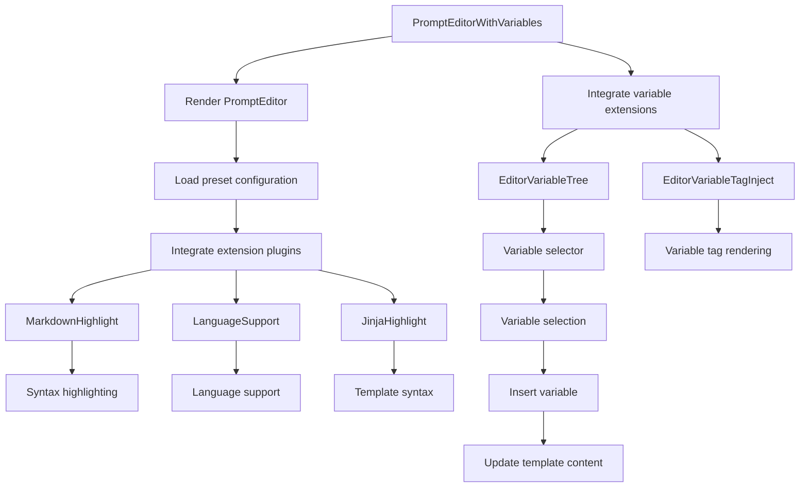

import { SourceCode } from '@theme';
import { BasicStory } from 'components/form-materials/components/prompt-editor-with-variables';

# PromptEditorWithVariables

PromptEditorWithVariables is an enhanced prompt editor that integrates variable management functionality. Built on PromptEditor, it provides a variable tree selector and variable tag injection, enabling users to conveniently reference and manage variables in prompt templates.

<br />
<div>
  
  *Prompts in LLM_3 and LLM_4 reference loop batch processing variables*
</div>

## Demo

### Basic Usage

<BasicStory />

```tsx pure title="form-meta.tsx"
import { PromptEditorWithVariables } from '@flowgram.ai/form-materials';

const formMeta = {
  render: () => (
    <>
      <Field<any> name="prompt_template" defaultValue={{
              type: 'template',
              content: `# Role
You are a helpful assistant

# Query
{{start_0.str}}`,
            }}>
        {({ field }) => (
          <PromptEditorWithVariables
            value={field.value}
            onChange={(value) => field.onChange(value)}
          />
        )}
      </Field>
    </>
  ),
}
```

### Variable Insertion

Enter the `@`, `{` characters in the editor to trigger the variable selector.

After entering `@`, `{`, a list of available variables will be displayed. Selecting a variable will automatically insert it in the `{{variable.path}}` format.

## API Reference

### PromptEditorWithVariables Props

| Property | Type | Default | Description |
|----------|------|---------|-------------|
| `value` | `{ type: 'template', content: string }` | - | Prompt template content |
| `onChange` | `(value: { type: 'template', content: string }) => void` | - | Callback function when content changes |
| `readonly` | `boolean` | `false` | Whether it's read-only mode |
| `placeholder` | `string` | - | Placeholder text |
| `activeLinePlaceholder` | `string` | - | Current line placeholder hint |
| `hasError` | `boolean` | `false` | Whether to display error state |
| `disableMarkdownHighlight` | `boolean` | `false` | Whether to disable Markdown highlighting |
| `options` | `Options` | - | CodeMirror configuration options |

## Source Code Guide

<SourceCode
  href="https://github.com/bytedance/flowgram.ai/tree/main/packages/materials/form-materials/src/components/prompt-editor-with-variables"
/>

Use CLI command to copy source code locally:

```bash
npx @flowgram.ai/cli@latest materials components/prompt-editor-with-variables
```

### Directory Structure Explanation

```
prompt-editor-with-variables/
├── index.tsx           # Lazy loading export file
├── editor.tsx          # Main component implementation
└── README.md          # Component documentation

prompt-editor/
├── index.tsx           # Basic prompt editor export
├── editor.tsx          # Basic prompt editor implementation
├── types.ts            # Type definitions
├── styles.ts           # Style components
└── extensions/         # Editor extensions
    ├── markdown.tsx    # Markdown highlighting
    ├── language-support.tsx # Language support
    └── jinja.tsx       # Jinja template highlighting
```

### Core Implementation Explanation

#### Variable Selector Integration
PromptEditorWithVariables extends the basic PromptEditor, adding variable management functionality:

```typescript
export function PromptEditorWithVariables(props: PromptEditorWithVariablesProps) {
  return (
    <PromptEditor {...props}>
      <EditorVariableTree />
      <EditorVariableTagInject />
    </PromptEditor>
  );
}
```

#### Variable Tree Selector
The `EditorVariableTree` component provides a tree-structured variable selector:

- Supports triggering variable selection with `@`
- Supports tree display of nested variables
- Supports searching and filtering variables
- Supports variable type icon display

#### Variable Tag Injection
The `EditorVariableTagInject` component is responsible for variable tag rendering and management:

- Variable tag style rendering
- Variable tag interaction handling
- Variable tag validation and error prompts

### Flowgram APIs Used

#### @flowgram.ai/coze-editor/react
- `Renderer`: Editor renderer
- `EditorProvider`: Editor provider
- `ActiveLinePlaceholder`: Active line placeholder
- `InferValues`: Type inference tool

#### @flowgram.ai/coze-editor/preset-prompt
- `preset`: Prompt editor preset configuration
- `EditorAPI`: Editor API interface

#### coze-editor-extensions materials

See [CozeEditorExtensions](./coze-editor-extensions)

- `EditorVariableTree`: Variable tree selection trigger
- `EditorVariableTagInject`: Variable tag display

### Overall Process


