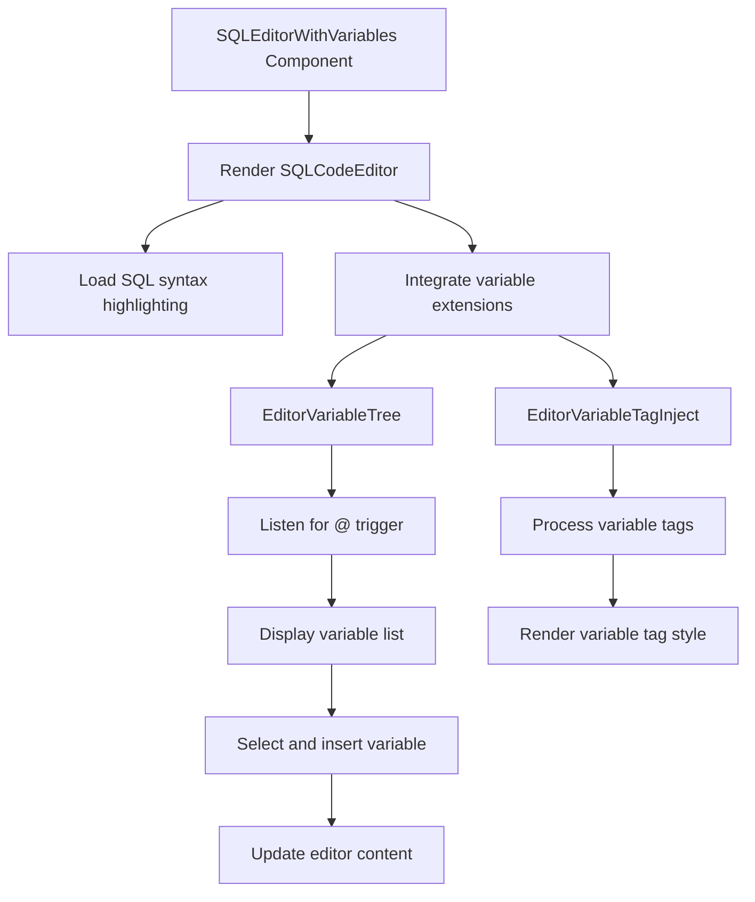

import { SourceCode } from '@theme';
import { BasicStory } from 'components/form-materials/components/sql-editor-with-variables';

# SQLEditorWithVariables

SQLEditorWithVariables is an enhanced SQL editor that supports inserting variable references in SQL. It is built on top of SQLCodeEditor and integrates a variable selector and variable tag injection, allowing users to reference variables using the `{{variable}}` syntax in SQL strings.

## Examples

### Basic Usage

<BasicStory />

```tsx pure title="form-meta.tsx"
import { SQLEditorWithVariables } from '@flowgram.ai/form-materials';

const formMeta = {
  render: () => (
    <>
      <FormHeader />
      <Field<string | undefined>
        name="sql_editor_with_variables"
        defaultValue="SELECT * FROM users WHERE user_id = {{start_0.str}}"
      >
        {({ field }) => (
          <SQLEditorWithVariables
            value={field.value}
            onChange={(value) => field.onChange(value)}
          />
        )}
      </Field>
    </>
  ),
}
```

### SQL Example with Variables

```sql
SELECT
  id, name, email
FROM users
WHERE id = {{start_0.user_id}}
  AND email LIKE '%{{start_0.domain}}'
LIMIT 10;
```

### Variable Insertion

Typing `@` or `{` in the editor can trigger the variable selector.

After typing `@` or `{`, a list of available variables will be displayed. Selecting a variable will automatically insert it in the `{{variable.name}}` format.

## API Reference

### SQLEditorWithVariables Props

| Property | Type | Default | Description |
|---|---|---|---|
| `value` | `string` | - | The content of the SQL string |
| `onChange` | `(value: string) => void` | - | Callback function when the content changes |
| `theme` | `'dark' \| 'light'` | `'light'` | The theme of the editor |
| `placeholder` | `string` | - | Placeholder text |
| `activeLinePlaceholder` | `string` | `'Type @ to select a variable'` | Placeholder hint for the current line |
| `readonly` | `boolean` | `false` | Whether it is in read-only mode |
| `options` | `Options` | - | CodeMirror configuration options |

### Variable Syntax

Use double curly braces to reference variables in the SQL string:

```sql
SELECT * FROM orders WHERE user_id = {{variable.path}}
```

Supported variable formats:
- `{{start_0.name}}` - Simple variable
- `{{start_0.address.city}}` - Nested property

## Source Code Guide

<SourceCode
  href="https://github.com/bytedance/flowgram.ai/tree/main/packages/materials/form-materials/src/components/sql-editor-with-variables"
/>

You can copy the source code locally using the CLI command:

```bash
npx @flowgram.ai/cli@latest materials components/sql-editor-with-variables
```

### Directory Structure

```
sql-editor-with-variables/
├── index.tsx           # Lazy-loaded export file
├── editor.tsx          # Main component implementation
└── README.md          # Component documentation
```

### Core Implementation

#### Variable Selector Integration
Integrate the `EditorVariableTree` and `EditorVariableTagInject` extensions:

```typescript
<EditorVariableTree />
<EditorVariableTagInject />
```

#### Trigger Characters
By default, `@` is used as the trigger character for variable selection. If you need to customize the trigger characters, you can extend it using the underlying `SQLCodeEditor`:

```typescript
import { SQLCodeEditor } from '@flowgram.ai/form-materials';

<SQLCodeEditor>
  <EditorVariableTree triggerCharacters={["@", "#", "$"]} />
  <EditorVariableTagInject />
</SQLCodeEditor>
```

### Used Flowgram APIs

#### @flowgram.ai/coze-editor
- `SQLCodeEditor`: SQL code editor
- `EditorVariableTree`: Variable tree selector
- `EditorVariableTagInject`: Variable tag injector

#### @flowgram.ai/i18n
- `I18n`: Internationalization support

#### coze-editor-extensions Materials
- `EditorVariableTree`: Trigger for variable tree selection
- `EditorVariableTagInject`: Display for variable tags

### Overall Flow


