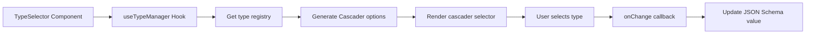

import { SourceCode } from '@theme';
import { BasicStory } from 'components/form-materials/components/type-selector';

# TypeSelector

TypeSelector is a type selector component used for selecting JSON Schema types in forms. It supports both basic types and composite types (such as array types).

<br />
<div>
  
</div>

## Demo

### Basic Usage

<BasicStory />

```tsx pure title="form-meta.tsx"
import { TypeSelector } from '@flowgram.ai/form-materials';

const formMeta = {
  render: () => (
    <>
      <FormHeader />
      <Field<Partial<IJsonSchema> | undefined> name="type_selector" defaultValue={{ type: 'string' }}>
        {({ field }) => (
          <TypeSelector value={field.value} onChange={(value) => field.onChange(value)} />
        )}
      </Field>
    </>
  ),
}
```

## API Reference

### TypeSelector Props

| Property | Type | Default | Description |
|----------|------|---------|-------------|
| `value` | `Partial<IJsonSchema>` | - | Selected type value, conforms to JSON Schema format |
| `onChange` | `(value?: Partial<IJsonSchema>) => void` | - | Callback function when type selection changes |
| `readonly` | `boolean` | `false` | Whether it's read-only mode |
| `disabled` | `boolean` | `false` | Whether it's disabled (deprecated, use readonly instead) |
| `style` | `React.CSSProperties` | - | Custom styles |

### Type Format Description

TypeSelector supports the following JSON Schema type formats:

- **Basic types**: `{ type: 'string' }`, `{ type: 'number' }`, `{ type: 'boolean' }`, etc.
- **Array types**: `{ type: 'array', items: { type: 'string' } }`
- **Nested arrays**: `{ type: 'array', items: { type: 'array', items: { type: 'string' } } }`

## Source Code Guide

<SourceCode
  href="https://github.com/bytedance/flowgram.ai/tree/main/packages/materials/form-materials/src/components/type-selector"
/>

Use CLI command to copy source code locally:

```bash
npx @flowgram.ai/cli@latest materials components/type-selector
```

### Directory Structure Explanation

```
type-selector/
├── index.tsx           # Main component implementation, contains TypeSelector core logic
└── README.md          # Component documentation
```

### Core Implementation Explanation

#### getTypeSelectValue
Converts JSON Schema object to array format required by Cascader component:

```typescript
// Input: { type: 'array', items: { type: 'string' } }
// Output: ['array', 'string']
```

#### parseTypeSelectValue
Converts Cascader component's array value back to JSON Schema object:

```typescript
// Input: ['array', 'string']
// Output: { type: 'array', items: { type: 'string' } }
```

### Flowgram APIs Used

#### @flowgram.ai/json-schema
- `useTypeManager()`: Get type manager for handling JSON Schema type display and validation
- `IJsonSchema`: JSON Schema type definition
- `JsonSchemaTypeManager`: Type manager class, provides type registration, icon display, and other features

### Overall Process


