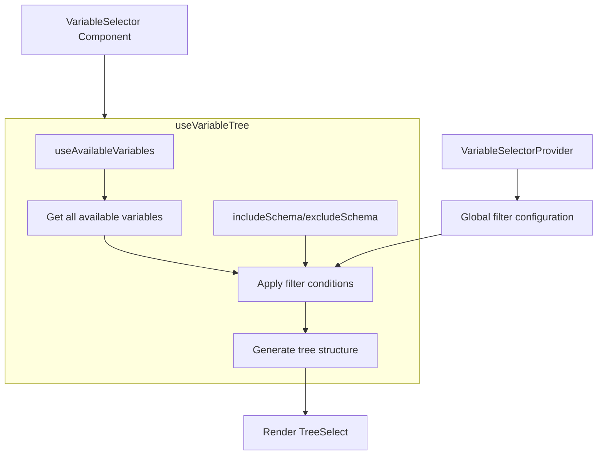

import { SourceCode } from '@theme';
import { BasicStory, FilterSchemaStory, CustomFilterStory } from 'components/form-materials/components/variable-selector';

# VariableSelector

VariableSelector is a component for selecting variables in the current scope, with filtering capabilities based on variable types.

<br />
<div>
  
</div>

## Demo

### Direct Usage

<BasicStory />

```tsx pure title="form-meta.tsx"
import { VariableSelector } from '@flowgram.ai/form-materials';

const formMeta = {
  render: () => (
    <>
      <FormHeader />
      <Field<string[] | undefined> name="variable_selector">
        {({ field }) => (
          <VariableSelector value={field.value} onChange={(value) => field.onChange(value)} />
        )}
      </Field>
    </>
  ),
}
```

### Filter Variable Types

<FilterSchemaStory />

```tsx pure title="form-meta.tsx"
import { VariableSelector } from '@flowgram.ai/form-materials';

const formMeta = {
  render: () => (
    <>
      <FormHeader />
      <Field<string[] | undefined> name="variable_selector">
        {({ field }) => (
          <VariableSelector
            value={field.value}
            onChange={(value) => field.onChange(value)}
            includeSchema={{ type: 'string' }}
          />
        )}
      </Field>
    </>
  ),
}
```

### Custom Filter Logic

<CustomFilterStory />

```tsx pure title="form-meta.tsx"
import { VariableSelector } from '@flowgram.ai/form-materials';

const formMeta = {
  render: () => (
    <VariableSelectorProvider skipVariable={(variable) => variable?.key === 'str'}>
      <FormHeader />
      <Field<string[] | undefined> name="variable_selector">
        {({ field }) => (
          <VariableSelector
            value={field.value}
            onChange={(value) => field.onChange(value)}
          />
        )}
      </Field>
    </VariableSelectorProvider>
  ),
}
```

## API Reference

### VariableSelector Props

| Property | Type | Default | Description |
|----------|------|---------|-------------|
| `value` | `string[]` | - | Selected variable path array |
| `onChange` | `(value?: string[]) => void` | - | Callback function when variable selection changes |
| `config` | `VariableSelectorConfig` | `{}` | Configuration object |
| `includeSchema` | `IJsonSchema \| IJsonSchema[]` | - | Variable type inclusion filter conditions |
| `excludeSchema` | `IJsonSchema \| IJsonSchema[]` | - | Variable type exclusion filter conditions |
| `readonly` | `boolean` | `false` | Whether it's read-only mode |
| `hasError` | `boolean` | `false` | Whether to display error state |
| `style` | `React.CSSProperties` | - | Custom styles |
| `triggerRender` | `(props: TriggerRenderProps) => React.ReactNode` | - | Custom trigger renderer |

### VariableSelectorConfig

| Property | Type | Default | Description |
|----------|------|---------|-------------|
| `placeholder` | `string` | `'Select variable'` | Placeholder text |
| `notFoundContent` | `string` | `'Not defined'` | Content displayed when variable is not found |

### VariableSelectorProvider Props

| Property | Type | Default | Description |
|----------|------|---------|-------------|
| `skipVariable` | `(variable?: BaseVariableField) => boolean` | - | Custom variable filter function |
| `includeSchema` | `IJsonSchema \| IJsonSchema[]` | - | Variable type inclusion filter conditions |
| `excludeSchema` | `IJsonSchema \| IJsonSchema[]` | - | Variable type exclusion filter conditions |
| `children` | `React.ReactNode` | - | Child components |

## Source Code Guide

<SourceCode
  href="https://github.com/bytedance/flowgram.ai/tree/main/packages/materials/form-materials/src/components/variable-selector"
/>

Use CLI command to copy source code locally:

```bash
npx @flowgram.ai/cli@latest materials components/variable-selector
```

### Directory Structure Explanation

```
variable-selector/
├── index.tsx           # Main component implementation, contains VariableSelector core logic
├── context.tsx         # Provides `VariableSelectorContext` for global variable filtering configuration
├── use-variable-tree.tsx # Custom Hook for processing variable tree data transformation and filtering
├── styles.tsx          # Style definitions using styled-components
└── README.md          # Component documentation
```

### Overall Process



### Flowgram APIs Used

#### @flowgram.ai/variable-core
- `useAvailableVariables()`: Get all available variables in the current scope
- `BaseVariableField`: Basic variable field type, includes variable key, type, metadata, etc.

#### @flowgram.ai/json-schema
- `useTypeManager()`: Get type manager for handling variable type display and validation
- `IJsonSchema`: JSON Schema type definition for variable type validation
- `JsonSchemaUtils`: JSON Schema utility class, provides type matching and conversion functions
