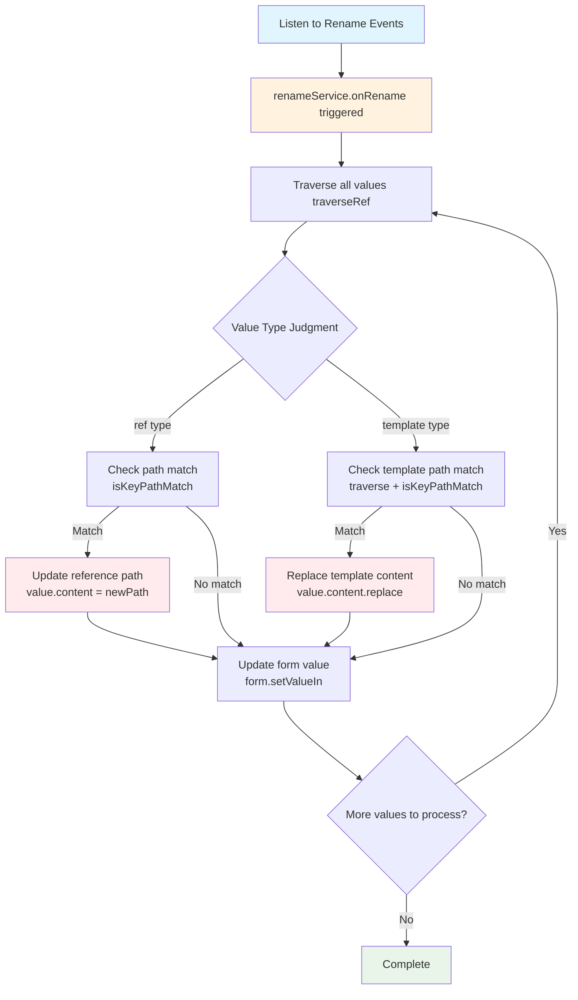

# autoRenameRef

autoRenameRef is an automatic reference renaming effect that automatically updates all reference values and template values referencing that field when the key name of a form field changes.

<br />
<div>
  
  *When the query variable name changes, automatically rename references in downstream inputs*
</div>

## Demo

import { BasicStory } from 'components/form-materials/effects/auto-rename-ref';

### Basic Usage

<BasicStory />

```tsx pure title="form-meta.tsx"
import { autoRenameRefEffect } from '@flowgram.ai/form-materials';

const formMeta = {
  effects: {
    "inputsValues": autoRenameRefEffect,
  },
  render: () => (
    <>
      <FormHeader />
      <Field<any> name="inputsValues">
        {({ field }) => (
          <InputsValues value={field.value} onChange={(value) => field.onChange(value)} />
        )}
      </Field>
    </>
  ),
}
```

### Usage in Complex Forms

```tsx pure title="form-meta.tsx"
import { autoRenameRefEffect } from '@flowgram.ai/form-materials';

const formMeta = {
  effects: {
    // Apply automatic renaming effect to multiple fields
    "inputsValues": autoRenameRefEffect,
    "outputsValues": autoRenameRefEffect,
    "config.data": autoRenameRefEffect,
  },
  render: () => (
    <>
      <FormHeader />
      <Field<any> name="inputsValues"> {/* inputsValues implementation */} </Field>
      <Field<any> name="outputsValues"> {/* outputsValues implementation */} </Field>
      <Field<any> name="config.data"> {/* config.data implementation */} </Field>
    </>
  ),
}
```

## API Reference

### Supported Value Types

The automatic renaming of autoRenameEffect is only triggered when the data under the specified key meets the following conditions:

- **Reference Value (ref)**: `{ type: 'ref', content: ['field', 'path'] }`
- **Template Value (template)**: `{ type: 'template', content: 'Hello {{user.name}}' }`
- **Complex Structure Containing Reference and Template Values**:
  ```json
  {
    "a": {
      "type": "ref",
      "content": ["start_0", "str"]
    },
    "b": {
      "c": {
        "type": "template",
        "content": "Hello {{a}}"
      }
    }
  }
  ```

## Source Code Guide

import { SourceCode } from '@theme';

<SourceCode
  href="https://github.com/bytedance/flowgram/tree/main/packages/materials/form-materials/src/effects/auto-rename-ref"
/>

Copy source code locally using CLI command:

```bash
npx @flowgram.ai/cli@latest materials effects/auto-rename-ref
```

### Core Process

1. **Listen to Rename Events**: Listen for field key name changes through `VariableFieldKeyRenameService`
2. **Traverse Reference Values**: Find all reference values and template values
3. **Match Key Paths**: Check if the reference path matches the path before the change
4. **Update References**: Update matching reference paths to the new key path



### Core APIs Used

#### @flowgram.ai/variable-core
- `VariableFieldKeyRenameService`: Field key name rename listener

#### @flowgram.ai/node
- `DataEvent.onValueInit`: Value initialization event
- `Effect`: Effect type definition

#### FlowValueUtils
- `FlowValueUtils.getTemplateKeyPaths()`: Extract all key paths from templates
