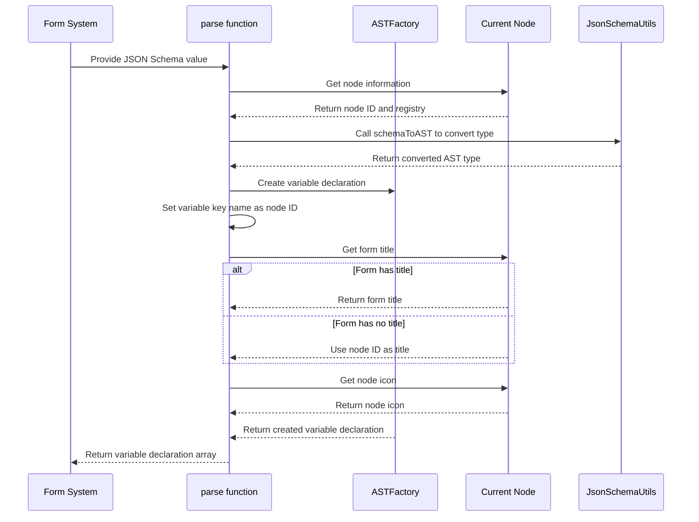

import { SourceCode } from '@theme';
import { BasicStory } from 'components/form-materials/effects/provide-json-schema-output';

# provideJsonSchemaOutputs

provideJsonSchemaOutputs is a form effect that converts JSON Schema definitions into output variables in the FlowGram variable engine.

It automatically parses the JSON Schema structure defined in the form into variable declarations, allowing other nodes in the workflow to reference these outputs.

## Examples

### Basic Usage

:::tip

`provideJsonSchemaOutputs` is typically used with [`syncVariableTitle`](./sync-variable-title) to ensure variables **real-time synchronize with node titles**.

:::


<BasicStory />

```tsx pure title="form-meta.tsx"
import { JsonSchemaEditor, provideJsonSchemaOutputs, syncVariableTitle } from '@flowgram.ai/form-materials';
import { Field } from '@flowgram.ai/free-layout-editor';

const formMeta = {
  render: () => (
    <>
      <FormHeader />
      <Field<IJsonSchema | undefined>
        name="outputs"
        defaultValue={{
          type: 'object',
          properties: {
            name: { type: 'string' },
            age: { type: 'number' },
          },
        }}
      >
        {({ field }) => (
          <JsonSchemaEditor value={field.value} onChange={(value) => field.onChange(value)} />
        )}
      </Field>
    </>
  ),
  effect: {
    // Sync title to variable
    title: syncVariableTitle,
    // Convert JSON Schema to output variables
    outputs: provideJsonSchemaOutputs,
  },
}
```


## API Reference

### provideJsonSchemaOutputs

Provides a form effect that converts JSON Schema to workflow output variables.

#### Parameters
- No direct parameters, used directly in formMeta.effect as a form effect

#### Return Value
- `EffectOptions[]`: Array of form effect options for formMeta.effect configuration

#### Working Principle

This form effect will:
1. Get the JSON Schema value defined in the form
2. Convert the Schema to FlowGram's AST type
3. Create variable declaration with key name as the current node ID
4. Set variable metadata (title, icon, etc.)

## Source Code Guide

<SourceCode
  href="https://github.com/bytedance/flowgram.ai/tree/main/packages/materials/form-materials/src/effects/provide-json-schema-outputs/index.ts"
/>

Use CLI command to copy source code to local:

```bash
npx @flowgram.ai/cli@latest materials effects/provide-json-schema-outputs
```

### Directory Structure

```
provide-json-schema-outputs/
└── index.ts           # Main implementation file, exports provideJsonSchemaOutputs form effect
```

### Core Implementation

#### Variable Generation Logic

provideJsonSchemaOutputs uses the [`createEffectFromVariableProvider`](/guide/variable/variable-output) factory function to create variable providers. It uses the `JsonSchemaUtils.schemaToAST` function within the effect to convert the JSON Schema filled in the form into AST.

:::tip

`JsonSchemaUtils.schemaToAST` recursively parses JSON schema to generate AST, see  [utils.ts](https://github.com/bytedance/flowgram.ai/blob/main/packages/variable-engine/json-schema/src/json-schema/utils.ts)

:::

Variable generation flow sequence diagram:



### Dependency Overview

#### flowgram API

[**@flowgram.ai/json-schema**](https://github.com/bytedance/flowgram.ai/tree/main/packages/variable/json-schema)
- [`JsonSchemaUtils`](https://flowgram.ai/auto-docs/json-schema/modules/JsonSchemaUtils): JSON Schema utility class for converting Schema to AST
- [`IJsonSchema`](https://flowgram.ai/auto-docs/json-schema/interfaces/IJsonSchema): JSON Schema interface definition

[**@flowgram.ai/editor**](https://github.com/bytedance/flowgram.ai/tree/main/packages/client/editor)
- [`EffectOptions`](https://flowgram.ai/auto-docs/editor/types/EffectOptions): Form effect options type
- [`FlowNodeRegistry`](https://flowgram.ai/auto-docs/document/interfaces/FlowNodeRegistry-1): Node registration type definition
- [`createEffectFromVariableProvider`](/guide/variable/variable-output): Factory function to create form effects from variable providers

[**@flowgram.ai/variable-core**](https://github.com/bytedance/flowgram.ai/tree/main/packages/client/editor)
- [`ASTFactory`](https://flowgram.ai/auto-docs/editor/modules/ASTFactory): AST creation factory for generating variable declarations
