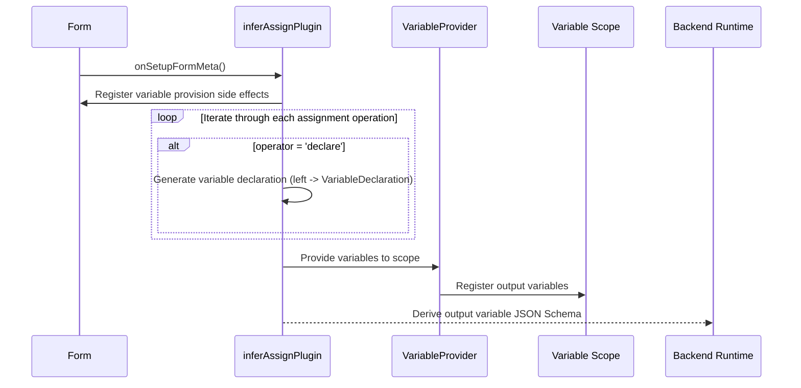

import { SourceCode } from '@theme';
import { BasicStory } from 'components/form-materials/form-plugins/infer-assign-plugin';

# inferAssignPlugin

`inferAssignPlugin` is a form plugin used for variable assignment nodes to automatically derive output variables. It is typically used in conjunction with the [`AssignRows`](../components/assign-rows) component.

The plugin implements the following capabilities for `declare` (declaring new variables) in `AssignRows`:
- Automatically generates node output variables, where the variable name is the left-hand value in the `declare` operator, and the variable type is automatically inferred based on the `right` value.
- When submitting data to the backend, automatically generates the corresponding JSON Schema based on the output variable types.

## Examples

### Basic Usage

:::tip

Click the Debug panel in the top right corner of the demo to view the JSON data sent to the backend

:::

<BasicStory />

```tsx pure title="form-meta.tsx"
import { createInferAssignPlugin, AssignRows, DisplayOutputs } from '@flowgram.ai/form-materials';

export const VariableFormRender = ({ form }) => {
  return (
    <>
      <FormHeader />
      <AssignRows
        name="assign"
        defaultValue={[
          // Declare variable from constant
          {
            operator: 'declare',
            left: 'userName',
            right: {
              type: 'constant',
              content: 'John Doe',
              schema: { type: 'string' },
            },
          },
          // Declare variable from variable
          {
            operator: 'declare',
            left: 'userInfo',
            right: {
              type: 'ref',
              content: ['start_0', 'obj'],
            },
          },
          // Assign existing variable
          {
            operator: 'assign',
            left: {
              type: 'ref',
              content: ['start_0', 'str'],
            },
            right: {
              type: 'constant',
              content: 'Hello Flowgram',
              schema: { type: 'string' },
            },
          },
        ]}
      />
      <DisplayOutputs displayFromScope />
    </>
  );
};

export const formMeta: FormMeta = {
  render: VariableFormRender,
  plugins: [
    createInferAssignPlugin({
      assignKey: 'assign',
      outputKey: 'outputs'
    })
  ],
};
```

## API Reference

```typescript
function createInferAssignPlugin(options: {
  assignKey: string;
  outputKey: string;
}): FormPlugin;
```

| Property | Type | Default | Description |
| :--- | :--- | :--- | :--- |
| assignKey | `string` | - | Field path in the form for storing the assignment operations array, value type is `AssignValueType[]` |
| outputKey | `string` | - | Field path for storing the output JSON Schema |


## Source Code Guide

<SourceCode
  href="https://github.com/bytedance/flowgram.ai/tree/main/packages/materials/form-materials/src/form-plugins/infer-assign-plugin"
/>

You can copy the source code locally using the CLI command:

```bash
npx @flowgram.ai/cli@latest materials form-plugins/infer-assign-plugin
```

### Directory Structure

```plaintext
infer-assign-plugin/
└── index.ts                  # Main plugin entry, creates and exports the plugin
```

### Core Implementation




### Dependencies

#### flowgram API

[**@flowgram.ai/editor**](https://github.com/bytedance/flowgram.ai/tree/main/packages/client/editor)
- `defineFormPluginCreator`: Factory function for defining form plugins
- `FormPlugin`: Form plugin type definition
- `FormPluginSetupMetaCtx`: Plugin setup context, provides `mergeEffect`, `addFormatOnSubmit` methods

[**@flowgram.ai/variable-core**](https://github.com/bytedance/flowgram.ai/tree/main/packages/variable-engine/variable-core)

[**@flowgram.ai/json-schema**](https://github.com/bytedance/flowgram.ai/tree/main/packages/variable-engine/json-schema)
- `IJsonSchema`: JSON Schema type definition

#### Other Dependencies

[**FlowValue**](../common/flow-value)
- `FlowValueUtils.inferJsonSchema()`: Infers JSON Schema from IFlowValue
- `FlowValueUtils.isConstant()`, `FlowValueUtils.isRef()`: Type checking utilities
- `IFlowValue`: Union type for Flow values
- `IFlowRefValue`: Variable reference type
- `IFlowConstantValue`: Constant type
