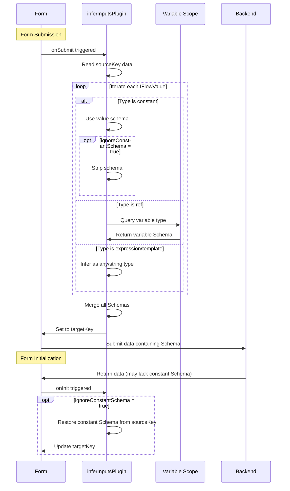

import { SourceCode } from '@theme';
import { BasicStory } from 'components/form-materials/form-plugins/infer-inputs-plugin';

# inferInputsPlugin

`inferInputsPlugin` is a **form plugin for automatically inferring JSON Schema of input parameters**. It can **automatically generate corresponding JSON Schema structures based on IFlowValue types (constants or variable references) before data is sent to the backend runtime**, providing type information for backend runtime type validation and backend interfaces.

<br />
<div>
  
  *When transmitted to the backend runtime, the JSON Schema of the inputs field is inferred from the values in inputsValues*
</div>

:::tip{title="Applicable Scenarios"}

- **HTTP Nodes**: Infer Schema for request headers and query parameters
- **Code Nodes**: Infer type structure for code input parameters
- **Function Call Nodes**: Infer Schema for function parameters
- **Any nodes accepting dynamic inputs**: Need to provide input type information for the backend

:::

## Demo

### Basic Usage

:::tip

Click the Debug panel in the top right corner of the demo to view the JSON data sent to the backend

:::

<BasicStory />

Infer Schema for HTTP request headers and body:

```tsx pure title="form-meta.tsx"
import { createInferInputsPlugin, InputsValue, InputsValuesTree } from '@flowgram.ai/form-materials';
import { Field } from '@flowgram.ai/editor';

export const HttpFormRender = ({ form }) => {
  return (
    <>
      <FormHeader />
      <FormContent>
        <Field<Record<string, IFlowValue>> name="headersValues">
          {({ field }) => (
            <InputsValues
              value={field.value}
              onChange={(val) => field.onChange(val)}
            />
          )}
        </Field>
        <Field<Record<string, IFlowValue>> name="bodyValues">
          {({ field }) => (
            <InputsValuesTree
              value={field.value}
              onChange={(val) => field.onChange(val)}
            />
          )}
        </Field>
      </FormContent>
    </>
  );
};

export const formMeta: FormMeta = {
  render: HttpFormRender,
  plugins: [
    // Infer Schema for headers
    createInferInputsPlugin({
      sourceKey: 'headersValues',
      targetKey: 'headersSchema'
    }),
    // Infer Schema for body
    createInferInputsPlugin({
      sourceKey: 'bodyValues',
      targetKey: 'bodySchema'
    })
  ],
};
```

## API Reference

```typescript
function createInferInputsPlugin(options: {
  sourceKey: string;
  targetKey: string;
  scope?: 'private' | 'public';
  ignoreConstantSchema?: boolean;
}): FormPlugin;
```

| Property | Type | Default | Description |
| :--- | :--- | :--- | :--- |
| sourceKey | `string` | - | Field path in the form that stores input values, value type is an object or array containing IFlowValue |
| targetKey | `string` | - | Field path where the inferred JSON Schema is stored |
| scope | `'private' \| 'public'` | `public` | Specifies the scope type used for variable resolution |
| ignoreConstantSchema | `boolean` | `false` | Whether to strip the Schema of constant values during submission (only keep Schema of variable references) |

## Source Code Guide

<SourceCode
  href="https://github.com/bytedance/flowgram.ai/tree/main/packages/materials/form-materials/src/form-plugins/infer-inputs-plugin/index.ts"
/>

Use CLI command to copy source code locally:

```bash
npx @flowgram.ai/cli@latest materials form-plugins/infer-inputs-plugin
```

### Directory Structure

```plaintext
infer-inputs-plugin/
└── index.tsx  # Complete plugin implementation, including Schema inference and bidirectional conversion logic
```

### Core Implementation

The core function of `inferInputsPlugin` is to infer JSON Schema from IFlowValue objects. For constant values, it directly uses their `schema` field; for variable references, it queries variable types from the scope; for expressions and templates, it infers them as corresponding basic types. The plugin also supports `ignoreConstantSchema` optimization, stripping constant Schema during submission and automatically restoring it during initialization.

#### Workflow Sequence Diagram



Core Features:

1. **Automatic Schema Inference**: Scans IFlowValue objects in form data and automatically infers their JSON Schema
2. **Variable Type Resolution**: For variable references, resolves the actual type of variables from the scope
3. **Constant Schema Optimization**: Optionally strips constant Schema during submission to reduce backend data load
4. **Bidirectional Conversion**: Restores Schema during form initialization and generates Schema during form submission

### Dependencies

#### flowgram API

[**@flowgram.ai/editor**](https://github.com/bytedance/flowgram.ai/tree/main/packages/client/editor)
- `defineFormPluginCreator`: Factory function for defining form plugins
- `FormPlugin`: Form plugin type definition
- `FormPluginSetupMetaCtx`: Plugin setup context, provides `addFormatOnInit`, `addFormatOnSubmit` methods

[**@flowgram.ai/variable-core**](https://github.com/bytedance/flowgram.ai/tree/main/packages/variable-engine/variable-core)

[**@flowgram.ai/json-schema**](https://github.com/bytedance/flowgram.ai/tree/main/packages/variable-engine/json-schema)
- `IJsonSchema`: JSON Schema type definition

#### Other Dependencies

[**FlowValue**](../common/flow-value)
- `FlowValueUtils.inferJsonSchema()`: Infer JSON Schema of IFlowValue
- `FlowValueUtils.traverse()`: Traverse nested FlowValue structures
- `FlowValueUtils.isConstant()`, `FlowValueUtils.isRef()`: Type judgment tools
- `IFlowValue`: Union type of Flow values
- `IFlowConstantValue`: Constant type, contains `schema` field
- `IFlowRefValue`: Variable reference type, contains variable path