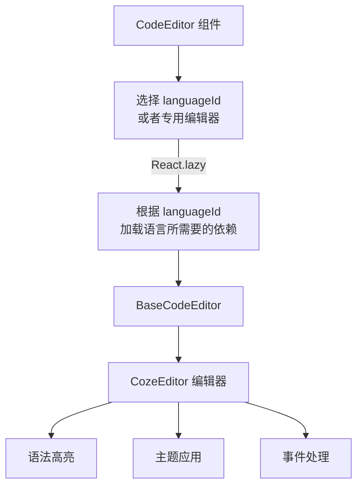

import { SourceCode } from '@theme';
import { BasicStory } from 'components/form-materials/components/code-editor';

# CodeEditor

CodeEditor 是一个功能强大的代码编辑器组件，基于 CodeMirror 6 构建，支持多种编程语言的语法高亮和智能提示。它提供了 TypeScript、Python、SQL、Shell、JSON 等语言的专用编辑器版本。

## 案例演示

### 基本使用

<BasicStory />

```tsx pure title="form-meta.tsx"
import { CodeEditor } from '@flowgram.ai/form-materials';

const formMeta = {
  render: () => (
    <>
      <FormHeader />
      <Field<string | undefined> name="code_editor">
        {({ field }) => (
          <CodeEditor
            value={field.value}
            onChange={(value) => field.onChange(value)}
            languageId="typescript"
          />
        )}
      </Field>
    </>
  ),
}
```

### 不同语言的专用编辑器

:::warning 注意事项
单独引入对应语言的专用编辑器，可以减少打包所需要的依赖
:::

```tsx
// TypeScript 编辑器
import { TypeScriptCodeEditor } from '@flowgram.ai/form-materials';

// Python 编辑器
import { PythonCodeEditor } from '@flowgram.ai/form-materials';

// SQL 编辑器
import { SQLCodeEditor } from '@flowgram.ai/form-materials';

// Shell 编辑器
import { ShellCodeEditor } from '@flowgram.ai/form-materials';

// JSON 编辑器
import { JsonCodeEditor } from '@flowgram.ai/form-materials';
```


## API 参考

### CodeEditor Props

| 属性名 | 类型 | 默认值 | 描述 |
|--------|------|--------|------|
| `value` | `string` | - | 编辑器内容 |
| `onChange` | `(value: string) => void` | - | 内容变化时的回调函数 |
| `languageId` | `'python' \| 'typescript' \| 'shell' \| 'json' \| 'sql'` | - | 代码语言类型 |
| `theme` | `'dark' \| 'light'` | `'light'` | 编辑器主题 |
| `placeholder` | `string` | - | 占位符文本 |
| `activeLinePlaceholder` | `string` | - | 当前行的占位提示 |
| `readonly` | `boolean` | `false` | 是否为只读模式 |
| `mini` | `boolean` | `false` | 是否为迷你模式 |
| `options` | `Options` | - | CodeMirror 配置选项 |

### 语言支持

CodeEditor 支持以下语言：

- **typescript**: TypeScript/JavaScript
- **python**: Python
- **sql**: SQL
- **shell**: Shell 脚本
- **json**: JSON

## 源码导读

<SourceCode
  href="https://github.com/bytedance/flowgram.ai/tree/main/packages/materials/form-materials/src/components/code-editor"
/>

使用 CLI 命令可以复制源代码到本地：

```bash
npx @flowgram.ai/cli@latest materials components/code-editor
```

### 目录结构讲解

```
code-editor/
├── index.tsx           # 统一导出文件
├── editor.tsx          # 基础编辑器组件 BaseCodeEditor
├── editor-all.tsx      # 全功能编辑器（已废弃）
├── editor-ts.tsx       # TypeScript 编辑器
├── editor-python.tsx   # Python 编辑器
├── editor-sql.tsx      # SQL 编辑器
├── editor-shell.tsx    # Shell 编辑器
├── editor-json.tsx     # JSON 编辑器
├── factory.tsx         # 编辑器工厂函数
├── theme/              # 主题配置
│   ├── dark.ts         # 暗色主题
│   ├── light.ts        # 亮色主题
│   └── index.ts        # 主题导出
├── utils.ts            # 工具函数
└── README.md          # 组件说明文档
```

### 核心实现说明

#### BaseCodeEditor

基础编辑器组件，对 coze-editor 的简单封装，提供了基础的语法高亮、主题切换、迷你模式、只读模式等功能。

:::warning 注意事项
BaseCodeEditor 不包含任何语言逻辑的加载，语言逻辑是在专用编辑器中实现的。
:::


#### 专用编辑器
每种语言都有对应的专用编辑器，通过动态导入实现按需加载：

```typescript
export const loadTypescriptLanguage = () =>
  import('@flowgram.ai/coze-editor/language-typescript').then((module) => {
    // TypeScript 语言加载逻辑
  });

export const TypeScriptCodeEditor = CodeEditorFactory<true>(
  loadTypescriptLanguage,
  {
    displayName: 'TypeScriptCodeEditor',
    fixLanguageId: 'typescript',
  }
);
```

### 使用到的 flowgram API

#### @flowgram.ai/coze-editor

@flowgram.ai/coze-editor 是一个基于 CodeMirror 6 构建的代码编辑器组件。源代码见：[coze-dev/rush-dev](https://github.com/coze-dev/rush-arch/tree/main/packages/text-editor)

- `createRenderer`: 创建编辑器
- `preset-code`: 代码编辑器预设配置
- `EditorProvider`: 编辑器上下文提供者
- `ActiveLinePlaceholder`: 当前行占位符组件

#### @codemirror/view
- `EditorView`: CodeMirror 编辑器视图


### 整体流程



### 性能优化

- **按需加载**: 每种语言按需加载
- **专用编辑器**: 推荐使用 XXXCodeEditor 而非通用 CodeEditor，以优化打包速度
