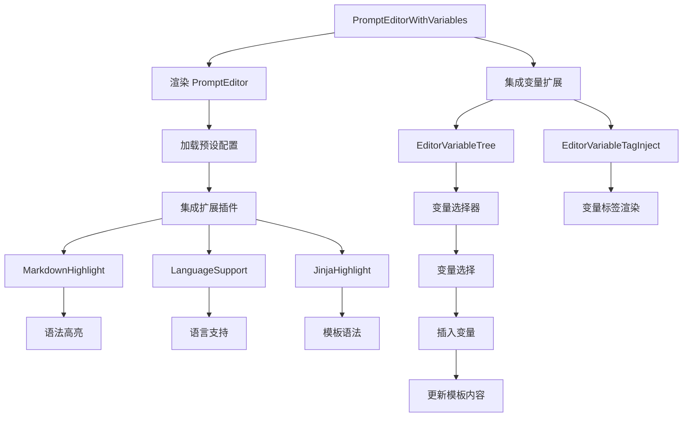

import { SourceCode } from '@theme';
import { BasicStory } from 'components/form-materials/components/prompt-editor-with-variables';

# PromptEditorWithVariables

PromptEditorWithVariables 是一个增强版的提示编辑器，集成了变量管理功能。它基于 PromptEditor 构建，提供了变量树选择器和变量标签注入功能，使用户能够在提示模板中方便地引用和管理变量。

<br />
<div>
  
  *LLM_3 和 LLM_4 的提示词中引用了循环的批处理变量*
</div>

## 案例演示

### 基本使用

<BasicStory />

```tsx pure title="form-meta.tsx"
import { PromptEditorWithVariables } from '@flowgram.ai/form-materials';

const formMeta = {
  render: () => (
    <>
      <FormHeader />
      <Field<any> name="prompt_template" defaultValue="Hello {{user.name}}, your balance is {{user.balance}}">
        {({ field }) => (
          <PromptEditorWithVariables
            value={field.value}
            onChange={(value) => field.onChange(value)}
          />
        )}
      </Field>
    </>
  ),
}
```


### 变量插入

在编辑器中输入 `@`, `{` 字符可以触发变量选择器。

输入 `@`, `{` 后会显示可用的变量列表，选择变量后会自动插入为 `{{variable.path}}` 格式。

## API 参考

### PromptEditorWithVariables Props

| 属性名 | 类型 | 默认值 | 描述 |
|--------|------|--------|------|
| `value` | `{ type: 'template', content: string }` | - | 提示模板内容 |
| `onChange` | `(value: { type: 'template', content: string }) => void` | - | 内容变化时的回调函数 |
| `readonly` | `boolean` | `false` | 是否为只读模式 |
| `placeholder` | `string` | - | 占位符文本 |
| `activeLinePlaceholder` | `string` | - | 当前行的占位提示 |
| `hasError` | `boolean` | `false` | 是否显示错误状态 |
| `disableMarkdownHighlight` | `boolean` | `false` | 是否禁用Markdown高亮 |
| `options` | `Options` | - | CodeMirror 配置选项 |


## 源码导读

<SourceCode
  href="https://github.com/bytedance/flowgram.ai/tree/main/packages/materials/form-materials/src/components/prompt-editor-with-variables"
/>

使用 CLI 命令可以复制源代码到本地：

```bash
npx @flowgram.ai/cli@latest materials components/prompt-editor-with-variables
```

### 目录结构讲解

```
prompt-editor-with-variables/
├── index.tsx           # 懒加载导出文件
├── editor.tsx          # 主组件实现
└── README.md          # 组件说明文档

prompt-editor/
├── index.tsx           # 基础提示编辑器导出
├── editor.tsx          # 基础提示编辑器实现
├── types.ts            # 类型定义
├── styles.ts           # 样式组件
└── extensions/         # 编辑器扩展
    ├── markdown.tsx    # Markdown高亮
    ├── language-support.tsx # 语言支持
    └── jinja.tsx       # Jinja模板高亮
```

### 核心实现说明

#### 变量选择器集成
PromptEditorWithVariables 扩展了基础 PromptEditor，增加了变量管理功能：

```typescript
export function PromptEditorWithVariables(props: PromptEditorWithVariablesProps) {
  return (
    <PromptEditor {...props}>
      <EditorVariableTree />
      <EditorVariableTagInject />
    </PromptEditor>
  );
}
```

#### 变量树选择器
`EditorVariableTree` 组件提供了树形结构的变量选择器：

- 支持按 `@` 触发变量选择
- 支持嵌套变量的树形展示
- 支持搜索和过滤变量
- 支持变量类型图标显示

#### 变量标签注入
`EditorVariableTagInject` 组件负责变量标签的渲染和管理：

- 变量标签的样式渲染
- 变量标签的交互处理
- 变量标签的验证和错误提示

### 使用到的 flowgram API

#### @flowgram.ai/coze-editor/react
- `Renderer`: 编辑器渲染器
- `EditorProvider`: 编辑器提供者
- `ActiveLinePlaceholder`: 活动行占位符
- `InferValues`: 类型推断工具

#### @flowgram.ai/coze-editor/preset-prompt
- `preset`: 提示编辑器预设配置
- `EditorAPI`: 编辑器API接口

#### coze-editor-extensions 物料
- `EditorVariableTree`: 变量树选择触发
- `EditorVariableTagInject`: 变量标签展示

### 整体流程


