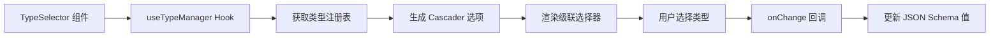

import { SourceCode } from '@theme';
import { BasicStory } from 'components/form-materials/components/type-selector';

# TypeSelector

TypeSelector 是一个类型选择器组件，用于在表单中选择 JSON Schema 类型。它支持基本类型和复合类型（如数组类型）的选择。

<br />
<div>
  
</div>

## 案例演示

### 基本使用

<BasicStory />

```tsx pure title="form-meta.tsx"
import { TypeSelector } from '@flowgram.ai/form-materials';

const formMeta = {
  render: () => (
    <>
      <FormHeader />
      <Field<Partial<IJsonSchema> | undefined> name="type_selector" defaultValue={{ type: 'string' }}>
        {({ field }) => (
          <TypeSelector value={field.value} onChange={(value) => field.onChange(value)} />
        )}
      </Field>
    </>
  ),
}
```


## API 参考

### TypeSelector Props

| 属性名 | 类型 | 默认值 | 描述 |
|--------|------|--------|------|
| `value` | `Partial<IJsonSchema>` | - | 选中的类型值，符合 JSON Schema 格式 |
| `onChange` | `(value?: Partial<IJsonSchema>) => void` | - | 类型选择变化时的回调函数 |
| `readonly` | `boolean` | `false` | 是否为只读模式 |
| `disabled` | `boolean` | `false` | 是否禁用（已废弃，请使用 readonly） |
| `style` | `React.CSSProperties` | - | 自定义样式 |

### 类型格式说明

TypeSelector 支持以下 JSON Schema 类型格式：

- **基本类型**: `{ type: 'string' }`, `{ type: 'number' }`, `{ type: 'boolean' }` 等
- **数组类型**: `{ type: 'array', items: { type: 'string' } }`
- **嵌套数组**: `{ type: 'array', items: { type: 'array', items: { type: 'string' } } }`

## 源码导读

<SourceCode
  href="https://github.com/bytedance/flowgram.ai/tree/main/packages/materials/form-materials/src/components/type-selector"
/>

使用 CLI 命令可以复制源代码到本地：

```bash
npx @flowgram.ai/cli@latest materials components/type-selector
```

### 目录结构讲解

```
type-selector/
├── index.tsx           # 主组件实现，包含 TypeSelector 核心逻辑
└── README.md          # 组件说明文档
```

### 核心实现说明

#### getTypeSelectValue
将 JSON Schema 对象转换为 Cascader 组件所需的数组格式：

```typescript
// 输入: { type: 'array', items: { type: 'string' } }
// 输出: ['array', 'string']
```

#### parseTypeSelectValue
将 Cascader 组件的数组值转换回 JSON Schema 对象：

```typescript
// 输入: ['array', 'string']
// 输出: { type: 'array', items: { type: 'string' } }
```

### 使用到的 flowgram API

#### @flowgram.ai/json-schema
- `useTypeManager()`: 获取类型管理器，用于处理 JSON Schema 类型的显示和验证
- `IJsonSchema`: JSON Schema 类型定义
- `JsonSchemaTypeManager`: 类型管理器类，提供类型注册、图标显示等功能

### 整体流程


