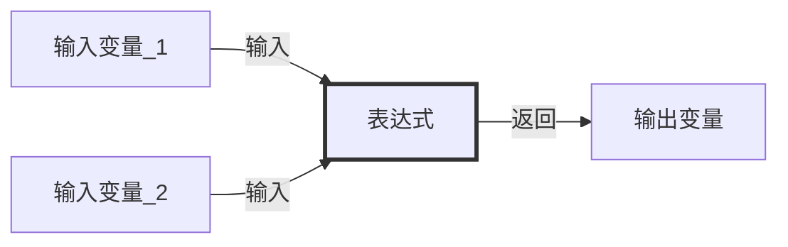
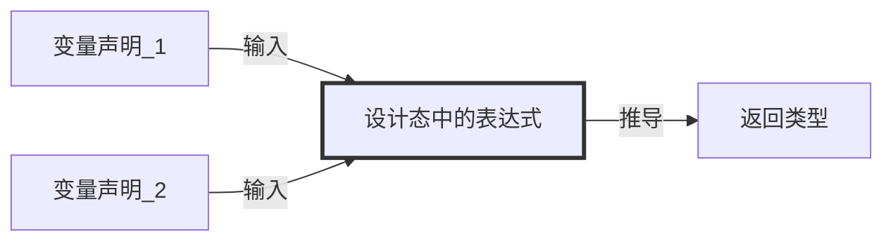
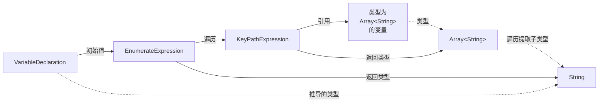
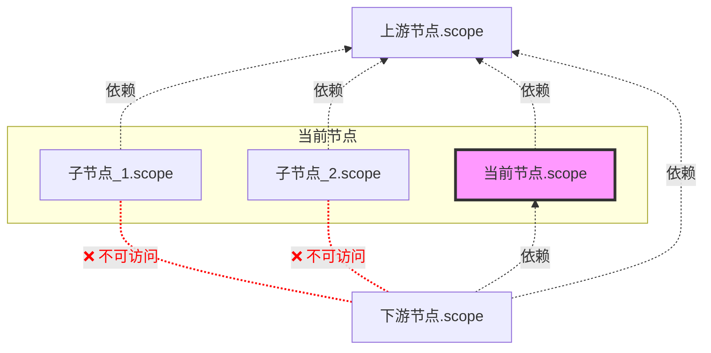
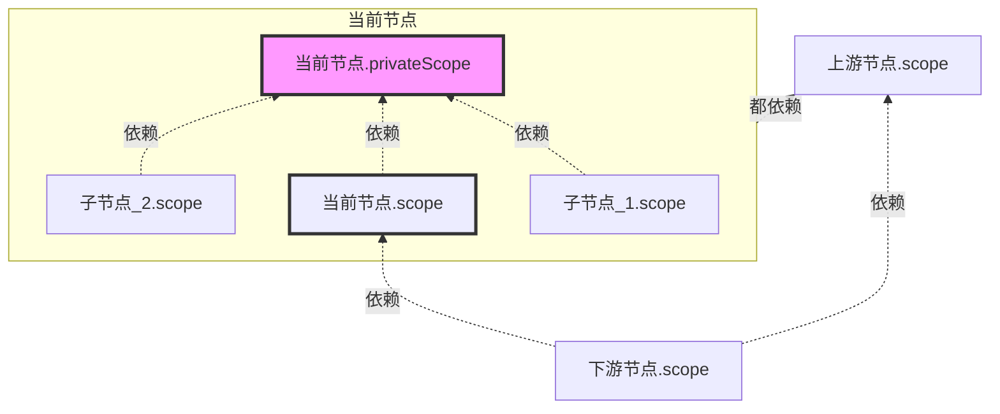
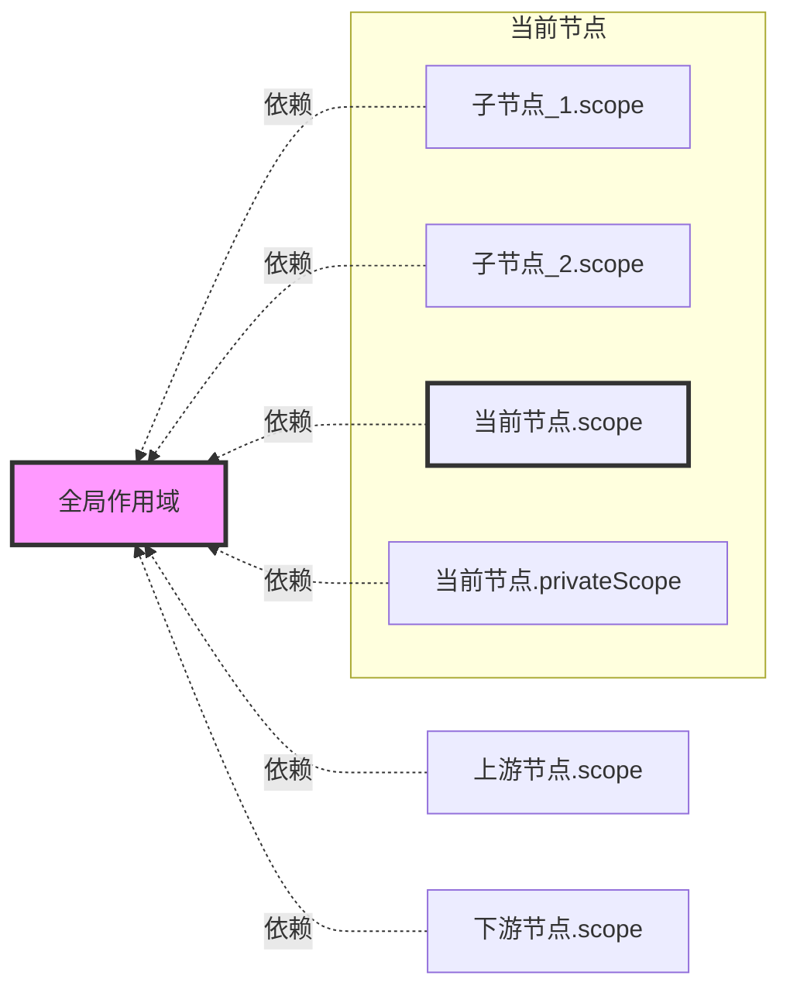

# 概念


:::tip

变量引擎概念较多且抽象。本文通过 🌟 标记出了一批可以**优先理解**的概念。

:::

:::info{title="📖 术语快速查询"}

- [**变量**](#变量) 🌟
- [**作用域**](#作用域-) 🌟：一种容器，聚合了一系列变量信息，同时维护与其他作用域的依赖关系。
- [**AST**](#ast-) 🌟：作用域通过 AST 存储变量信息。
- [**ASTNode**](#astnode)：存储变量信息的基本单元。
- [**ASTNodeJSON**](#astnodejson)：ASTNode 的 JSON 表示。
- [**声明**](#声明) 🌟：标识符 + 定义。
- [**类型**](#类型) 🌟：变量值的约束。
- [**表达式**](#表达式)：通过特定方法组合若干变量，返回一个新的变量。
- [**作用域链**](#作用域链)：定义一个作用域可以引用哪些作用域的变量。
- [**依赖作用域**](#依赖作用域)：作用域可以访问哪些作用域的输出变量。
- [**覆盖作用域**](#覆盖作用域)：作用域的输出变量可以被哪些作用域访问。
- [**节点作用域**](#节点作用域) 🌟：可以访问上游节点的输出变量，其输出变量也可以被下游节点访问。
- [**节点私有作用域**](#节点私有作用域)：节点私有作用域只能被节点本身或者子节点访问。
- [**全局作用域**](#全局作用域)：所有节点的作用域都可以访问全局作用域的变量。

:::


## 核心概念

变量引擎核心概念可以通过下图总结：


### 变量

详见 [变量介绍](./basic.mdx)

:::warning{title="⚠️ 变量在设计和运行中的关注点不同"}

**在流程设计中，变量只关注定义，不关注值**。变量的值在流程的[运行时](/guide/runtime/introduction)才会被动态计算。

:::

### 作用域 🌟

作用域（Scope）是一种**容器**：容器内聚合了一系列**变量信息**，同时维护了**与其他作用域的依赖关系**。

作用域的范围可以根据业务场景的不同约定：

| 场景 | 示例 |
| :--- | :--- |
| 流程里节点可以约定为作用域 |  |
| 全局变量侧边栏也可以约定为作用域 |  |
| 界面编辑里组件（含变量）可以约定为作用域 |  |


:::warning{title="为什么 FlowGram 要在节点之外，新抽象一个作用域的概念？"}

1. 节点不等同于作用域
2. 存在一些作用域（如：全局作用域）和节点无关
3. 一个节点可以存在多个作用域（如：循环私有作用域）

:::

### AST 🌟

作用域（Scope）通过 `AST` 存储变量信息。

:::tip

通过 `scope.ast` 可以访问作用域内的 `AST` 树，从而可以对变量信息进行 CRUD 操作。

:::


#### ASTNode

`ASTNode` 是变量引擎中用于**存储变量信息**的**基本信息单元**。它可以为各种**变量信息建模**。这些变量信息包括：

- **声明**：如 `VariableDeclaration` ，用于声明新变量。
- **类型**：如 `StringType`，用于表示 String 类型。
- **表达式**：如 `KeyPathExpression`，用于对变量的引用。

:::info{title="ASTNode 具有以下特点"}

- **树状结构**: `ASTNode` 可以嵌套形成树（`AST`），表示复杂的变量结构。
- **序列化**: `ASTNode` 可以与 JSON 格式（`ASTNodeJSON`）相互转换，以便存储或传输。
- **可扩展**: 可以通过扩展 `ASTNode` 基类来添加新功能。
- **响应式**: `ASTNode` 值的变化会触发事件，从而实现响应式编程模式。

:::

#### ASTNodeJSON

`ASTNodeJSON` 是 `ASTNode` 的**纯 JSON 序列化**表示。

`ASTNodeJSON` 包含一个 `kind` 字段，用于表示 `ASTNode` 的类型：

```tsx
/**
 * 相当于 JavaScript 代码：
 * `var var_index: string`
 */
{
  kind: 'VariableDeclaration',
  key: 'var_index',
  type: { kind: 'StringType' },
}
```

用户在使用变量引擎时，通过 `ASTNodeJSON` 描述变量信息，然后通过变量引擎**实例化**为 `ASTNode`，并将其添加到作用域中。

```tsx
/**
 * 通过 scope.setVar 方法，将 ASTNodeJSON 实例化为 ASTNode，并添加到作用域中
 */
const variableDeclaration: VariableDeclaration = scope.setVar({
  kind: 'VariableDeclaration',
  key: 'var_index',
  type: { kind: 'StringType' },
});

/**
 * ASTNodeJSON 实例化为 ASTNode 之后，可以进行响应式监听
 */
variableDeclaration.onTypeChange((newType) => {
  console.log('变量类型变化了', newType);
})

```

:::info{title="概念比对"}

`ASTNodeJSON` 和 `ASTNode` 的关系，类似于 React 中 `JSX` 和 `VDOM` 的关系
- `ASTNodeJSON` 通过变量引擎实例化为 `ASTNode`
- `JSX` 通过 React 引擎实例化为 `VDOM`

:::

:::warning{title="❓ 为什么不用 Json Schema"}

[`Json Schema`](https://json-schema.org/) 是一种用于描述 JSON 数据结构的格式：

- `Json Schema` 只描述了变量的类型信息，而 `ASTNodeJSON` 还可以包含变量的其他信息（如：变量的初始值）。
- `ASTNodeJSON` 可以通过变量引擎实例化为 `ASTNode`，从而实现响应式监听等能力。
- `Json Schema` 擅长描述 Json 的类型，而 `ASTNodeJSON` 可以通过自定义扩展定义行为更复杂的信息。

在技术选型上，`变量引擎内核`需要更强大的扩展与表达能力，因此需要用 `ASTNodeJSON` 来描述更丰富更复杂的变量信息，如：通过定义变量的初始值，实现变量类型的动态推导 + 自动联动。

不过 `Json Schema` 作为业界通用的 JSON 类型描述格式，在易用性、跨团队沟通以及生态（如 ajv、zod）上更有优势。因此我们在[**物料库**](/materials/introduction)中大量使用了 Json Schema，来降低大家的上手成本。

:::

:::tip

变量引擎提供了 `ASTFactory`，可以**类型安全**地创建 `ASTNodeJSON`:

```tsx
import { ASTFactory } from '@flowgram/editor';

/**
 * 类型安全地创建 VariableDeclaration ASTNodeJSON
 *
 * 等价于：
 * {
 *   kind: 'VariableDeclaration',
 *   key: 'var_index',
 *   type: { kind: 'StringType' },
 * }
 */
ASTFactory.createVariableDeclaration({
  key: 'var_index',
  type: { kind: 'StringType' },
});
```
:::


### 声明

声明 = 标识符（Key） + 定义（Definition）。在设计态中，声明是一种存储标识符 + 变量信息的 `ASTNode`。

- 标识符（Key）：访问声明的索引。
- 定义（Definition）：声明定义的信息。如：变量的定义 = 类型 + 右值。


:::info{title="举例：JavaScript 中的声明"}

**变量声明** = 标识符 + 变量定义（类型 + 初始值）

```javascript
/**
 * 标识符：some_var
 * 变量定义：类型为 number，初始值为 10
 */
const some_var: number = 10;
```

**函数声明** = 标识符 + 函数定义（函数入参出参 + 函数体实现）

```javascript
/**
 * 标识符：add
 * 函数定义：入参为两个 number 类型的变量 a, b，出参为 number 类型的变量
 */
function add(a: number, b: number): number {
  return a + b;
}
```

**结构体声明** = 标识符 + 结构体定义（字段 + 类型）

```javascript
/**
 * 标识符：Point
 * 结构体定义：字段为 x, y，类型均为 number
 */
interface Point {
  x: number;
  y: number;
}
```

:::


:::tip{title="标识符的作用"}

- `标识符`是声明的**索引**，用于访问声明中的`定义`。
- 举例：编程语言在编译时，通过`标识符`找到变量的类型`定义`，从而可以进行类型检查。

:::


变量引擎目前只提供了**变量字段声明**（`BaseVariableField`），并基于此扩展了**变量声明**（`VariableDeclaration`）和**属性声明**（`Property`）两种声明。

- 变量字段声明（`BaseVariableField`）= 标识符 + 变量字段定义（类型 + 元信息 + 初始值）
- 变量声明（`VariableDeclaration`）= **全局唯一**标识符 + 变量定义（类型 + 元信息 + 初始值 + 作用域内排序）
- 属性声明（`Property`）= **Object 内唯一**标识符 + 属性定义（类型 + 元信息 + 初始值）


### 类型

类型用于**约束变量值的范围**。在设计态中，类型是一种 `ASTNode`。

变量引擎内置了 JSON 的**基础类型**：
- `StringType`：字符串
- `IntegerType`：整数
- `NumberType`：浮点数
- `BooleanType`：布尔值
- `ObjectType`：对象，可下钻 `Property` 声明。
- `ArrayType`：数组，可下钻其他类型。

同时新增了：
- `MapType`：键值对，键和值都可以进行类型定义。
- `CustomType`：由用户进行自定义扩展，如日期、时间、文件类型等。

### 表达式

表达式**输入 0 个或者多个变量**，并通过**通过特定方式**进行计算，返回一个新的**变量**。



而在**设计态**中，表达式是一种 `ASTNode`，建模中我们只需关注：

- 表达式**使用了哪些变量声明** ?
- 表达式的**返回类型**是怎么推导的 ?




:::info{title="举例：设计态中表达式的推导"}

假设我们有一个用 JavaScript 代码描述的表达式 `ref_var + 1`

表达式**使用了哪些变量声明** ?
- `ref_var` 标识符对应的变量声明

表达式的**返回类型**是怎么推导的 ?
- `ref_var` 的类型为 `IntegerType`，则 `ref_var + 1` 的返回类型为 `IntegerType`
- `ref_var` 的类型为 `NumberType`，则 `ref_var + 1` 的返回类型为 `NumberType`
- `ref_var` 的类型为 `StringType`，则 `ref_var + 1` 的返回类型为 `StringType`

:::

:::info{title="举例：变量引擎如何实现类型推导 + 联动"}

<div style={{  }}>
  <div style={{ width: 500 }}>
     
  </div>

  <div style={{ minWidth: 500 }}>


图中展示了一个常见的例子：批处理节点引用前序节点的输出变量，对其进行遍历处理，得到一个 item 变量。其中 item 的变量类型会随着前序节点输出变量的类型而自动变化。

这个例子的 ASTNodeJSON 可表示为：

```tsx
ASTFactory.createVariableDeclaration({
  key: 'item',
  initializer: ASTFactory.createEnumerateExpression({
    enumerateFor: ASTFactory.createKeyPathExpression({
      keyPath: ['start_0', 'arr']
    })
  })
})
```

变量的推导链路如下：


  </div>
</div>


:::


### 作用域链

作用域链（Scope Chain）定义了**一个作用域可以引用哪些作用域的变量**。它是一个抽象类，具体的业务场景可以实现自定义的作用域链。

变量引擎内置了**自由布局作用域链**和**固定布局作用域链**两种作用域链实现。


#### 依赖作用域

`依赖作用域` = 作用域可以访问哪些作用域的输出变量

可以通过 `scope.depScopes` 访问作用域的`依赖作用域`。


#### 覆盖作用域

`覆盖作用域` = 作用域的输出变量可以被哪些作用域访问

可以通过 `scope.coverScopes` 访问作用域的`覆盖作用域`。


## 画布中的变量

FlowGram 在画布中定义了以下几种特殊的作用域：

### 节点作用域

又称`节点公开作用域`，作用域可以访问**上游节点**的`节点作用域`的变量，同时其输出变量声明也可以被**下游节点**的`节点作用域`访问。

`节点作用域` 可以通过 `node.scope` 来设置和获取，它的作用域链关系如下图所示：



:::warning

在默认的作用域逻辑中，子节点的 `节点作用域` 输出变量不可被**父节点的下游节点** 访问。

:::


### 节点私有作用域

`节点私有作用域`的输出变量只能在**当前节点**的`节点作用域`及其**子节点**的`节点作用域`中访问。类似编程语言中`私有变量`的概念。

`节点私有作用域` 可以通过 `node.privateScope` 来设置和获取，它的作用域链关系如下图所示：




### 全局作用域

`全局作用域`的变量能被**所有节点作用域和节点私有作用域**访问，但是不能访问其他作用域的变量。

全局作用域的设置方式详见[输出全局变量](./variable-output#输出全局变量)，他的作用域链关系如下图所示：




## 整体架构


变量引擎设计上遵循 DIP（依赖反转）原则，按照 代码稳定性、抽象层次 以及和 业务的远近 分为三层：

### 变量抽象层

变量架构中抽象层次最高，代码也最为稳定的部分。抽象层对 `ASTNode`、`Scope`、`ScopeChain` 等核心概念进行了抽象类定义。

### 变量实现层

变量架构中变动较大，不同业务之间可能存在调整的部分。引擎内置了一批较为稳定的 `ASTNode` 节点和 `ScopeChain` 的实现。当用户存在复杂的变量需求时，可以通过依赖注入注册新的 `ASTNode` 或者重载已有 `ASTNode` 节点实现定制化。

### 变量物料层

基于外观模式（Facade）的思路提高变量易用性，将复杂的变量逻辑封装为简单开箱即用的变量物料。

- 变量物料的使用详见：[物料](/materials/introduction)

