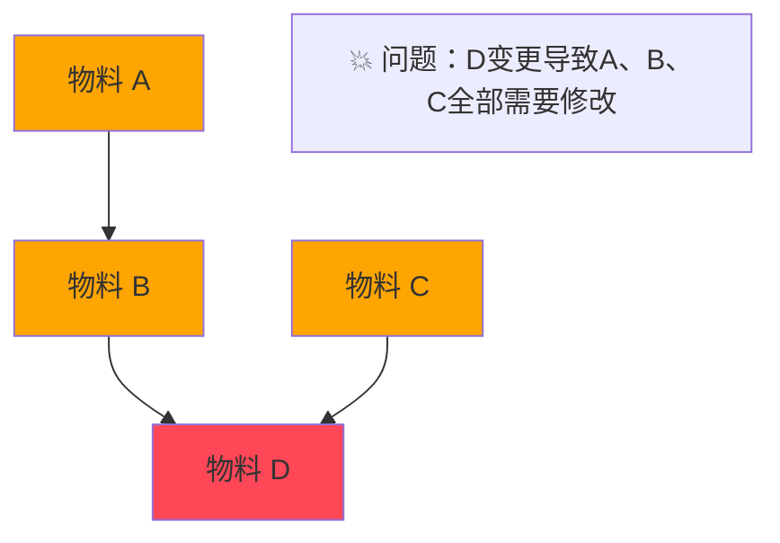
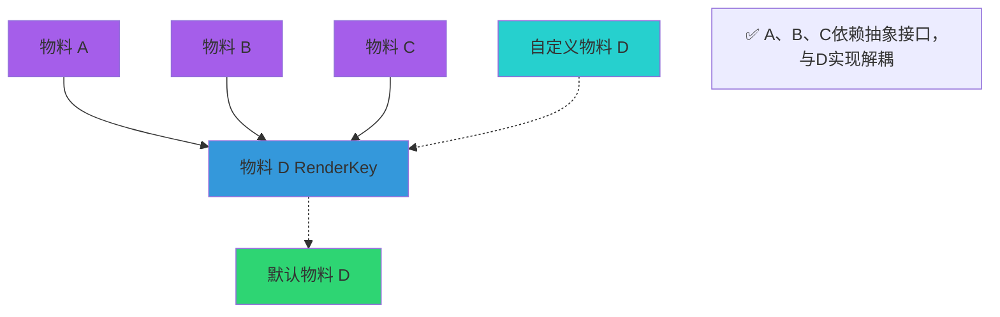
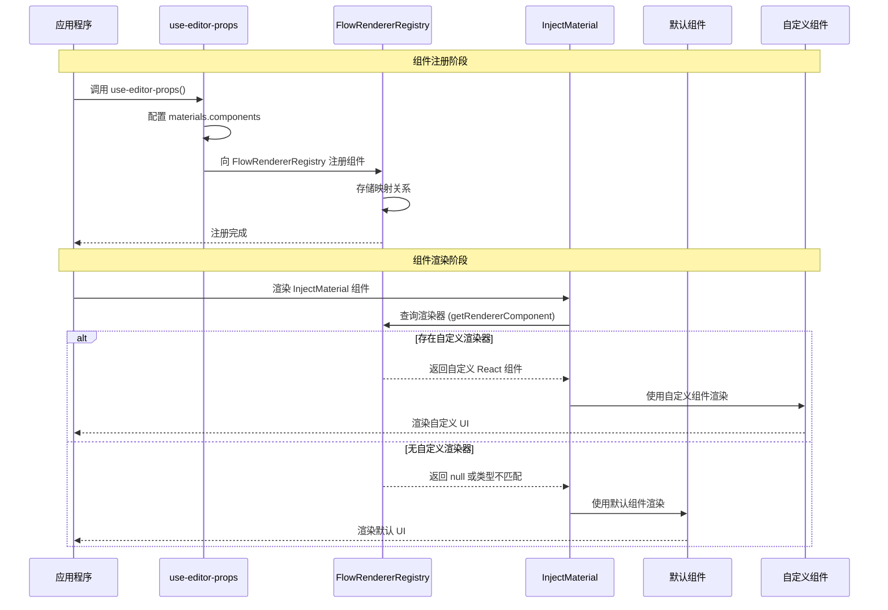

import { SourceCode } from '@theme';

# 物料组件依赖注入

:::tip{title="目前物料库中支持依赖注入的组件物料"}

- [InjectDynamicValueInput](../components/dynamic-value-input)
- [InjectTypeSelector](../components/type-selector)
- [InjectVariableSelector](../components/variable-selector)

:::

## 背景：为什么物料库需要依赖注入 ?

### ❌ 紧耦合：传统依赖问题



**问题：** 连锁反应、高维护成本

### ✅ 解耦：依赖注入方案



**优势：** 热插拔、并行开发、版本兼容

## 使用方式

### 创建可注入的组件物料

```tsx
import { createInjectMaterial } from '@flowgram.ai/form-materials';
import { VariableSelector } from './VariableSelector';

// 使用 createInjectMaterial 高阶组件包装组件
const InjectVariableSelector = createInjectMaterial(VariableSelector);

// 现在你可以像使用普通组件一样使用它
function MyComponent() {
  return <InjectVariableSelector value={value} onChange={handleChange} />;
}
```

### 注册自定义组件

一个组件物料并创建为可注入的物料组件，当被其他物料使用时候，可以在 `use-editor-props.tsx` 中注入该物料的自定义渲染器：

```tsx
import { useEditorProps } from '@flowgram.ai/editor';
import { YourCustomVariableSelector } from './YourCustomVariableSelector';
import { VariableSelector } from '@flowgram.ai/form-materials';

function useCustomEditorProps() {
  const editorProps = useEditorProps({
    materials: {
      components: {
        // 默认使用组件的 Function Name 作为 renderKey
        'VariableSelector': YourCustomVariableSelector,
        'TypeSelector': YourCustomTypeSelector,
      }
    }
  });

  return editorProps;
}
```

### 使用自定义 renderKey

如果你的组件需要特定的 renderKey：

**方法 1：** 通过 createInjectMaterial 的第二个参数指定 renderKey

```tsx
const InjectCustomComponent = createInjectMaterial(MyComponent, {
  renderKey: 'my-custom-key'
});
// 注册时
{
  materials: {
    components: {
      'my-custom-key': MyCustomRenderer
    }
  }
}
```

**方法 2：** 或者直接设置组件的 renderKey 属性

```tsx
MyComponent.renderKey = 'my-custom-key';
const InjectCustomComponent = createInjectMaterial(MyComponent);
// 注册时
{
  materials: {
    components: {
      [MyComponent.renderKey]: MyCustomRenderer
    }
  }
}

```


:::note{title="渲染键优先级"}

组件渲染键的确定遵循以下优先级顺序：

1. `params.renderKey` (createInjectMaterial 的第二个参数)
2. `Component.renderKey` (组件自身的 renderKey 属性)
3. `Component.name` (组件的显示名称)
4. 空字符串 (最终回退)

:::

## API 参考

```typescript
interface CreateInjectMaterialOptions {
  renderKey?: string;
}

function createInjectMaterial<Props>(
  Component: React.FC<Props> & { renderKey?: string },
  params?: CreateInjectMaterialOptions
): React.FC<Props>
```

## 源码导读

<SourceCode
  href="https://github.com/bytedance/flowgram.ai/blob/main/packages/materials/form-materials/src/shared/inject-material/index.tsx"
/>

使用 CLI 命令可以复制源代码到本地：

```bash
npx @flowgram.ai/cli@latest materials shared/inject-material
```

### 核心时序图

完整的组件注册和渲染时序图：


