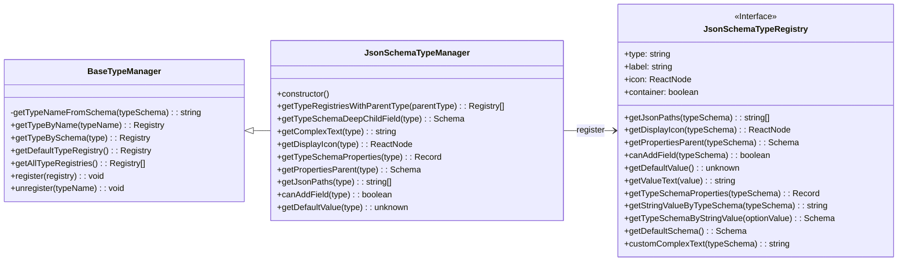

import { SourceCode } from '@theme';
import { BasicStory } from 'components/form-materials/common/json-schema-preset';

# 类型管理

物料库类型管理分为两部分实现：

1. **物料层**（物料库预设类型定义）：
   - 扩展类型引擎，使其可以定义类型的默认渲染器、Condition 规则配置等
   - 提供了默认类型在物料库中的预设定义（常量输入器渲染、Condition 规则配置等）
   - 提供 Editor Plugin 方便扩展自定义类型
2. **引擎层**（核心类型引擎，由 `@flowgram.ai/json-schema` 提供）
   - 提供了 Json 类型的基本定义，包括 icon，名称展示等
   - 提供 BaseTypeManager，可以扩展 JsonSchema 官方定义之外的类型定义
   - 提供 `JsonSchemaUtils` 实现 JsonSchema 和 AST 的互相转换

## 案例演示

### 增加 Color 类型

<BasicStory />


```tsx pure title="use-editor-props.tsx"
import { createTypePresetPlugin } from "@flowgram.ai/form-materials";

// ...
{
  plugins: () => [
    createTypePresetPlugin({
      types: [
        types: [
          {
            type: 'color',
            icon: <IconColorPalette />,
            label: 'Color',
            ConstantRenderer: ({ value, onChange }) => (
              <div className="json-schema-color-picker-container ">
                <ColorPicker
                  alpha={true}
                  usePopover={true}
                  value={value ? ColorPicker.colorStringToValue(value) : undefined}
                  onChange={(_value) => onChange?.(_value.hex)}
                />
              </div>
            ),
            conditionRule: {
              eq: { type: 'color' },
            },
          },
        ],
      ],
    }),
  ],
}
// ...

```


### 获取类型定义


```tsx
const typeManager = useTypeManager();

// 根据 schema 获取类型定义
const type = typeManager.getTypeBySchema({ type: "color" });
const type2 = typeManager.getTypeBySchema({ type: "array", items: { type: "color" } });

// 根据类型名获取类型定义
const type3 = typeManager.getTypeByName("color");
```


## API

### createTypePresetPlugin

创建一个 Editor Plugin，用于扩展物料库预设类型定义，或者关闭某些物料库中预设的类型。

```typescript
function createTypePresetPlugin(options: TypePresetPluginOptions): Plugin;

interface TypePresetPluginOptions {
  // 要添加的自定义类型定义数组
  types?: TypePresetRegistry[];
  // 要移除的类型名称数组
  unregisterTypes?: string[];
}

interface TypePresetRegistry {
  // 类型名称
  type: string;
  // 类型图标
  icon?: React.ReactNode;
  // 类型标签
  label?: string;
  // 常量渲染器组件
  ConstantRenderer: React.FC<ConstantRendererProps>;
  // 条件规则配置
  conditionRule?: IConditionRule | IConditionRuleFactory;
  // 其他从基础类型继承的属性
}

interface ConstantRendererProps<Value = any> {
  value?: Value;
  onChange?: (value: Value) => void;
  readonly?: boolean;
  [key: string]: any;
}
```

## 源码导读

物料层源代码：<SourceCode
  href="https://github.com/bytedance/flowgram.ai/tree/main/packages/materials/form-materials/src/plugins/json-schema-preset"
/>

使用 CLI 命令可以复制物料层源代码到本地：

```bash
npx @flowgram.ai/cli@latest materials plugins/json-schema-preset
```

引擎层源代码：<SourceCode
  href="https://github.com/bytedance/flowgram.ai/tree/main/packages/variable-engine/json-schema/src"
/>

引擎层由于复杂度较高，因此目前需要通过单独的 `@flowgram.ai/json-schema` 包使用，不支持 CLI 命令下载源代码。

### 物料层核心逻辑

物料层新增的定义被以下物料使用：
- [ConstantInput](../components/constant-input): 获取类型对应的常量输入
  - 源代码见：<SourceCode
    href="https://github.com/bytedance/flowgram.ai/tree/main/packages/materials/form-materials/src/components/constant-input/index.tsx"
  />
- [ConditionContext](../components/condition-context)：获取类型对应的 Condition 规则
  - 源代码见：<SourceCode
    href="https://github.com/bytedance/flowgram.ai/blob/main/packages/materials/form-materials/src/components/condition-context/hooks/use-condition.tsx"
  />

### 引擎层核心逻辑

#### JsonSchemaTypeManager 类结构



#### JsonSchemaTypeManager 功能概览

**核心功能**：

1. **类型注册与管理**
   - `register(registry)`: 注册新的类型定义
   - `unregister(typeName)`: 移除已注册的类型
   - `getAllTypeRegistries()`: 获取所有已注册的类型
   - `getTypeByName(typeName)`: 通过类型名称获取类型定义
   - `getTypeBySchema(schema)`: 通过 schema 获取对应的类型定义

2. **类型信息获取**
   - `getTypeNameFromSchema(schema)`: 从 schema 中提取类型名称
   - `getTypeRegistriesWithParentType(parentType)`: 获取指定父类型下的所有类型
   - `getTypeSchemaDeepChildField(type)`: 获取类型的最深层子字段
   - `getComplexText(type)`: 获取类型的复杂文本表示（如 Array\<String\>）
   - `getDisplayIcon(type)`: 获取类型的显示图标

3. **类型属性操作**
   - `getTypeSchemaProperties(type)`: 获取类型的属性定义
   - `getPropertiesParent(type)`: 获取属性的父节点
   - `getJsonPaths(type)`: 获取类型在 flow schema 中的 json 路径
   - `canAddField(type)`: 判断是否可以向类型添加字段
   - `getDefaultValue(type)`: 获取类型的默认值

**初始化过程**：

在构造函数中，JsonSchemaTypeManager 会自动注册一系列默认类型定义：
- defaultTypeDefinitionRegistry: 默认类型定义
- stringRegistryCreator: 字符串类型
- integerRegistryCreator: 整数类型
- numberRegistryCreator: 数字类型
- booleanRegistryCreator: 布尔类型
- objectRegistryCreator: 对象类型
- arrayRegistryCreator: 数组类型
- unknownRegistryCreator: 未知类型
- mapRegistryCreator: 映射类型
- dateTimeRegistryCreator: 日期时间类型

