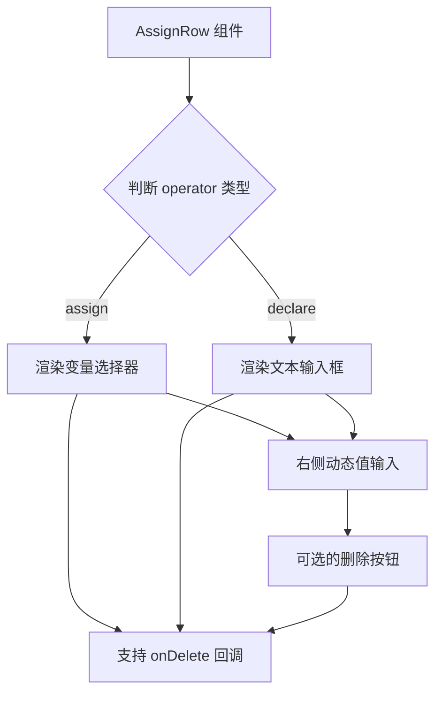

import { SourceCode } from '@theme';
import { AssignModeStory, DeclareModeStory } from 'components/form-materials/components/assign-row';

# AssignRow

AssignRow 是一个赋值行组件，支持两种操作模式：**赋值模式 (assign)** 和 **声明模式 (declare)**。

- 在赋值模式下：左侧是变量选择器，右侧是动态值输入；
- 在声明模式下：左侧是文本输入框，右侧是动态值输入。

## 案例演示

### 赋值模式

AssignRow **默认为赋值模式**，在赋值模式下，左侧为变量选择器，右侧为动态值输入：

<AssignModeStory />

```tsx pure title="form-meta.tsx"
import { AssignRow } from '@flowgram.ai/form-materials';
import { AssignValueType } from '@flowgram.ai/form-materials';

const formMeta = {
  render: () => (
    <>
      <FormHeader />
      <Field<AssignValueType | undefined> name="assign_row">
        {({ field }) => (
          <AssignRow value={field.value} onChange={(value) => field.onChange(value)} />
        )}
      </Field>
    </>
  ),
}
```

### 声明模式

声明模式下，左侧为变量名输入，右侧为动态值输入：

<DeclareModeStory />

```tsx pure title="form-meta.tsx"
import { AssignRow } from '@flowgram.ai/form-materials';
import { AssignValueType } from '@flowgram.ai/form-materials';

const formMeta = {
  render: () => (
    <>
      <FormHeader />
      <Field<AssignValueType | undefined> name="assign_row">
        {({ field }) => (
          <AssignRow
            value={{
              operator: 'declare',
              left: 'newVariable',
              right: {
                type: 'constant',
                content: 'Hello World',
                schema: { type: 'string' },
              },
            }}
            onChange={(value) => field.onChange(value)}
          />
        )}
      </Field>
    </>
  ),
}
```


## API 参考

### AssignRow Props

| 属性名 | 类型 | 默认值 | 描述 |
|--------|------|--------|------|
| `value` | `AssignValueType` | - | 赋值行的值，包含操作符、左侧值和右侧值 |
| `onChange` | `(value?: AssignValueType) => void` | - | 值变化时的回调函数 |
| `onDelete` | `() => void` | - | 删除按钮点击时的回调函数 |
| `readonly` | `boolean` | `false` | 是否为只读模式 |

### AssignValueType

```typescript
type AssignValueType =
  | {
      operator: 'assign';
      left?: IFlowRefValue;      // 变量引用
      right?: IFlowValue;        // 动态值
    }
  | {
      operator: 'declare';
      left?: string;             // 变量名
      right?: IFlowValue;        // 动态值
    };
```

## 源码导读

<SourceCode
  href="https://github.com/bytedance/flowgram.ai/tree/main/packages/materials/form-materials/src/components/assign-row"
/>

使用 CLI 命令可以复制源代码到本地：

```bash
npx @flowgram.ai/cli@latest materials components/assign-row
```

### 目录结构讲解

```
assign-row/
├── index.tsx     # AssignRow 组件主实现
└── types.ts      # 类型定义文件
```

### 核心实现说明

AssignRow 组件的核心逻辑是根据 `operator` 字段来渲染不同的左侧输入控件：

1. **赋值模式 (`operator: 'assign'`)**：左侧渲染 `InjectVariableSelector`，用于选择已有变量
2. **声明模式 (`operator: 'declare'`)**：左侧渲染 `BlurInput`，用于输入新变量名
3. **右侧统一**：无论哪种模式，右侧都渲染 `InjectDynamicValueInput`，支持常量和变量输入

#### 组件结构



### 依赖梳理

#### 其他物料

[**VariableSelector**](./variable-selector)
- `InjectVariableSelector`: 依赖注入的变量选择器

[**DynamicValueInput**](./dynamic-value-input)
- `InjectDynamicValueInput`: 依赖注入的动态值输入组件

[**BlurInput**](./blur-input)
- `BlurInput`: 失焦输入组件

#### 第三方库

[**Semi Design**](https://semi.design/zh-CN/)
- `IconButton`: 图标按钮组件
- `IconMinus`: 减号图标
