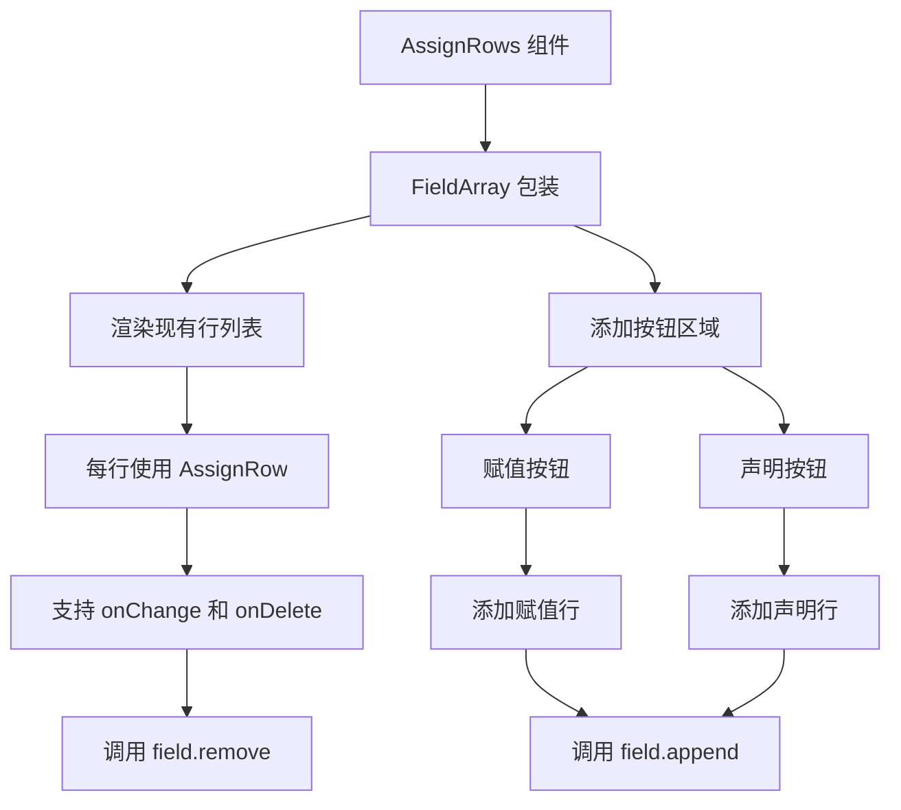

import { SourceCode } from '@theme';
import { BasicStory } from 'components/form-materials/components/assign-rows';

# AssignRows

AssignRows 是一个赋值行列表组件，基于 `FieldArray` 实现，支持动态添加和删除赋值行。

组件提供了两个操作按钮：**赋值** 和 **声明**，可以分别添加赋值模式和声明模式的赋值行。每个赋值行都可以独立配置和删除。

:::tip

`AssignRows` 通常和 [`infer-assign-plugin`](../form-plugins/infer-assign-plugin) 表单插件一起使用，用于将定义的声明转换为节点的输出变量，并实现类型的自动联动。

:::

## 案例演示

### 基本使用

<BasicStory />

```tsx pure title="form-meta.tsx"
import { AssignRows } from '@flowgram.ai/form-materials';

const formMeta = {
  render: () => (
    <>
      <FormHeader />
      <AssignRows name="assign_rows" />
    </>
  ),
}
```


## API 参考

### AssignRows Props

| 属性名 | 类型 | 默认值 | 描述 |
|--------|------|--------|------|
| `name` | `string` | - | 表单字段名称，用于 FieldArray |
| `readonly` | `boolean` | `false` | 是否为只读模式 |

## 源码导读

<SourceCode
  href="https://github.com/bytedance/flowgram.ai/tree/main/packages/materials/form-materials/src/components/assign-rows"
/>

使用 CLI 命令可以复制源代码到本地：

```bash
npx @flowgram.ai/cli@latest materials components/assign-rows
```

### 目录结构讲解

```
assign-rows/
└── index.tsx     # AssignRows 组件主实现
```

### 核心实现说明

AssignRows 组件的核心功能是基于 `FieldArray` 实现的动态列表管理：

1. **动态添加**：提供两个按钮分别添加赋值模式和声明模式的行
2. **动态删除**：每行都支持独立的删除操作
3. **状态管理**：使用 `FieldArray` 管理整个列表的状态
4. **组件复用**：每行都复用 `AssignRow` 组件

#### 组件工作流程



### 依赖梳理

#### flowgram API

[**@flowgram.ai/editor**](https://github.com/bytedance/flowgram.ai/tree/main/packages/client/editor)
- `FieldArray`: 表单数组字段组件，用于管理动态列表
- `FieldArrayRenderProps`: FieldArray 渲染属性类型

#### 其他物料

[**AssignRow**](./assign-row)
- `AssignRow`: 赋值行组件，处理单行逻辑
- `AssignValueType`: 赋值行值类型定义

#### 第三方库

[**Semi Design**](https://semi.design/zh-CN/)
- `Button`: 按钮组件
- `IconPlus`: 加号图标

