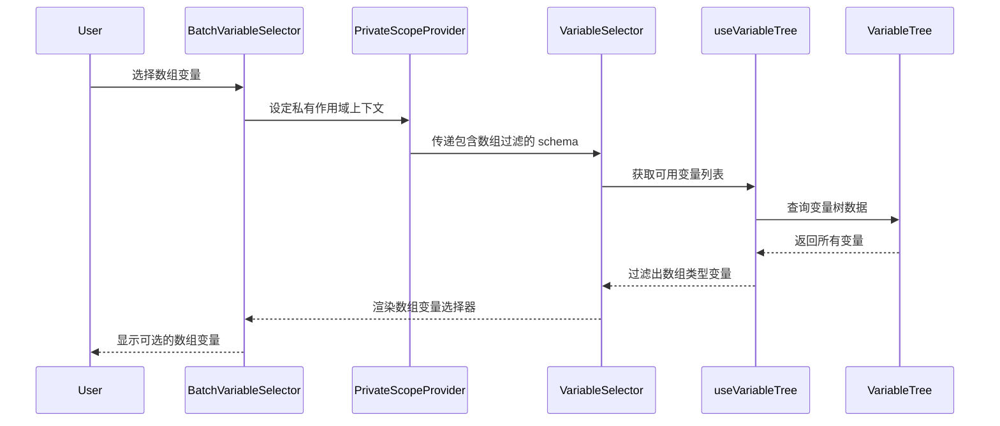

import { SourceCode } from '@theme';
import { BasicStory } from 'components/form-materials/components/batch-variable-selector';

# BatchVariableSelector

BatchVariableSelector 是一个用于选择数组类型变量的组件，它是 [VariableSelector](./variable-selector) 的封装版本。

该组件自动过滤变量树，只显示数组类型的变量，并自动设定[私有作用域](../../guide/variable/concept#节点私有作用域)，常用于批处理场景（如 Loop 节点的循环数据源选择）。

**核心特性：**

- 🔍 **自动过滤**：只显示数组类型（`type: 'array'`）的变量。
- 🔐 **私有作用域**：通过 [`PrivateScopeProvider`](../../guide/variable/concept#节点私有作用域) 提供独立的变量作用域。
- 🎯 **专用场景**：专为批处理、循环等需要数组数据源的场景设计。

## 案例演示

### 基本使用

<BasicStory />

```tsx pure title="form-meta.tsx"
import { BatchVariableSelector, VariableSelector } from '@flowgram.ai/form-materials';

const formMeta = {
  render: () => (
    <>
      <FormHeader />
      {/* BatchVariableSelector 只显示数组类型变量 */}
      <Field<string[] | undefined> name="batch_variable">
        {({ field }) => (
          <BatchVariableSelector
            value={field.value}
            onChange={(value) => field.onChange(value)}
          />
        )}
      </Field>

      {/* VariableSelector 显示所有类型变量 */}
      <Field<string[] | undefined> name="normal_variable">
        {({ field }) => (
          <VariableSelector
            value={field.value}
            onChange={(value) => field.onChange(value)}
          />
        )}
      </Field>
    </>
  ),
}
```

## API 参考

### BatchVariableSelector Props

BatchVariableSelector 继承了 [VariableSelector](./variable-selector) 的所有属性，但 `includeSchema` 属性已被固定为数组类型过滤，无法自定义。

| 属性名 | 类型 | 默认值 | 描述 |
|--------|------|--------|------|
| `value` | `string[]` | - | 选中的变量路径数组 |
| `onChange` | `(value?: string[]) => void` | - | 变量选择变化时的回调函数 |
| `config` | `VariableSelectorConfig` | `{}` | 配置对象（同 VariableSelector） |
| `readonly` | `boolean` | `false` | 是否为只读模式 |
| `hasError` | `boolean` | `false` | 是否显示错误状态 |
| `style` | `React.CSSProperties` | - | 自定义样式 |
| `triggerRender` | `(props: TriggerRenderProps) => React.ReactNode` | - | 自定义触发器渲染 |

:::warning
`includeSchema` 和 `excludeSchema` 属性在 BatchVariableSelector 中不可用，因为组件内部已固定使用 `{ type: 'array', extra: { weak: true } }` 作为过滤条件。
:::

### VariableSelectorConfig

| 属性名 | 类型 | 默认值 | 描述 |
|--------|------|--------|------|
| `placeholder` | `string` | `'选择变量'` | 占位符文本 |
| `notFoundContent` | `string` | `'未定义'` | 变量未找到时的显示内容 |

## 源码导读

<SourceCode
  href="https://github.com/bytedance/flowgram.ai/tree/main/packages/materials/form-materials/src/components/batch-variable-selector"
/>

使用 CLI 命令可以复制源代码到本地：

```bash
npx @flowgram.ai/cli@latest materials components/batch-variable-selector
```

### 目录结构讲解

```
batch-variable-selector/
└── index.tsx           # 主组件实现，包含 BatchVariableSelector 核心逻辑
```

### 核心实现说明

#### 私有作用域机制

BatchVariableSelector 通过 `PrivateScopeProvider` 为子组件提供独立的变量作用域：

```tsx
<PrivateScopeProvider>
  <VariableSelector {...props} includeSchema={batchVariableSchema} />
</PrivateScopeProvider>
```

`PrivateScopeProvider` 会创建一个[节点私有作用域](../../guide/variable/concept#节点私有作用域)，这在批处理场景中非常重要：

- **循环变量隔离**：在 Loop 节点中，每次迭代的循环变量（如 `item`、`index`）都存储在私有作用域中，避免污染外部作用域
- **避免命名冲突**：批处理节点内部定义的临时变量不会与外部变量产生命名冲突
- **支持嵌套结构**：复杂的批处理逻辑可以在私有作用域中定义多层变量结构
- **数据安全**：私有作用域中的变量只能被当前节点及其子节点访问，确保数据安全性

:::info

更多关于作用域的详细信息，请参考[变量概念文档](../../guide/variable/concept#画布中的变量)。

:::

#### 数组类型过滤

组件内部固定使用以下 schema 进行过滤：

```typescript
const batchVariableSchema: IJsonSchema = {
  type: 'array',
  extra: { weak: true },
};
```

- `type: 'array'`：只显示数组类型的变量
- `extra: { weak: true }`：启用弱类型匹配，允许匹配可能兼容的类型

### 整体流程



### 使用到的 FlowGram API

[**@flowgram.ai/editor**](https://github.com/bytedance/flowgram.ai/tree/main/packages/plugins/node-variable-plugin)
- [`PrivateScopeProvider`](https://flowgram.ai/auto-docs/node-variable-plugin/functions/PrivateScopeProvider): 提供私有变量作用域的 Context Provider

[**@flowgram.ai/json-schema**](https://github.com/bytedance/flowgram.ai/tree/main/packages/variable/json-schema)
- [`IJsonSchema`](https://flowgram.ai/auto-docs/json-schema/interfaces/IJsonSchema): JSON Schema 类型定义，用于变量类型过滤

### 依赖的其他物料

[**VariableSelector**](./variable-selector) 变量选择器基础组件
- `VariableSelector`: 核心变量选择组件，BatchVariableSelector 是其封装版本
- `VariableSelectorProps`: 属性类型定义

## 常见问题

### 为什么需要 PrivateScopeProvider？

`PrivateScopeProvider` 提供了变量作用域隔离机制，在以下场景中非常重要：

1. **循环节点**：在 Loop 节点中，每次迭代都需要一个独立的作用域来存储循环变量（如 `item`, `index`）。参考[变量概念 - 节点私有作用域](../../guide/variable/concept#节点私有作用域)
2. **嵌套结构**：当节点内部有嵌套的变量声明时，避免与外部变量产生命名冲突
3. **组件复用**：相同的组件在不同上下文中使用时，确保变量不会互相干扰
4. **数据安全**：私有作用域中的变量只能被当前节点及其子节点访问，确保数据安全性

更多关于作用域链和变量访问权限的信息，请参考[变量概念 - 作用域链](../../guide/variable/concept#作用域链)。

### BatchVariableSelector 与 VariableSelector 的区别？

| 特性 | BatchVariableSelector | VariableSelector |
|------|----------------------|------------------|
| 变量类型过滤 | 固定为数组类型 | 可自定义 |
| 作用域 | 自带私有作用域 | 使用当前作用域 |
| 使用场景 | 批处理、循环等 | 通用变量选择 |
| Schema 配置 | 不可配置 | 完全可配置 |

### 如何获取选中变量的实际值？

BatchVariableSelector 返回的是变量路径（`string[]`），如需获取实际值，需要在表单的 effect 中配合 [`provideBatchInputEffect`](../effects/provide-batch-input) 使用：

```typescript
export const formMeta = {
  render: YourFormRender,
  effect: {
    yourFieldName: provideBatchInputEffect,
  },
};
```

`provideBatchInputEffect` 会自动解析变量引用并注入到表单数据中。
