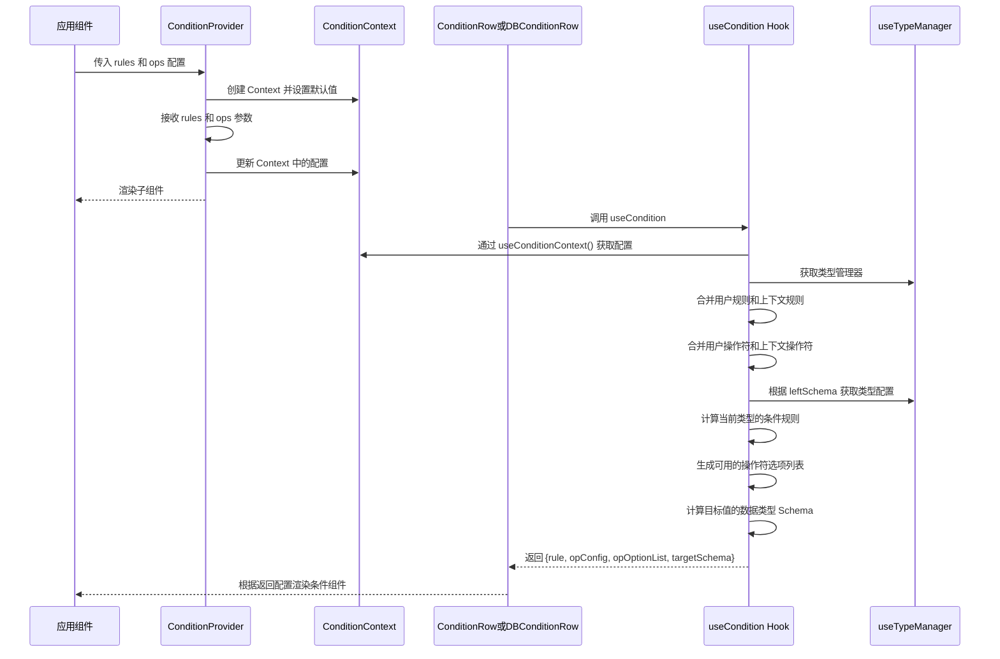

import { SourceCode } from '@theme';
import { BasicStory } from 'components/form-materials/components/condition-context';

# ConditionContext

ConditionContext 是一个条件配置的上下文管理系统，用于统一管理条件规则和操作符配置，为条件组件提供一致的配置环境。

:::tip

ConditionContext 的条件配置上下文可以影响到以下物料：

- [**ConditionRow**](./condition-row)
- [**DBConditionRow**](./db-condition-row)

:::

## 案例演示

### 基本使用

<BasicStory />

```tsx pure title="form-meta.tsx"
import React from 'react';
import { Field } from '@flowgram.ai/free-layout-editor';
import {
  ConditionProvider,
  ConditionRow,
  DBConditionRow,
  type ConditionOpConfigs,
  type IConditionRule
} from '@flowgram.ai/form-materials';

const OPS: ConditionOpConfigs = {
  cop: {
    abbreviation: 'C',
    label: 'Custom Operator',
  },
};

const RULES: Record<string, IConditionRule> = {
  string: {
    cop: { type: 'string' },
  },
};

const formMeta = {
  render: () => (
    <>
      <FormHeader />
      <ConditionProvider ops={OPS} rules={RULES}>
        <Field<any | undefined> name="condition_row">
          {({ field }) => (
            <ConditionRow value={field.value} onChange={(value) => field.onChange(value)} />
          )}
        </Field>
        <Field<any | undefined> name="db_condition_row">
          {({ field }) => (
            <DBConditionRow
              options={[
                {
                  label: 'UserName',
                  value: 'username',
                  schema: { type: 'string' },
                },
              ]}
              value={field.value}
              onChange={(value) => field.onChange(value)}
            />
          )}
        </Field>
      </ConditionProvider>
    </>
  ),
};
```

## API 参考

### ConditionProvider

条件配置的上下文提供者组件，用于统一管理条件规则和操作符配置。

| 参数名 | 类型 | 必选 | 说明 |
|--------|------|------|------|
| `rules` | `Record<string, IConditionRule>` | 否 | 条件规则配置 |
| `ops` | `ConditionOpConfigs` | 否 | 操作符配置 |
| `children` | `React.ReactNode` | 是 | 子组件 |

### useCondition

获取条件配置的 Hook，根据数据类型和操作符获取相应的配置信息。

具体使用可以参考 [ConditionRow 的源代码](https://github.com/bytedance/flowgram.ai/blob/main/packages/materials/form-materials/src/components/condition-row/index.tsx) 中 `useCondition` 的使用。


### ConditionPresetOp

预设的操作符枚举，提供常用的比较操作符。

| 枚举值 | 说明 | 缩写 |
|--------|------|------|
| `EQ` | 等于 | `=` |
| `NEQ` | 不等于 | `≠` |
| `GT` | 大于 | `>` |
| `GTE` | 大于等于 | `>=` |
| `LT` | 小于 | `<` |
| `LTE` | 小于等于 | `<=` |
| `IN` | 在集合中 | `∈` |
| `NIN` | 不在集合中 | `∉` |
| `CONTAINS` | 包含 | `⊇` |
| `NOT_CONTAINS` | 不包含 | `⊉` |
| `IS_EMPTY` | 为空 | `=` |
| `IS_NOT_EMPTY` | 不为空 | `≠` |
| `IS_TRUE` | 为真 | `=` |
| `IS_FALSE` | 为假 | `=` |

### 类型定义

```typescript
// 操作符配置
interface ConditionOpConfig {
  label: string; // 操作符标签
  abbreviation: string; // 操作符缩写
  rightDisplay?: string; // 右侧显示文本（当右侧不是值时）
}

// 操作符配置集合
type ConditionOpConfigs = Record<string, ConditionOpConfig>;

// 条件规则
type IConditionRule = Record<string, string | IJsonSchema | null>;

// 条件规则工厂函数
type IConditionRuleFactory = (
  schema?: IJsonSchema
) => Record<string, string | IJsonSchema | null>;
```

## 源码导读

<SourceCode
  href="https://github.com/bytedance/flowgram.ai/tree/main/packages/materials/form-materials/src/components/condition-context"
/>

使用 CLI 命令可以复制源代码到本地：

```bash
npx @flowgram.ai/cli@latest materials components/condition-context
```

### 目录结构讲解

```
condition-context/
├── context.tsx        # Context 相关实现
├── hooks/             # 钩子函数目录
│   └── use-condition.tsx  # useCondition 钩子实现
├── index.tsx          # 统一导出文件
├── op.ts              # 预设操作符定义
└── types.ts           # 类型定义
```

### 核心实现说明

#### ConditionContext 工作流程

以下是 ConditionProvider 和 useCondition Hook 的工作流程时序图：



### 依赖梳理

#### flowgram API

[**@flowgram.ai/editor**](https://github.com/bytedance/flowgram.ai/tree/main/packages/client/editor)
- [`I18n`](https://flowgram.ai/auto-docs/editor/variables/I18n): 国际化工具类

[**@flowgram.ai/json-schema**](https://github.com/bytedance/flowgram.ai/tree/main/packages/common/json-schema)
- [`IJsonSchema`](https://flowgram.ai/auto-docs/json-schema/types/IJsonSchema): JSON Schema 类型定义
