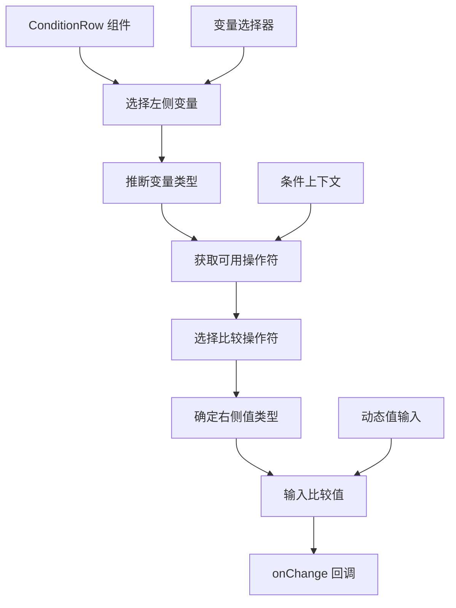

import { SourceCode } from '@theme';
import { BasicStory } from 'components/form-materials/components/condition-row';

# ConditionRow

ConditionRow 是一个条件表达式组件，用于构建变量比较逻辑。它支持选择变量、选择比较操作符、输入比较值，能够根据变量类型自动适配可用的操作符和值类型。

<br />
<div>
  
  *第一个条件为 query 变量包含 Hello Flow，第二个条件为 enable 变量为 true*
</div>

## 案例演示

### 基本使用

<BasicStory />

```tsx pure title="form-meta.tsx"
import { ConditionRow } from '@flowgram.ai/form-materials';

const formMeta = {
  render: () => (
    <>
      <FormHeader />
      <Field<any | undefined> name="condition_row">
        {({ field }) => (
          <ConditionRow value={field.value} onChange={(value) => field.onChange(value)} />
        )}
      </Field>
    </>
  ),
}
```

### 带初始值的条件行

```tsx
<ConditionRow
  value={{
    left: { type: 'ref', content: 'user.age' },
    operator: 'gt',
    right: { type: 'constant', content: 18, schema: { type: 'number' } }
  }}
  onChange={(value) => console.log('条件变化:', value)}
/>
```


## API 参考

### ConditionRow Props

| 属性名 | 类型 | 默认值 | 描述 |
|--------|------|--------|------|
| `value` | `ConditionRowValueType` | - | 条件表达式值 |
| `onChange` | `(value?: ConditionRowValueType) => void` | - | 条件变化时的回调函数 |
| `readonly` | `boolean` | `false` | 是否为只读模式 |
| `ruleConfig` | `{ ops?: ConditionOpConfigs; rules?: Record<string, IConditionRule> }` | - | 操作符和规则配置 |
| `style` | `React.CSSProperties` | - | 自定义样式 |

### ConditionRowValueType

```typescript
interface ConditionRowValueType {
  left?: IFlowRefValue;           // 左侧变量引用
  operator?: string;            // 操作符
  right?: IFlowConstantRefValue; // 右侧常量值
}

interface IFlowRefValue {
  type: 'ref';
  content: string; // 变量路径，如 "user.name"
}

interface IFlowConstantRefValue {
  type: 'constant';
  content: any;           // 常量值
  schema: IJsonSchema;  // 值的类型定义
}
```

### 支持的比较操作符

根据左侧变量的类型，ConditionRow 会自动提供相应的比较操作符：

- **字符串类型**: equals, not_equals, contains, not_contains, starts_with, ends_with
- **数字类型**: equals, not_equals, gt, gte, lt, lte
- **布尔类型**: equals, not_equals
- **数组类型**: contains, not_contains, empty, not_empty

## 源码导读

<SourceCode
  href="https://github.com/bytedance/flowgram.ai/tree/main/packages/materials/form-materials/src/components/condition-row"
/>

使用 CLI 命令可以复制源代码到本地：

```bash
npx @flowgram.ai/cli@latest materials components/condition-row
```

### 目录结构讲解

```
condition-row/
├── index.tsx           # 主组件实现，包含 ConditionRow 核心逻辑
├── types.ts            # 类型定义
└── styles.css          # 样式文件
```

### 核心实现说明

#### 变量类型推断
组件会根据左侧选择的变量自动推断其 JSON Schema 类型：

```typescript
const leftSchema = useMemo(() => {
  if (!variable) return undefined;
  return JsonSchemaUtils.astToSchema(variable.type, { drilldown: false });
}, [variable?.type?.hash]);
```

#### 操作符动态适配
通过 `useCondition` Hook 根据左侧变量类型获取可用的操作符：

```typescript
const { rule, opConfig, opOptionList, targetSchema } = useCondition({
  leftSchema,
  operator,
});
```

#### 右侧值类型自动匹配
右侧输入框的类型会根据操作符和左侧变量类型自动匹配：

```typescript
targetSchema ? (
  <InjectDynamicValueInput
    schema={targetSchema}
    // ... 其他属性
  />
) : (
  // 占位输入框
)
```

### 使用到的 flowgram API

#### @flowgram.ai/json-schema
- `JsonSchemaUtils.astToSchema()`: 将 AST 类型转换为 JSON Schema
- `IJsonSchema`: JSON Schema 类型定义

#### @flowgram.ai/variable-core
- `useScopeAvailable()`: 获取当前作用域的可用变量

#### @flowgram.ai/i18n
- `I18n`: 国际化支持

#### 内部组件
- [`InjectVariableSelector`](./variable-selector): 变量选择器
- [`InjectDynamicValueInput`](./dynamic-value-input): 动态值输入组件
- `useCondition`: 条件逻辑 Hook

### 整体流程



