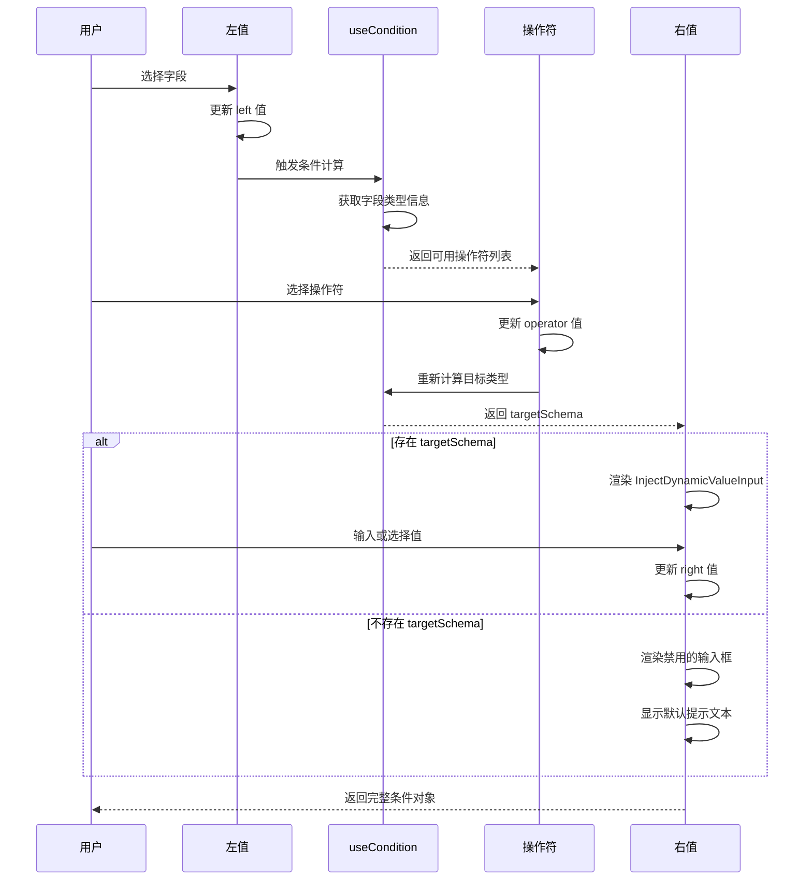

import { SourceCode } from '@theme';
import { BasicStory } from 'components/form-materials/components/db-condition-row';

# DBConditionRow

DBConditionRow 是一个数据库条件行组件，用于构建数据库查询条件。它提供了字段选择、操作符选择和值输入功能，可以根据字段类型自动显示合适的操作符和输入控件。

## 案例演示

### 基本使用

<BasicStory />

```tsx pure title="form-meta.tsx"
import { DBConditionRow } from '@flowgram.ai/form-materials';

const formMeta = {
  render: () => (
    <>
      <FormHeader />
      <Field<any | undefined> name="db_condition_row">
        {({ field }) => (
          <DBConditionRow
            options={[
              {
                label: 'TransactionID',
                value: 'transaction_id',
                schema: { type: 'integer' },
              },
              {
                label: 'Amount',
                value: 'amount',
                schema: { type: 'number' },
              },
              {
                label: 'Description',
                value: 'description',
                schema: { type: 'string' },
              },
              {
                label: 'Archived',
                value: 'archived',
                schema: { type: 'boolean' },
              },
              {
                label: 'CreateTime',
                value: 'create_time',
                schema: { type: 'date-time' },
              },
            ]}
            value={field.value}
            onChange={(value) => field.onChange(value)}
          />
        )}
      </Field>
    </>
  ),
}
```

## API 参考

### DBConditionRow Props

| 属性名 | 类型 | 默认值 | 描述 |
|--------|------|--------|------|
| `value` | `DBConditionRowValueType` | - | 条件行的值，包含 left（字段名）、operator（操作符）和 right（值） |
| `onChange` | `(value?: DBConditionRowValueType) => void` | - | 值变化时的回调函数 |
| `options` | `DBConditionOptionType[]` | - | 可选字段列表，每个字段包含 label、value 和 schema |
| `readonly` | `boolean` | `false` | 是否为只读模式 |
| `style` | `React.CSSProperties` | - | 自定义样式 |
| `ruleConfig` | `{ ops?: ConditionOpConfigs; rules?: Record<string, IConditionRule> }` | - | **已废弃**，使用 ConditionContext 替代 |

### DBConditionRowValueType 类型

```typescript
interface DBConditionRowValueType {
  left?: string; // 字段名
  operator?: string; // 操作符
  right?: IFlowConstantRefValue; // 值，支持常量或变量引用
}
```

### DBConditionOptionType 类型

```typescript
interface DBConditionOptionType {
  label: string | JSX.Element; // 字段显示名称
  value: string; // 字段值
  schema: IJsonSchema; // 字段类型定义
}
```

## 源码导读

<SourceCode
  href="https://github.com/bytedance/flowgram.ai/tree/main/packages/materials/form-materials/src/components/db-condition-row"
/>

使用 CLI 命令可以复制源代码到本地：

```bash
npx @flowgram.ai/cli@latest materials components/db-condition-row
```

### 目录结构讲解

```
db-condition-row/
├── index.tsx    # 主组件实现
├── types.ts     # 类型定义
└── styles.css   # 样式文件
```

### 核心实现说明

#### 组件实现流程



1. **左值：字段选择器**：使用 Semi UI 的 Select 组件，根据 options 显示可用字段，并展示字段类型图标。

2. **操作符：操作符选择器**：通过 useCondition Hook 获取与字段类型匹配的操作符列表，用户选择后更新 operator。

3. **右值：值输入组件**：根据选择的字段类型和操作符，动态显示合适的输入控件：
   - 当存在 targetSchema 时，使用 InjectDynamicValueInput 组件
   - 否则显示禁用的输入框，展示提示信息


### 依赖梳理

#### flowgram API

[**@flowgram.ai/editor**](https://github.com/bytedance/flowgram.ai/tree/main/packages/client/editor)
- [`I18n`](https://flowgram.ai/auto-docs/editor/variables/I18n): 国际化工具类

[**@flowgram.ai/json-schema**](https://github.com/bytedance/flowgram.ai/tree/main/packages/variable/json-schema)
- [`IJsonSchema`](https://flowgram.ai/auto-docs/json-schema/interfaces/IJsonSchema): JSON Schema 类型定义

#### 其他物料

[**ConditionContext**](./condition-context)
- `useCondition`: 获取条件配置的 Hook
- `ConditionOpConfigs`: 操作符配置类型
- `IConditionRule`: 条件规则类型

[**DynamicValueInput**](./dynamic-value-input)
- `InjectDynamicValueInput`: 可注入的动态值输入组件

#### 第三方库

[**Semi UI**](https://semi.design/zh-CN/)
- [`Select`](https://semi.design/zh-CN/input/select): 选择器组件
- [`Button`](https://semi.design/zh-CN/basic/button): 按钮组件
- [`Input`](https://semi.design/zh-CN/input/input): 输入框组件
