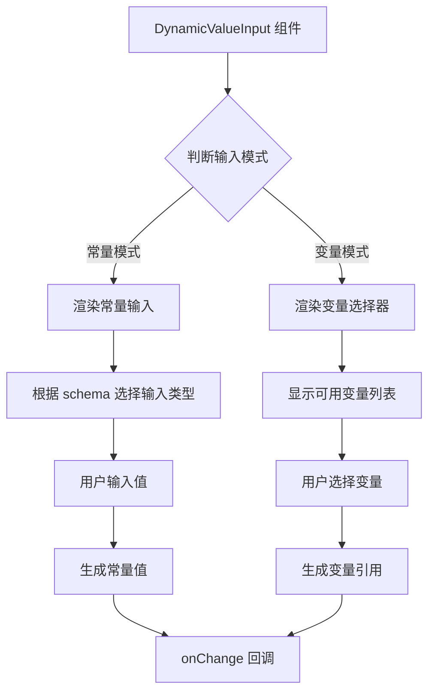

import { SourceCode } from '@theme';
import { BasicStory, WithSchemaStory } from 'components/form-materials/components/dynamic-value-input';

# DynamicValueInput

DynamicValueInput 是一个动态值输入组件，支持常量和变量两种输入模式。它可以根据提供的 schema 自动选择合适的输入类型，并提供变量选择功能。组件能够智能地在常量输入和变量选择之间切换。

<br />
<div>
  
</div>

## 案例演示

### 基本使用

<BasicStory />

```tsx pure title="form-meta.tsx"
import { DynamicValueInput } from '@flowgram.ai/form-materials';

const formMeta = {
  render: () => (
    <>
      <FormHeader />
      <Field<any> name="dynamic_value_input">
        {({ field }) => (
          <DynamicValueInput value={field.value} onChange={(value) => field.onChange(value)} />
        )}
      </Field>
    </>
  ),
}
```

### 带 Schema 约束

<WithSchemaStory />

```tsx pure title="form-meta.tsx"
import { DynamicValueInput } from '@flowgram.ai/form-materials';

const formMeta = {
  render: () => (
    <>
      <FormHeader />
      <Field<any> name="dynamic_value_input">
        {({ field }) => (
          <DynamicValueInput
            value={field.value}
            onChange={(value) => field.onChange(value)}
            schema={{ type: 'string' }}
          />
        )}
      </Field>
    </>
  ),
}
```

### 常量模式

```tsx
<DynamicValueInput
  value={{
    type: 'constant',
    content: 'Hello World',
    schema: { type: 'string' }
  }}
  onChange={handleChange}
/>
```

### 变量模式

```tsx
<DynamicValueInput
  value={{
    type: 'ref',
    content: ['start_0', 'query']
  }}
  onChange={handleChange}
/>
```

## API 参考

### DynamicValueInput Props

| 属性名 | 类型 | 默认值 | 描述 |
|--------|------|--------|------|
| `value` | `IFlowConstantRefValue` | - | 输入值，支持常量或变量引用 |
| `onChange` | `(value?: IFlowConstantRefValue) => void` | - | 值变化时的回调函数 |
| `readonly` | `boolean` | `false` | 是否为只读模式 |
| `hasError` | `boolean` | `false` | 是否显示错误状态 |
| `style` | `React.CSSProperties` | - | 自定义样式 |
| `schema` | `IJsonSchema` | - | 约束输入类型的 JSON Schema |
| `constantProps` | `ConstantInputProps` | - | 传递给常量输入组件的额外属性 |

### IFlowConstantRefValue

```typescript
type IFlowConstantRefValue =
  | IFlowConstantValue  // 常量值
  | IFlowRefValue;     // 变量引用

interface IFlowConstantValue {
  type: 'constant';
  content: any;           // 常量值
  schema: IJsonSchema;  // 值的类型定义
}

interface IFlowRefValue {
  type: 'ref';
  content: string; // 变量路径，如 "user.name"
}
```

### 模式切换

组件支持两种输入模式的智能切换：

1. **常量模式**: 直接输入值
2. **变量模式**: 选择作用域内的变量

## 源码导读

<SourceCode
  href="https://github.com/bytedance/flowgram.ai/tree/main/packages/materials/form-materials/src/components/dynamic-value-input"
/>

使用 CLI 命令可以复制源代码到本地：

```bash
npx @flowgram.ai/cli@latest materials components/dynamic-value-input
```

### 目录结构讲解

```
dynamic-value-input/
├── index.tsx           # 主组件实现，包含 DynamicValueInput 核心逻辑
├── hooks.ts            # 自定义 Hooks，处理变量引用和 schema 选择
├── styles.tsx          # 样式定义，使用 styled-components
└── README.md          # 组件说明文档
```

### 核心实现说明

#### 变量引用处理
通过 `useRefVariable` Hook 获取变量引用信息：

```typescript
const refVariable = useRefVariable(value);
```

#### Schema 选择管理
通过 `useSelectSchema` Hook 管理类型选择：

```typescript
const [selectSchema, setSelectSchema] = useSelectSchema(
  schemaFromProps,
  constantProps,
  value
);
```

#### 模式切换逻辑
组件通过判断 `value.type` 来决定渲染常量输入还是变量选择器：

```typescript
if (value?.type === 'ref') {
  // 渲染变量选择器
  return <InjectVariableSelector />;
} else {
  // 渲染常量输入
  return <ConstantInput />;
}
```

### 使用到的 flowgram API

#### @flowgram.ai/json-schema
- `JsonSchemaUtils`: JSON Schema 工具类
- `IJsonSchema`: JSON Schema 类型定义
- `useTypeManager`: 类型管理器 Hook

#### @flowgram.ai/variable-core
- `useScopeAvailable`: 获取当前作用域的可用变量

#### 内部组件
- [`InjectVariableSelector`](./variable-selector): 变量选择器
- [`TypeSelector`](./type-selector): 类型选择器
- `ConstantInput`: 常量输入组件
- `createInjectMaterial`: 创建可注入的物料组件

### 整体流程



