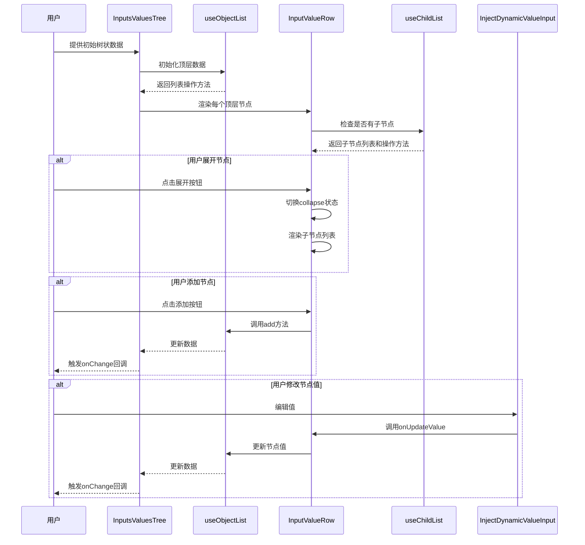

import { SourceCode } from '@theme';
import { BasicStory } from 'components/form-materials/components/inputs-values-tree';

# InputsValuesTree

InputsValuesTree 是一个用于展示和编辑**树状结构输入值**的组件，每个叶子节点为一个键值对，值支持常量和变量两种输入模式，通过 DynamicValueInput 组件实现灵活的输入方式。组件采用树形层级展示，支持节点的展开和折叠，适用于构建复杂的嵌套数据结构。

:::tip{title="和 InputsValues 的区别"}

- **结构差异**：InputsValues 仅支持一级键值对列表，而 InputsValuesTree 支持树形嵌套结构
- **展示方式**：InputsValues 使用简单的行列表展示，InputsValuesTree 使用树形结构展示，带有缩进和展开/折叠功能
- **适用场景**：InputsValues 适用于简单的键值对配置，InputsValuesTree 适用于复杂的多层级数据结构配置

:::

## 案例演示

### 基本使用

<BasicStory />

```tsx pure title="form-meta.tsx"
import { InputsValuesTree } from '@flowgram.ai/form-materials';

const formMeta = {
  render: () => (
    <>
      <FormHeader />
      <Field<Record<string, any> | undefined>
        name="inputs_values"
        defaultValue={{
          a: {
            b: {
              type: 'ref',
              content: ['start_0', 'str'],
            },
            c: {
              type: 'constant',
              content: 'hello',
            },
          },
          d: {
            type: 'constant',
            content: '{ "a": "b"}',
            schema: { type: 'object' },
          },
        }}
      >
        {({ field }) => (
          <InputsValuesTree value={field.value} onChange={(value) => field.onChange(value)} />
        )}
      </Field>
    </>
  ),
}
```

## API 参考

| 属性名 | 类型 | 默认值 | 说明 |
| :--- | :--- | :--- | :--- |
| value | `IInputsValues` | - | 树状结构的输入值对象 |
| onChange | `(value?: IInputsValues) => void` | - | 值变化时的回调函数 |
| readonly | `boolean` | `false` | 是否只读模式 |
| hasError | `boolean` | `false` | 是否显示错误状态 |
| schema | `IJsonSchema` | - | JSON Schema 定义，用于验证和类型提示 |
| style | `React.CSSProperties` | - | 自定义样式 |
| constantProps | `{ strategies?: ConstantInputStrategy[]; [key: string]: any }` | - | 常量输入组件的配置属性 |

## 源码导读

<SourceCode
  href="https://github.com/bytedance/flowgram.ai/tree/main/packages/materials/form-materials/src/components/inputs-values-tree"
/>

使用 CLI 命令可以复制源代码到本地：

```bash
npx @flowgram.ai/cli@latest materials components/inputs-values-tree
```

### 目录结构讲解

```plaintext
components/inputs-values-tree/
├── index.tsx          # 组件入口文件
├── row.tsx            # 树行组件，处理单个节点的展示和编辑
├── types.ts           # 类型定义文件
├── icon.tsx           # 图标组件
├── styles.css         # 组件样式文件
└── hooks/
    └── use-child-list.tsx # 处理子节点列表的自定义 Hook
```

### 核心实现说明

InputsValuesTree 组件主要用于展示和编辑树状结构的输入值，支持两种类型的值：常量值（constant）和引用值（ref）。

#### 工作流程时序图



核心功能特点：

1. **树状结构展示**：通过递归的方式展示嵌套的树状数据结构
2. **值类型支持**：支持常量值和引用值两种类型，常量值可以是字符串、数字、布尔值等，引用值指向工作流中的其他节点
3. **增删改操作**：支持添加、删除、修改节点的键名和值
4. **可配置性**：通过 constantProps 属性可以自定义常量输入组件的行为

组件内部使用 useObjectList 钩子管理对象列表，使用 InputValueRow 组件渲染每一行数据。当用户点击添加按钮时，会默认添加一个空的字符串类型常量值。

### 依赖梳理

#### flowgram API

[**@flowgram.ai/editor**](https://github.com/bytedance/flowgram.ai/tree/main/packages/client/editor)
- [`I18n`](https://flowgram.ai/auto-docs/editor/variables/I18n): 国际化工具类

[**@flowgram.ai/json-schema**](https://github.com/bytedance/flowgram.ai/tree/main/packages/json-schema)
- [`IJsonSchema`](https://flowgram.ai/auto-docs/json-schema/interfaces/IJsonSchema): JSON Schema 类型定义

#### 第三方库

[**Semi UI**](https://semi.design/zh-CN)
- `Button`: 按钮组件
- `IconPlus`: 加号图标组件
