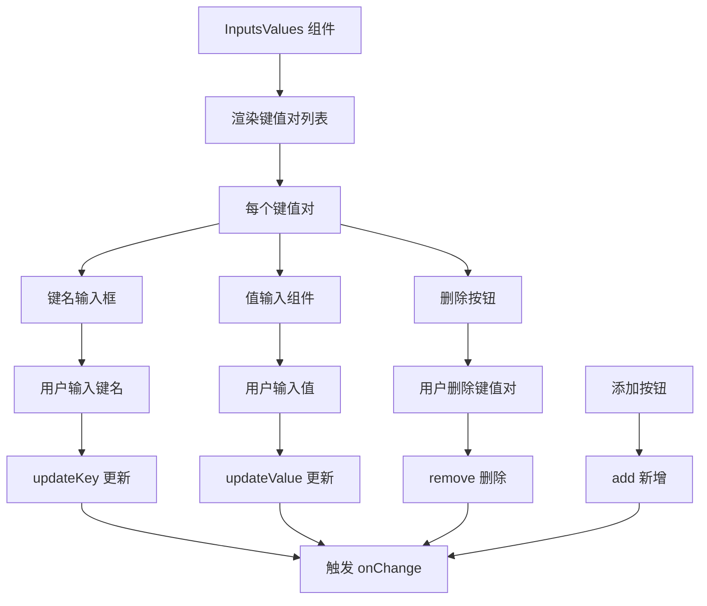

import { SourceCode } from '@theme';
import { BasicStory, WithSchemaStory } from 'components/form-materials/components/inputs-values';

# InputsValues

InputsValues 是一个键值对输入列表组件，用于收集和管理一组输入参数。每个键值对都支持常量和变量两种输入模式，通过 DynamicValueInput 组件实现灵活的输入方式。

## 案例演示

### 基本使用

<BasicStory />

```tsx pure title="form-meta.tsx"
import { InputsValues } from '@flowgram.ai/form-materials';

const formMeta = {
  render: () => (
    <>
      <FormHeader />
      <Field<Record<string, any> | undefined> name="inputs_values">
        {({ field }) => (
          <InputsValues value={field.value} onChange={(value) => field.onChange(value)} />
        )}
      </Field>
    </>
  ),
}
```

### 带 Schema 约束

<WithSchemaStory />

```tsx pure title="form-meta.tsx"
import { InputsValues } from '@flowgram.ai/form-materials';

const formMeta = {
  render: () => (
    <>
      <FormHeader />
      <Field<Record<string, any> | undefined> name="inputs_values">
        {({ field }) => (
          <InputsValues
            value={field.value}
            onChange={(value) => field.onChange(value)}
            schema={{
              type: 'string',
            }}
          />
        )}
      </Field>
    </>
  ),
}
```

### 自定义常量输入策略
通过 `constantProps` 可以自定义每个值的输入行为：

```typescript
const customStrategies = [
  {
    type: 'string',
    render: (props) => <CustomStringInput {...props} />
  },
  {
    type: 'number',
    render: (props) => <CustomNumberInput {...props} />
  }
];

<InputsValues
  constantProps={{
    strategies: customStrategies
  }}
/>
```


## API 参考

### InputsValues Props

| 属性名 | 类型 | 默认值 | 描述 |
|--------|------|--------|------|
| `value` | `Record<string, IFlowValue \| undefined>` | - | 键值对数据 |
| `onChange` | `(value?: Record<string, IFlowValue \| undefined>) => void` | - | 数据变化时的回调函数 |
| `readonly` | `boolean` | `false` | 是否为只读模式 |
| `hasError` | `boolean` | `false` | 是否显示错误状态 |
| `style` | `React.CSSProperties` | - | 自定义样式 |
| `schema` | `IJsonSchema` | - | 约束所有值类型的 JSON Schema |
| `constantProps` | `ConstantInputProps` | - | 传递给 DynamicValueInput 的额外属性 |

### 数据结构

```typescript
interface PropsType {
  value?: Record<string, IFlowValue | undefined>;
  onChange: (value?: Record<string, IFlowValue | undefined>) => void;
  // ... 其他属性
}

type IFlowValue =
  | IFlowConstantValue  // 常量值
  | IFlowRefValue;     // 变量引用

interface IFlowConstantValue {
  type: 'constant';
  content: any;           // 常量值
  schema: IJsonSchema;  // 值的类型定义
}

interface IFlowRefValue {
  type: 'ref';
  content: string; // 变量路径，如 "user.name"
}
```

## 源码导读

<SourceCode
  href="https://github.com/bytedance/flowgram.ai/tree/main/packages/materials/form-materials/src/components/inputs-values"
/>

使用 CLI 命令可以复制源代码到本地：

```bash
npx @flowgram.ai/cli@latest materials components/inputs-values
```

### 目录结构讲解

```
inputs-values/
├── index.tsx           # 主组件实现，包含 InputsValues 核心逻辑
├── types.ts            # 类型定义
└── styles.css          # 样式文件
```

### 核心实现说明

#### 键值对管理
使用 `useObjectList` Hook 管理键值对列表：

```typescript
const { list, updateKey, updateValue, remove, add } = useObjectList<IFlowValue | undefined>({
  value,
  onChange,
  sortIndexKey: 'extra.index',
});
```

#### 动态值输入集成
每个值都使用 `InjectDynamicValueInput` 组件实现输入：

```typescript
<InjectDynamicValueInput
  value={item.value as IFlowConstantRefValue}
  onChange={(v) => updateValue(item.id, v)}
  schema={schema}
  constantProps={constantProps}
/>
```

#### 键名输入
使用 `BlurInput` 组件实现键名的输入和验证：

```typescript
<BlurInput
  value={item.key}
  onChange={(v) => updateKey(item.id, v)}
  placeholder={I18n.t('Input Key')}
/>
```

### 使用到的 flowgram API

#### @flowgram.ai/i18n
- `I18n`: 国际化支持

#### 内部组件
- `InjectDynamicValueInput`: 动态值输入组件
- `BlurInput`: 失焦输入组件
- `useObjectList`: 对象列表管理 Hook

### 整体流程


