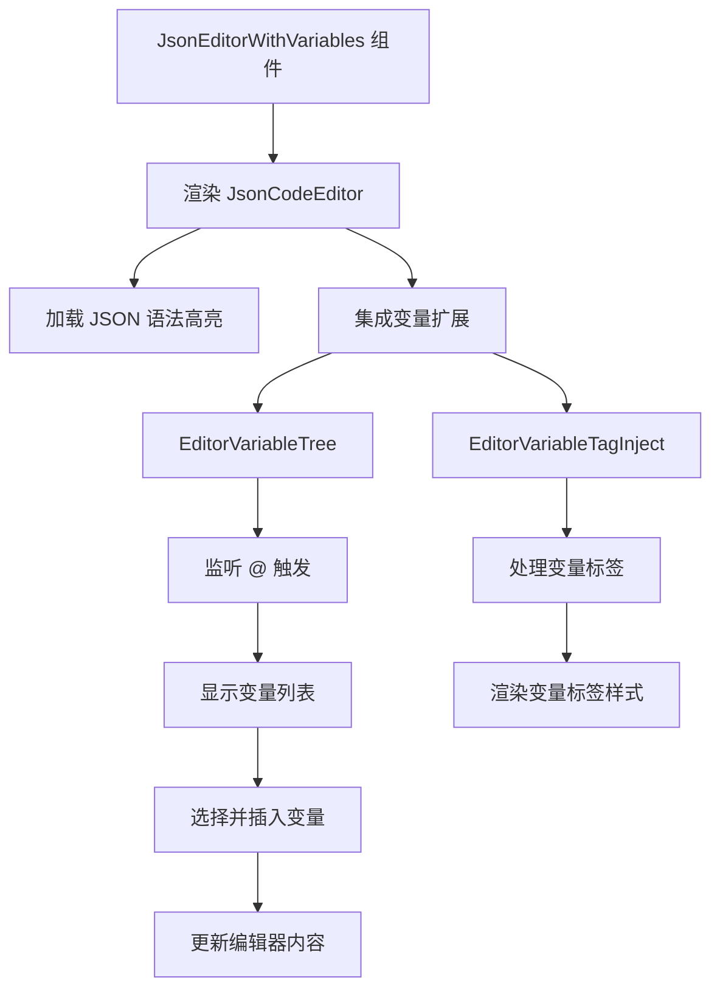

import { SourceCode } from '@theme';
import { BasicStory } from 'components/form-materials/components/json-editor-with-variables';

# JsonEditorWithVariables

JsonEditorWithVariables 是一个增强版的 JSON 编辑器，支持在 JSON 中插入变量引用。它基于 JsonCodeEditor 构建，集成了变量选择器和变量标签注入功能，使用户能够在 JSON 字符串中使用 `{{variable}}` 语法引用变量。

## 案例演示

### 基本使用

<BasicStory />

```tsx pure title="form-meta.tsx"
import { JsonEditorWithVariables } from '@flowgram.ai/form-materials';

const formMeta = {
  render: () => (
    <>
      <FormHeader />
      <Field<any> name="json_editor_with_variables" defaultValue={`{ "a": {{start_0.str}} }`}>
        {({ field }) => (
          <JsonEditorWithVariables
            value={field.value}
            onChange={(value) => field.onChange(value)}
          />
        )}
      </Field>
    </>
  ),
}
```

### 带变量的 JSON 示例

```json
{
  "user_info": {
    "name": "{{start_0.name}}",
    "email": "{{start_0.email}}",
  }
}
```

### 变量插入

在编辑器中输入 `@` 字符可以触发变量选择器。

输入 `@` 后会显示可用的变量列表，选择变量后会自动插入为 `{{variable.name}}` 格式。

## API 参考

### JsonEditorWithVariables Props

| 属性名 | 类型 | 默认值 | 描述 |
|--------|------|--------|------|
| `value` | `string` | - | JSON 字符串内容 |
| `onChange` | `(value: string) => void` | - | 内容变化时的回调函数 |
| `theme` | `'dark' \| 'light'` | `'light'` | 编辑器主题 |
| `placeholder` | `string` | - | 占位符文本 |
| `activeLinePlaceholder` | `string` | `'按 @ 选择变量'` | 当前行的占位提示 |
| `readonly` | `boolean` | `false` | 是否为只读模式 |
| `options` | `Options` | - | CodeMirror 配置选项 |

### 变量语法

在 JSON 字符串中使用双花括号语法引用变量：

```json
{
  "key": "{{variable.path}}"
}
```

支持的变量格式：
- `{{start_0.name}}` - 简单变量
- `{{start_0.address.city}}` - 嵌套属性

## 源码导读

<SourceCode
  href="https://github.com/bytedance/flowgram.ai/tree/main/packages/materials/form-materials/src/components/json-editor-with-variables"
/>

使用 CLI 命令可以复制源代码到本地：

```bash
npx @flowgram.ai/cli@latest materials components/json-editor-with-variables
```

### 目录结构讲解

```
json-editor-with-variables/
├── index.tsx           # 懒加载导出文件
├── editor.tsx          # 主组件实现
└── README.md          # 组件说明文档
```

### 核心实现说明

#### 变量语法解析
通过正则表达式解析 JSON 中的变量引用：

```typescript
const matches = findAllMatches(originalSource, /\{\{([^\}]*)\}\}/g);
```


#### 变量选择器集成
集成 `EditorVariableTree` 和 `EditorVariableTagInject` 扩展：

```typescript
<EditorVariableTree triggerCharacters={TRIGGER_CHARACTERS} />
<EditorVariableTagInject />
```

#### 触发字符
使用 `@` 作为变量选择的触发字符：

```typescript
const TRIGGER_CHARACTERS = ['@'];
```

### 使用到的 flowgram API

#### @flowgram.ai/coze-editor
- `JsonCodeEditor`: JSON 代码编辑器
- `transformerCreator`: 语法转换器创建器
- `EditorVariableTree`: 变量树选择器
- `EditorVariableTagInject`: 变量标签注入器
- `Text`: 文本处理工具

#### @flowgram.ai/i18n
- `I18n`: 国际化支持

#### coze-editor-extensions 物料
- `EditorVariableTree`: 变量树选择触发
- `EditorVariableTagInject`: 变量标签展示


### 整体流程



#### 自定义触发字符
可以通过扩展支持更多触发字符：

```typescript
const CUSTOM_TRIGGERS = ['@', '#', '$'];

<JsonCodeEditor
  options={{
    transformer: customTransformer,
  }}
>
  <EditorVariableTree triggerCharacters={CUSTOM_TRIGGERS} />
</JsonCodeEditor>
```

