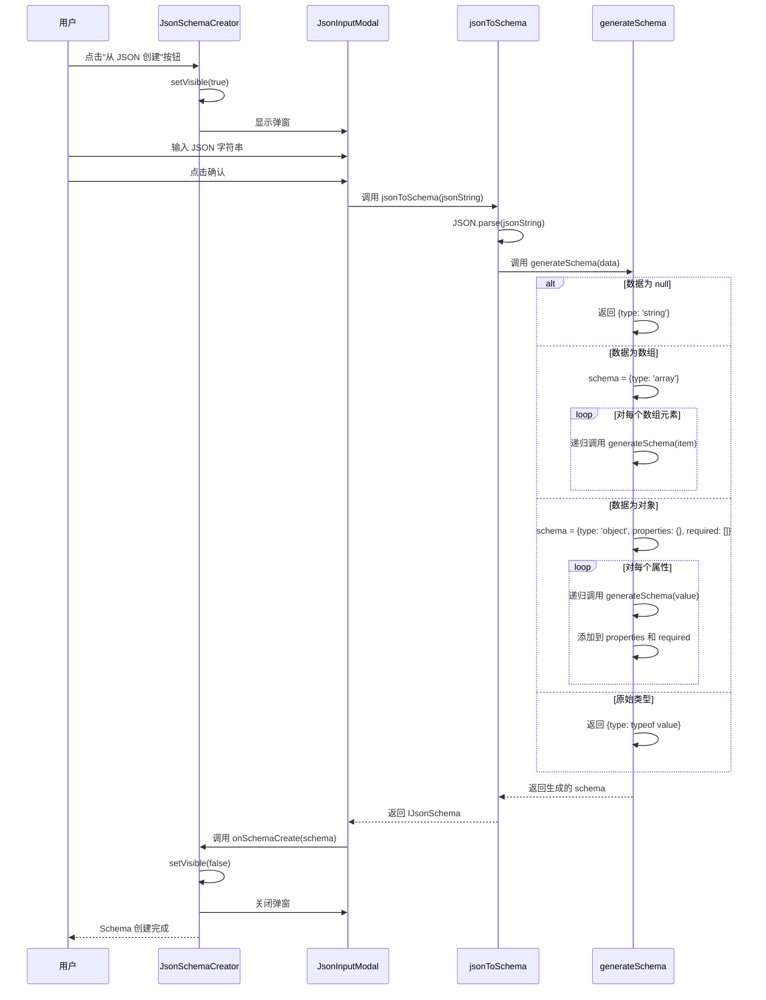

import { SourceCode } from '@theme';
import { BasicStory } from 'components/form-materials/components/json-schema-creator';

# JsonSchemaCreator

JsonSchemaCreator 是一个用于从 JSON 字符串自动生成 JSON Schema 的组件。它提供了一个按钮来触发弹窗，用户可以在弹窗中粘贴 JSON 数据，组件会自动分析数据结构并生成对应的 JSON Schema。

## 案例演示

### 基本使用

<BasicStory />

```tsx pure title="form-meta.tsx"
import { JsonSchemaCreator } from '@flowgram.ai/form-materials';

const formMeta = {
  render: () => (
    <>
      <FormHeader />
      <Field<IJsonSchema | undefined> name="json_schema">
        {({ field }) => (
          <div>
            <JsonSchemaCreator
              onSchemaCreate={(schema) => field.onChange(schema)}
            />
            <div style={{ marginTop: 16 }}>
              <JsonSchemaEditor
                value={field.value}
                onChange={(value) => field.onChange(value)}
              />
            </div>
          </div>
        )}
      </Field>
    </>
  ),
}
```

## API 参考

### JsonSchemaCreator Props

| 属性名 | 类型 | 默认值 | 描述 |
|--------|------|--------|------|
| `onSchemaCreate` | `(schema: IJsonSchema) => void` | - | 生成 schema 后的回调函数 |

## 源码导读

<SourceCode
  href="https://github.com/bytedance/flowgram.ai/tree/main/packages/materials/form-materials/src/components/json-schema-creator"
/>

使用 CLI 命令可以复制源代码到本地：

```bash
npx @flowgram.ai/cli@latest materials components/json-schema-creator
```

### 目录结构讲解

```
json-schema-creator/
├── index.tsx              # 主组件导出，包含 JsonSchemaCreator 和 JsonSchemaCreatorProps
├── json-schema-creator.tsx # 主组件实现，包含按钮和状态管理
├── json-input-modal.tsx   # JSON 输入弹窗组件
└── utils/
    └── json-to-schema.ts  # JSON 转 Schema 的核心工具函数
```

### 核心实现说明

#### JSON 解析和 Schema 生成流程

以下是 JSON Schema 创建的完整交互时序图：



### 使用到的 FlowGram API

[**@flowgram.ai/json-schema**](https://github.com/bytedance/flowgram.ai/tree/main/packages/variable/json-schema)
- [`IJsonSchema`](https://flowgram.ai/auto-docs/json-schema/interfaces/IJsonSchema): JSON Schema 类型定义

### 依赖的其他物料

[**JsonCodeEditor**](./code-editor) 代码编辑器组件
- 用于在弹窗中编辑 JSON 数据

### 使用的第三方库

[**@douyinfe/semi-ui**](https://semi.design/)
- `Button`: 触发弹窗的按钮组件
- `Modal`: 弹窗容器
- `Typography`: 文本组件
