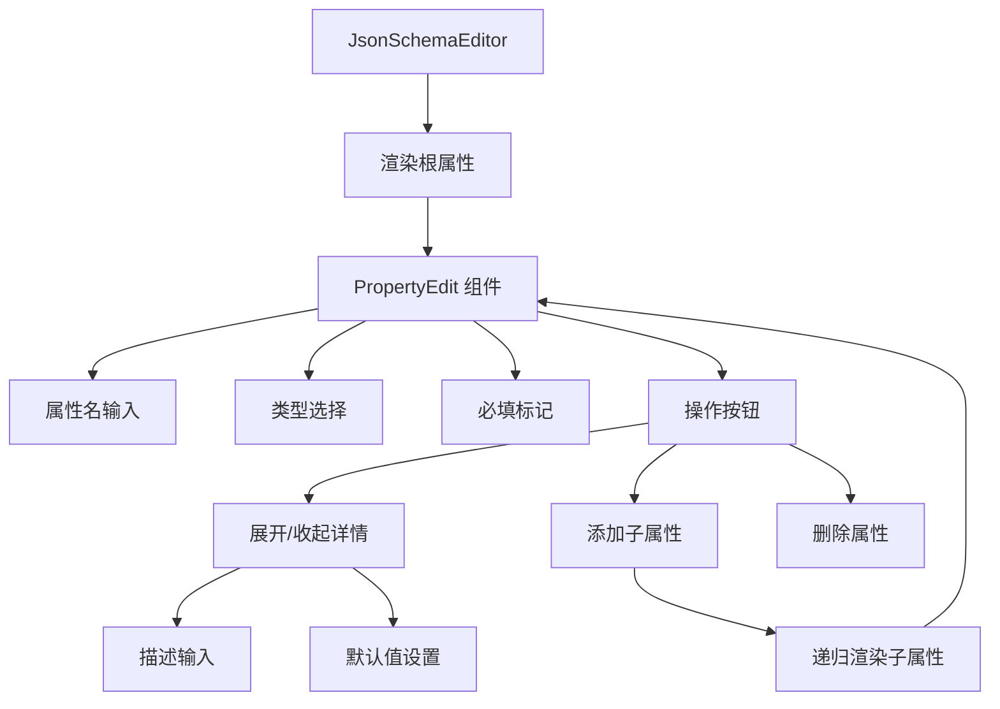

import { SourceCode } from '@theme';
import { BasicStory } from 'components/form-materials/components/json-schema-editor';

# JsonSchemaEditor

JsonSchemaEditor 是一个可视化的 JSON Schema 编辑器，支持创建和编辑复杂的 JSON Schema 结构。它提供了树形结构的界面，可以直观地定义对象、数组、字符串、数字等各种类型的属性，支持嵌套结构和必填字段标记。

JsonSchema 协议可以通过以下文档学习：

- [Json Schema 官网](https://json-schema.org/learn)
- [Json Schema 规范（中文版）](https://json-schema.apifox.cn/)

## 案例演示

### 基本使用

<BasicStory />

```tsx pure title="form-meta.tsx"
import { JsonSchemaEditor } from '@flowgram.ai/form-materials';

const formMeta = {
  render: () => (
    <>
      <FormHeader />
      <Field<IJsonSchema> name="json_schema" defaultValue={{ type: 'object' }}>
        {({ field }) => (
          <JsonSchemaEditor
            value={field.value}
            onChange={(value) => field.onChange(value)}
          />
        )}
      </Field>
    </>
  ),
}
```

## API 参考

### JsonSchemaEditor Props

| 属性名 | 类型 | 默认值 | 描述 |
|--------|------|--------|------|
| `value` | `IJsonSchema` | `{ type: 'object' }` | JSON Schema 对象 |
| `onChange` | `(value: IJsonSchema) => void` | - | Schema 变化时的回调函数 |
| `config` | `ConfigType` | `{}` | 编辑器配置选项 |
| `className` | `string` | - | 自定义样式类名 |
| `readonly` | `boolean` | `false` | 是否为只读模式 |

### ConfigType

| 属性名 | 类型 | 默认值 | 描述 |
|--------|------|--------|------|
| `placeholder` | `string` | `'输入变量名'` | 属性名占位符 |
| `descTitle` | `string` | `'描述'` | 描述字段标题 |
| `descPlaceholder` | `string` | `'帮助LLM理解该属性'` | 描述字段占位符 |
| `defaultValueTitle` | `string` | `'默认值'` | 默认值字段标题 |
| `defaultValuePlaceholder` | `string` | `'默认值'` | 默认值占位符 |
| `addButtonText` | `string` | `'添加'` | 添加按钮文本 |

### 支持的类型

| 类型 | 描述 | 示例 |
|------|------|------|
| `string` | 字符串类型 | `"hello"` |
| `number` | 数字类型 | `42` |
| `boolean` | 布尔类型 | `true` |
| `object` | 对象类型 | `{}` |
| `array` | 数组类型 | `[]` |
| `null` | 空值类型 | `null` |

## 源码导读

<SourceCode
  href="https://github.com/bytedance/flowgram.ai/tree/main/packages/materials/form-materials/src/components/json-schema-editor"
/>

使用 CLI 命令可以复制源代码到本地：

```bash
npx @flowgram.ai/cli@latest materials components/json-schema-editor
```

### 目录结构讲解

```
json-schema-editor/
├── index.tsx           # 主组件实现
├── types.ts            # 类型定义
├── hooks.tsx           # 状态管理钩子
├── styles.css          # 样式文件
├── default-value.tsx   # 默认值编辑器
└── icon.tsx            # 图标组件
```

### 核心实现说明

#### 树形结构管理
组件使用递归的 `PropertyEdit` 组件来渲染嵌套的 Schema 结构：

```typescript
function PropertyEdit(props: {
  value?: PropertyValueType;
  config?: ConfigType;
  onChange?: (value: PropertyValueType) => void;
  onRemove?: () => void;
  readonly?: boolean;
  $level?: number;
  $isLast?: boolean;
})
```

#### 属性编辑状态管理
使用 `usePropertiesEdit` 钩子管理 Schema 的增删改查：

```typescript
const {
  propertyList,
  onAddProperty,
  onRemoveProperty,
  onEditProperty
} = usePropertiesEdit(value, onChangeProps);
```


### 使用到的 flowgram API

#### @flowgram.ai/json-schema
- `IJsonSchema`: JSON Schema 类型定义

#### @flowgram.ai/i18n
- `I18n`: 国际化支持

### 整体流程



### 高级功能

#### 嵌套结构支持
支持无限层级的嵌套对象和数组：

```json
{
  "type": "object",
  "properties": {
    "level1": {
      "type": "object",
      "properties": {
        "level2": {
          "type": "object",
          "properties": {
            "level3": {
              "type": "string"
            }
          }
        }
      }
    }
  }
}
```

#### 数组元素定义
支持定义数组元素的 Schema：

```json
{
  "type": "array",
  "items": {
    "type": "object",
    "properties": {
      "id": { "type": "number" },
      "name": { "type": "string" }
    }
  }
}
```

#### 必填字段管理
支持标记字段为必填，并自动更新 `required` 数组：

```json
{
  "type": "object",
  "properties": {
    "name": { "type": "string" },
    "email": { "type": "string" }
  },
  "required": ["email"]
}
```

### 使用场景

- **API 文档生成**: 为 REST API 创建请求/响应 Schema
- **表单验证**: 定义表单字段的验证规则
- **数据建模**: 创建数据结构模型
- **配置管理**: 定义配置文件的结构
- **代码生成**: 为代码生成器提供 Schema 输入
