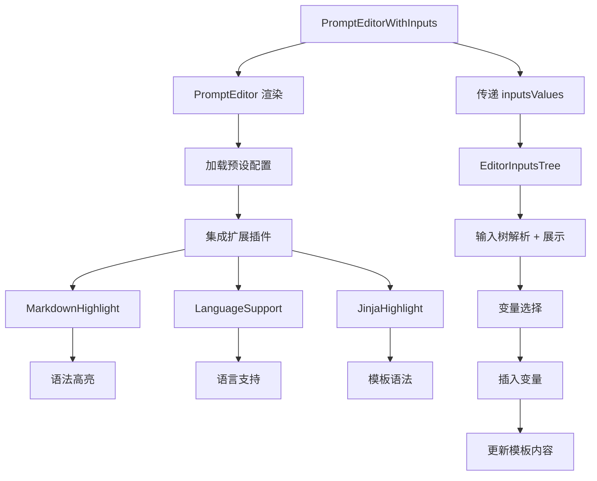

import { SourceCode } from '@theme';
import { BasicStory } from 'components/form-materials/components/prompt-editor-with-inputs';

# PromptEditorWithInputs

PromptEditorWithInputs 是一个增强版的提示编辑器，集成了输入变量管理功能。它基于 PromptEditor 构建，额外提供了输入变量的树形选择器，使用户能够在提示模板中方便地引用和管理输入变量。

## 案例演示

### 基本使用

<BasicStory />

```tsx pure title="form-meta.tsx"
import { PromptEditorWithInputs } from '@flowgram.ai/form-materials';

const formMeta = {
  render: () => (
    <>
      <FormHeader />
      <Field<IInputsValues | undefined>
        name="inputsValues"
        defaultValue={{
          a: { type: 'constant', content: '123' },
          b: { type: 'ref', content: ['start_0', 'obj'] },
        }}
      >
        {({ field }) => (
          <InputsValuesTree value={field.value} onChange={(value) => field.onChange(value)} />
        )}
      </Field>
      <br />
      <Field<IInputsValues | undefined> name="inputsValues">
        {({ field: inputsField }) => (
          <Field<IFlowTemplateValue | undefined>
            name="prompt_editor_with_inputs"
            defaultValue={{
              type: 'template',
              content: '# Query \n {{b.obj2.num}}',
            }}
          >
            {({ field }) => (
              <PromptEditorWithInputs
                value={field.value}
                onChange={(value) => field.onChange(value)}
                inputsValues={inputsField.value || {}}
              />
            )}
          </Field>
        )}
      </Field>
    </>
  ),
}
```

### Inputs 插入

在编辑器中输入 `@`, `{` 字符可以触发 Inputs 选择器。

输入 `@`, `{` 后会显示可用的变量列表，选择变量后会自动插入为 `{{inputs.path}}` 格式。


## API 参考

### PromptEditorWithInputs Props

| 属性名 | 类型 | 默认值 | 描述 |
|--------|------|--------|------|
| `value` | `{ type: 'template', content: string }` | - | 提示模板内容 |
| `inputsValues` | `IInputsValues` | `{}` | 输入变量键值对 |
| `onChange` | `(value: { type: 'template', content: string }) => void` | - | 内容变化时的回调函数 |
| `readonly` | `boolean` | `false` | 是否为只读模式 |
| `placeholder` | `string` | - | 占位符文本 |
| `activeLinePlaceholder` | `string` | - | 当前行的占位提示 |
| `hasError` | `boolean` | `false` | 是否显示错误状态 |
| `disableMarkdownHighlight` | `boolean` | `false` | 是否禁用Markdown高亮 |
| `options` | `Options` | - | CodeMirror 配置选项 |


## 源码导读

<SourceCode
  href="https://github.com/bytedance/flowgram.ai/tree/main/packages/materials/form-materials/src/components/prompt-editor-with-inputs"
/>

使用 CLI 命令可以复制源代码到本地：

```bash
npx @flowgram.ai/cli@latest materials components/prompt-editor-with-inputs
```

### 目录结构讲解

```
prompt-editor-with-inputs/
├── index.tsx           # 懒加载导出文件
├── editor.tsx          # 主组件实现
└── README.md          # 组件说明文档

prompt-editor/
├── index.tsx           # 基础提示编辑器导出
├── editor.tsx          # 基础提示编辑器实现
├── types.ts            # 类型定义
├── styles.ts           # 样式组件
└── extensions/         # 编辑器扩展
    ├── markdown.tsx    # Markdown高亮
    ├── language-support.tsx # 语言支持
    └── jinja.tsx       # Jinja模板高亮
```

### 核心实现说明

#### 输入变量集成
PromptEditorWithInputs 扩展了基础 PromptEditor，增加了输入变量选择器：

```typescript
export function PromptEditorWithInputs({
  inputsValues,
  ...restProps
}: PromptEditorWithInputsProps) {
  return (
    <PromptEditor {...restProps}>
      <EditorInputsTree inputsValues={inputsValues} />
    </PromptEditor>
  );
}
```

#### 基础提示编辑器
基础 PromptEditor 提供了完整的模板编辑功能：

```typescript
<PromptEditor
  value={field.value}
  onChange={(value) => field.onChange(value)}
  placeholder="输入提示模板..."
  activeLinePlaceholder="按 @ 插入变量"
/>
```

#### 编辑器扩展
基础编辑器集成了多个扩展：

- **MarkdownHighlight**: 提供Markdown语法高亮
- **LanguageSupport**: 支持多种编程语言
- **JinjaHighlight**: Jinja2模板语法高亮

#### 变量选择器
`EditorInputsTree` 组件提供了树形结构的变量选择器：

```typescript
<EditorInputsTree inputsValues={inputsValues} />
```

### 使用到的 flowgram API

#### @flowgram.ai/coze-editor/react
- `Renderer`: 编辑器渲染器
- `EditorProvider`: 编辑器提供者
- `ActiveLinePlaceholder`: 活动行占位符
- `InferValues`: 类型推断工具

#### @flowgram.ai/coze-editor/preset-prompt
- `preset`: 提示编辑器预设配置
- `EditorAPI`: 编辑器API接口

#### 通用物料逻辑
- `IInputsValues`: 输入变量类型定义

### 整体流程


