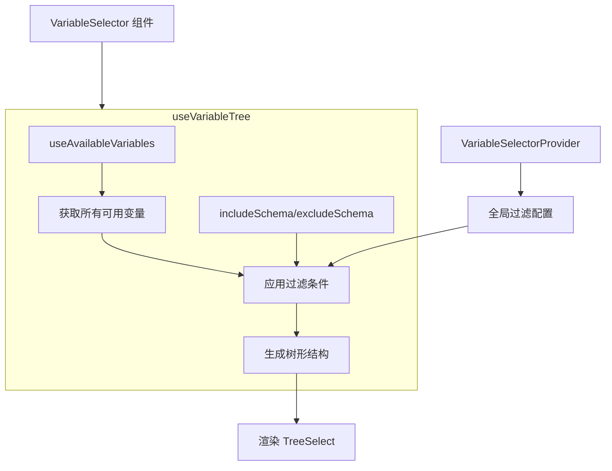

import { SourceCode } from '@theme';
import { BasicStory, FilterSchemaStory, CustomFilterStory } from 'components/form-materials/components/variable-selector';

# VariableSelector

VariableSelector 是一个用于选择当前作用域变量的组件，它可以根据变量的类型进行过滤。

<br />
<div>
  
</div>


## 案例演示

### 直接使用

<BasicStory />

```tsx pure title="form-meta.tsx"
import { VariableSelector } from '@flowgram.ai/form-materials';

const formMeta = {
  render: () => (
    <>
      <FormHeader />
      <Field<string[] | undefined> name="variable_selector">
        {({ field }) => (
          <VariableSelector value={field.value} onChange={(value) => field.onChange(value)} />
        )}
      </Field>
    </>
  ),
}
```


### 过滤变量类型

<FilterSchemaStory />

```tsx pure title="form-meta.tsx"
import { VariableSelector } from '@flowgram.ai/form-materials';

const formMeta = {
  render: () => (
    <>
      <FormHeader />
      <Field<string[] | undefined> name="variable_selector">
        {({ field }) => (
          <VariableSelector
            value={field.value}
            onChange={(value) => field.onChange(value)}
            includeSchema={{ type: 'string' }}
          />
        )}
      </Field>
    </>
  ),
}
```

### 自定义过滤逻辑

<CustomFilterStory />

```tsx pure title="form-meta.tsx"
import { VariableSelector } from '@flowgram.ai/form-materials';

const formMeta = {
  render: () => (
    <VariableSelectorProvider skipVariable={(variable) => variable?.key === 'str'}>
      <FormHeader />
      <Field<string[] | undefined> name="variable_selector">
        {({ field }) => (
          <VariableSelector
            value={field.value}
            onChange={(value) => field.onChange(value)}
          />
        )}
      </Field>
    </VariableSelectorProvider>
  ),
}
```


## API 参考

### VariableSelector Props

| 属性名 | 类型 | 默认值 | 描述 |
|--------|------|--------|------|
| `value` | `string[]` | - | 选中的变量路径数组 |
| `onChange` | `(value?: string[]) => void` | - | 变量选择变化时的回调函数 |
| `config` | `VariableSelectorConfig` | `{}` | 配置对象 |
| `includeSchema` | `IJsonSchema \| IJsonSchema[]` | - | 包含的变量类型过滤条件 |
| `excludeSchema` | `IJsonSchema \| IJsonSchema[]` | - | 排除的变量类型过滤条件 |
| `readonly` | `boolean` | `false` | 是否为只读模式 |
| `hasError` | `boolean` | `false` | 是否显示错误状态 |
| `style` | `React.CSSProperties` | - | 自定义样式 |
| `triggerRender` | `(props: TriggerRenderProps) => React.ReactNode` | - | 自定义触发器渲染 |

### VariableSelectorConfig

| 属性名 | 类型 | 默认值 | 描述 |
|--------|------|--------|------|
| `placeholder` | `string` | `'选择变量'` | 占位符文本 |
| `notFoundContent` | `string` | `'未定义'` | 变量未找到时的显示内容 |

### VariableSelectorProvider Props

| 属性名 | 类型 | 默认值 | 描述 |
|--------|------|--------|------|
| `skipVariable` | `(variable?: BaseVariableField) => boolean` | - | 自定义变量过滤函数 |
| `children` | `React.ReactNode` | - | 子组件 |

## 源码导读

<SourceCode
  href="https://github.com/bytedance/flowgram.ai/tree/main/packages/materials/form-materials/src/components/variable-selector"
/>

使用 CLI 命令可以复制源代码到本地：

```bash
npx @flowgram.ai/cli@latest materials components/variable-selector
```

### 目录结构讲解

```
variable-selector/
├── index.tsx           # 主组件实现，包含 VariableSelector 核心逻辑
├── context.tsx         # 提供 `VariableSelectorContext` 上下文，支持全局配置变量过滤逻辑
├── use-variable-tree.tsx # 自定义 Hook，处理变量树数据的转换和过滤
└── styles.css          # 样式文件
```


### 整体流程



### 使用到的 flowgram API

#### @flowgram.ai/variable-core
- `useAvailableVariables()`: 获取当前作用域内所有可用的变量
- `BaseVariableField`: 基础变量字段类型，包含变量键、类型、元数据等

#### @flowgram.ai/json-schema
- `useTypeManager()`: 获取类型管理器，用于处理变量类型的显示和验证
- `IJsonSchema`: JSON Schema 类型定义，用于变量类型验证
- `JsonSchemaUtils`: JSON Schema 工具类，提供类型匹配和转换功能


