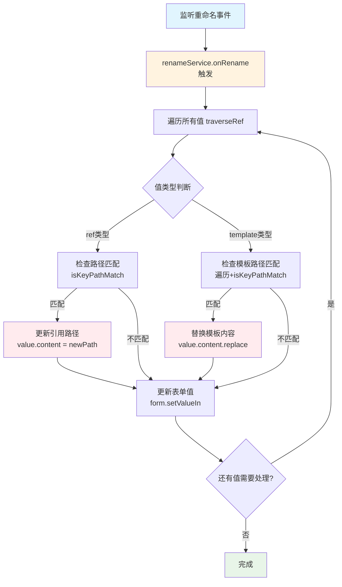

import { SourceCode } from '@theme';
import { BasicStory } from 'components/form-materials/effects/auto-rename-ref';

# autoRenameRef

autoRenameRef 是一个自动重命名引用效果，当表单字段的键名发生变化时，自动更新所有引用该字段的引用值和模板值。

<br />
<div>
  
  *query 变量名变化时，自动重命名下游 inputs 中的引用*
</div>

## 案例演示

### 基本使用

<BasicStory />

```tsx pure title="form-meta.tsx"
import { autoRenameRefEffect } from '@flowgram.ai/form-materials';

const formMeta = {
  effects: {
    "inputsValues": autoRenameRefEffect,
  },
  render: () => (
    <>
      <FormHeader />
      <Field<any> name="inputsValues">
        {({ field }) => (
          <InputsValues value={field.value} onChange={(value) => field.onChange(value)} />
        )}
      </Field>
    </>
  ),
}
```

### 在复杂表单中使用

```tsx pure title="form-meta.tsx"
import { autoRenameRefEffect } from '@flowgram.ai/form-materials';

const formMeta = {
  effects: {
    // 为多个字段应用自动重命名效果
    "inputsValues": autoRenameRefEffect,
    "outputsValues": autoRenameRefEffect,
    "config.data": autoRenameRefEffect,
  },
  render: () => (
    <>
      <FormHeader />
      <Field<any> name="inputsValues"> {/* inputsValues 实现 */} </Field>
      <Field<any> name="outputsValues"> {/* outputsValues 实现 */} </Field>
      <Field<any> name="config.data"> {/* config.data 实现 */} </Field>
    </>
  ),
}
```

## API 介绍

### 支持的值类型

当指定 key 下对应的数据满足以下条件时，autoRenameEffect 的自动重命名才会被触发：

- **引用值 (ref)**：`{ type: 'ref', content: ['field', 'path'] }`
- **模板值 (template)**：`{ type: 'template', content: 'Hello {{user.name}}' }`
- **包含引用值和模板值的复杂结构**：
  ```json
  {
    "a": {
      "type": "ref",
      "content": ["start_0", "str"]
    },
    "b": {
      "c": {
        "type": "template",
        "content": "Hello {{a}}"
      }
    }
  }
  ```

## 源码导读

<SourceCode
  href="https://github.com/bytedance/flowgram.ai/tree/main/packages/materials/form-materials/src/effects/auto-rename-ref"
/>

使用 CLI 命令可以复制源代码到本地：

```bash
npx @flowgram.ai/cli@latest materials effects/auto-rename-ref
```

### 核心流程

1. **监听重命名事件**：通过 `VariableFieldKeyRenameService` 监听字段键名变更
2. **遍历引用值**：查找所有引用值和模板值
3. **匹配键路径**：检查引用路径是否与变更前的路径匹配
4. **更新引用**：将匹配的引用路径更新为新的键路径



### 使用到的核心 API

#### @flowgram.ai/variable-core
- `VariableFieldKeyRenameService`: 字段键名重命名监听


#### @flowgram.ai/node
- `DataEvent.onValueInit`: 值初始化事件
- `Effect`: 效果类型定义

#### FlowValueUtils
- `FlowValueUtils.getTemplateKeyPaths()`: 提取模板中的所有键路径
