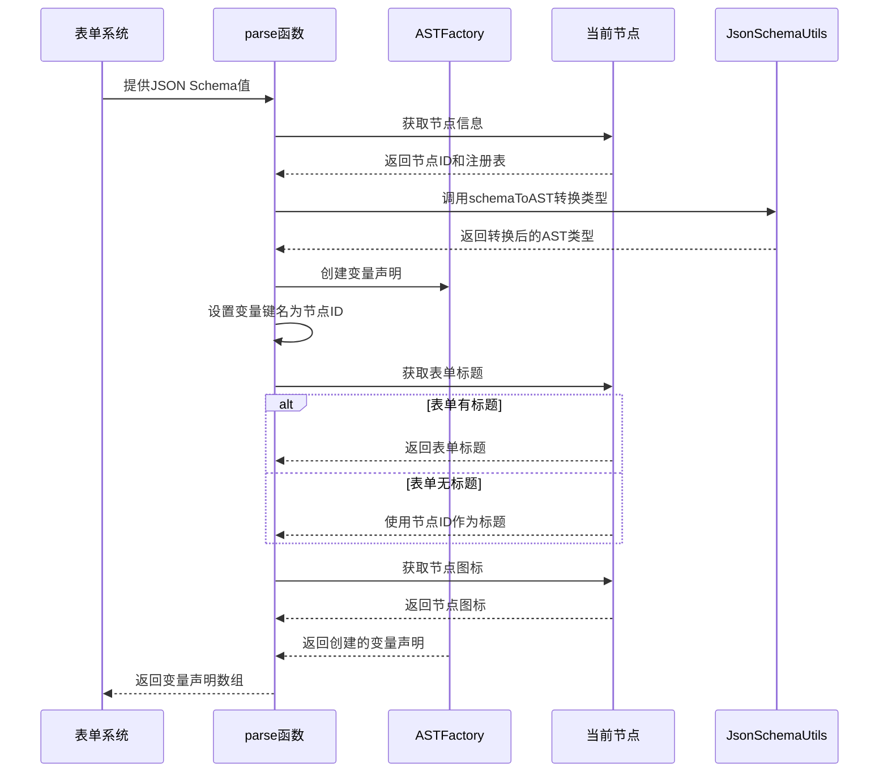

import { SourceCode } from '@theme';
import { BasicStory } from 'components/form-materials/effects/provide-json-schema-output';

# provideJsonSchemaOutputs

provideJsonSchemaOutputs 是一个表单副作用，用于将 JSON Schema 定义转换为 FlowGram 变量引擎中的输出变量。

它能够自动将表单中定义的 JSON Schema 结构解析为变量声明，使工作流中的其他节点可以引用这些输出。

## 案例演示

### 基本使用

:::tip

`provideJsonSchemaOutputs` 通常结合 [`syncVariableTitle`](./sync-variable-title) 使用，保证变量能**实时同步节点的标题**。

:::


<BasicStory />

```tsx pure title="form-meta.tsx"
import { JsonSchemaEditor, provideJsonSchemaOutputs, syncVariableTitle } from '@flowgram.ai/form-materials';
import { Field } from '@flowgram.ai/free-layout-editor';

const formMeta = {
  render: () => (
    <>
      <FormHeader />
      <Field<IJsonSchema | undefined>
        name="outputs"
        defaultValue={{
          type: 'object',
          properties: {
            name: { type: 'string' },
            age: { type: 'number' },
          },
        }}
      >
        {({ field }) => (
          <JsonSchemaEditor value={field.value} onChange={(value) => field.onChange(value)} />
        )}
      </Field>
    </>
  ),
  effect: {
    // 同步标题到变量
    title: syncVariableTitle,
    // 将 JSON Schema 转换为输出变量
    outputs: provideJsonSchemaOutputs,
  },
}
```


## API 参考

### provideJsonSchemaOutputs

提供一个表单副作用，将 JSON Schema 转换为工作流输出变量。

#### 参数
- 无直接参数，作为表单副作用直接使用在 formMeta.effect 中

#### 返回值
- `EffectOptions[]`: 表单副作用选项数组，用于 formMeta.effect 配置

#### 工作原理

该表单副作用会：
1. 获取表单中定义的 JSON Schema 值
2. 将 Schema 转换为 FlowGram 的 AST 类型
3. 创建变量声明，键名为当前节点 ID
4. 设置变量的元数据（标题、图标等）

## 源码导读

<SourceCode
  href="https://github.com/bytedance/flowgram.ai/tree/main/packages/materials/form-materials/src/effects/provide-json-schema-outputs/index.ts"
/>

使用 CLI 命令可以复制源代码到本地：

```bash
npx @flowgram.ai/cli@latest materials effects/provide-json-schema-outputs
```

### 目录结构讲解

```
provide-json-schema-outputs/
└── index.ts           # 主实现文件，导出 provideJsonSchemaOutputs 表单副作用
```

### 核心实现说明

#### 变量生成逻辑

provideJsonSchemaOutputs 使用 [`createEffectFromVariableProvider`](/guide/variable/variable-output) 工厂函数创建变量提供器。副作用内使用 `JsonSchemaUtils.schemaToAST` 函数将表单中填写的 JSON Schema 转换为 AST。

:::tip

`JsonSchemaUtils.schemaToAST` 递归解析 json schema 生成 AST，源码见 [utils.ts](https://github.com/bytedance/flowgram.ai/blob/main/packages/variable-engine/json-schema/src/json-schema/utils.ts)

:::

变量生成流程时序图：



### 依赖梳理

#### flowgram API

[**@flowgram.ai/json-schema**](https://github.com/bytedance/flowgram.ai/tree/main/packages/variable/json-schema)
- [`JsonSchemaUtils`](https://flowgram.ai/auto-docs/json-schema/modules/JsonSchemaUtils): JSON Schema 工具类，用于将 Schema 转换为 AST
- [`IJsonSchema`](https://flowgram.ai/auto-docs/json-schema/interfaces/IJsonSchema): JSON Schema 接口定义

[**@flowgram.ai/editor**](https://github.com/bytedance/flowgram.ai/tree/main/packages/client/editor)
- [`EffectOptions`](https://flowgram.ai/auto-docs/editor/types/EffectOptions): 表单副作用选项类型
- [`FlowNodeRegistry`](https://flowgram.ai/auto-docs/document/interfaces/FlowNodeRegistry-1): 节点注册类型定义
- [`createEffectFromVariableProvider`](/guide/variable/variable-output): 从变量提供器创建表单副作用的工厂函数

[**@flowgram.ai/variable-core**](https://github.com/bytedance/flowgram.ai/tree/main/packages/client/editor)
- [`ASTFactory`](https://flowgram.ai/auto-docs/editor/modules/ASTFactory): AST 创建工厂，用于生成变量声明

